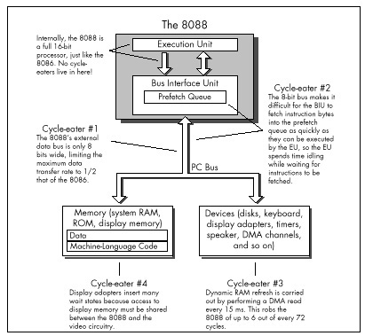
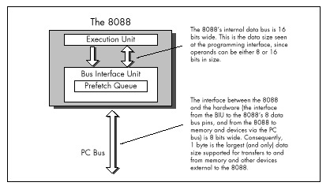

\
 **Figure 4.1**  *The location of the major cycle-eaters in the IBM PC.*

\
 **Figure 4.2**  *Internal data bus widths of the 8088.*

As shown in Figure 4.1, the 8-bit bus cycle-eater lies squarely on the
8088's external data bus. Technically, it might be more accurate to
place this cycle-eater in the Bus Interface Unit, which breaks 16-bit
memory accesses into paired 8-bit accesses, but it is really the limited
width of the external data bus that constricts data flow into and out of
the 8088. True, the original PC's bus is also only 8 bits wide, but
that's just to match the 8088's 8-bit bus; even if the PC's bus were 16
bits wide, data could still pass into and out of the 8088 chip itself
only 1 byte at a time.

Each bus access by the 8088 takes 4 clock cycles, or 0.838 µs in the
4.77 MHz PC, and transfers 1 byte. That means that the maximum rate at
which data can be transferred into and out of the 8088 is 1 byte every
0.838 µs. While 8086 bus accesses also take 4 clock cycles, each 8086
bus access can transfer either 1 byte or 1 word, for a maximum transfer
rate of 1 word every 0.838 µs. Consequently, for word-sized memory
accesses, the 8086 has an effective transfer rate of 1 byte every 0.419
µs. By contrast, every word-sized access on the 8088 requires two
4-cycle-long bus accesses, one for the high byte of the word and one for
the low byte of the word. As a result, the 8088 has an effective
transfer rate for word-sized memory accesses of just 1 word every 1.676
µs—and that, in a nutshell, is the 8-bit bus cycle-eater.

A related cycle-eater lurks beneath the 386SX chip, which is a 32-bit
processor internally with only a 16-bit path to system memory. The
numbers are different, but the way the cycle-eater operates is exactly
the same. AT-compatible systems have 16-bit data buses, which can access
a full 16-bit word at a time. The 386SX can process 32 bits (a
doubleword) at a time, however, and loses a lot of time fetching that
doubleword from memory in two halves.

#### The Impact of the 8-Bit Bus Cycle-Eater {#Heading7}

One obvious effect of the 8-bit bus cycle-eater is that word-sized
accesses to memory operands on the 8088 take 4 cycles longer than
byte-sized accesses. That's why the official instruction timings
indicate that for code running on an 8088 an additional 4 cycles are
required for every word-sized access to a memory operand. For instance,

    mov  ax,word ptr [MemVar]

takes 4 cycles longer to read the word at address **MemVar** than

    mov  al,byte ptr [MemVar]

takes to read the byte at address **MemVar.** (Actually, the difference
between the two isn't very likely to be exactly 4 cycles, for reasons
that will become clear once we discuss the prefetch queue and dynamic
RAM refresh cycle-eaters later in this chapter.)

What's more, in some cases one instruction can perform multiple
word-sized accesses, incurring that 4-cycle penalty on each access. For
example, adding a value to a word-sized memory variable requires two
word-sized accesses—one to read the destination operand from memory
prior to adding to it, and one to write the result of the addition back
to the destination operand—and thus incurs not one but two 4-cycle
penalties. As a result

    add  word ptr [MemVar],ax

takes about 8 cycles longer to execute than:

    add  byte ptr [MemVar],al

String instructions can suffer from the 8-bit bus cycle-eater to a
greater extent than other instructions. Believe it or not, a single
**REP MOVSW** instruction can lose as much as 131,070 word-sized memory
accesses x 4 cycles, or *524,280 cycles* to the 8-bit bus cycle-eater!
In other words, one 8088 instruction (admittedly, an instruction that
does a great deal) can take over one-tenth of a second longer on an 8088
than on an 8086, simply because of the 8-bit bus. *One-tenth of a
second!* That's a phenomenally long time in computer terms; in one-tenth
of a second, the 8088 can perform more than 50,000 additions and
subtractions.

The upshot of all this is simply that the 8088 can transfer word-sized
data to and from memory at only half the speed of the 8086, which
inevitably causes performance problems when coupled with an Execution
Unit that can process word-sized data every bit as quickly as an 8086.
These problems show up with any code that uses word-sized memory
operands. More ominously, as we will see shortly, the 8-bit bus
cycle-eater can cause performance problems with other sorts of code as
well.

#### What to Do about the 8-Bit Bus Cycle-Eater? {#Heading8}

The obvious implication of the 8-bit bus cycle-eater is that byte-sized
memory variables should be used whenever possible. After all, the 8088
performs *byte-sized* memory accesses just as quickly as the 8086. For
instance, Listing 4.1, which uses a byte-sized memory variable as a loop
counter, runs in 10.03 s per loop. That's 20 percent faster than the
12.05 µs per loop execution time of Listing 4.2, which uses a word-sized
counter. Why the difference in execution times? Simply because each
word-sized **DEC** performs 4 byte-sized memory accesses (two to read
the word-sized operand and two to write the result back to memory),
while each byte-sized **DEC** performs only 2 byte-sized memory accesses
in all.

**LISTING 4.1 LST4-1.ASM**

    ; Measures the performance of a loop which uses a
    ; byte-sized memory variable as the loop counter.
    ;
          jmp  Skip
    ;
    Counter    db    100
    ;
    Skip:
          call ZTimerOn
    LoopTop:
          dec  [Counter]
          jnz  LoopTop
          call ZTimerOff

**LISTING 4.2 LST4-2.ASM**

    ; Measures the performance of a loop which uses a
    ; word-sized memory variable as the loop counter.
    ;
          jmp  Skip
    ;
    Counter    dw    100
    ;
    Skip:
          call  ZTimerOn
    LoopTop:
          dec   [Counter]
          jnz   LoopTop
          call  ZTimerOff

I'd like to make a brief aside concerning code optimization in the
listings in this book. Throughout this book I've modeled the sample code
after working code so that the timing results are applicable to
real-world programming. In Listings 4.1 and 4.2, for example, I could
have shown a still greater advantage for byte-sized operands simply by
performing 1,000 **DEC** instructions in a row, with no branching at
all. However, **DEC** instructions don't exist in a vacuum, so in the
listings I used code that both decremented the counter and tested the
result. The difference is that between decrementing a memory location
(simply an instruction) and using a loop counter (a functional
instruction sequence). If you come across code in this book that seems
less than optimal, it's simply due to my desire to provide code that's
relevant to real programming problems. On the other hand, optimal code
is an elusive thing indeed; by no means should you assume that the code
in this book is ideal! Examine it, question it, and improve upon it, for
an inquisitive, skeptical mind is an important part of the Zen of
assembly optimization.