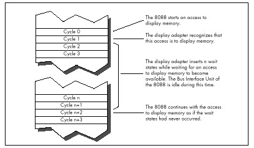
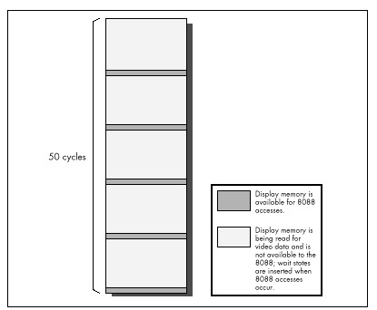
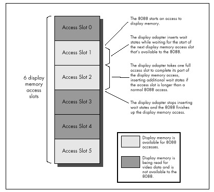

  ------------------------ --------------------------------- --------------------
  [Previous](04-07.html)   [Table of Contents](index.html)   [Next](04-09.html)
  ------------------------ --------------------------------- --------------------

Wait states exist because the CPU must to be able to coexist with any
adapter, no matter how slow (within reason). The 8088 expects to be able
to complete each bus access—a memory or I/O read or write—in 4 cycles,
but adapters can't always respond that quickly for a number of reasons.
For example, display adapters must split access to display memory
between the CPU and the circuitry that generates the video signal based
on the contents of display memory, so they often can't immediately
fulfill a request by the CPU for a display memory read or write. To
resolve this conflict, display adapters can tell the CPU to wait during
bus accesses by inserting one or more wait states, as shown in Figure
4.6. The CPU simply sits and idles as long as wait states are inserted,
then completes the access as soon as the display adapter indicates its
readiness by no longer inserting wait states. The same would be true of
any adapter that couldn't keep up with the CPU.

Mind you, this is all transparent to executing code. An instruction that
encounters wait states runs exactly as if there were no wait states,
only slower. Wait states are nothing more or less than wasted time as
far as the CPU and your program are concerned.

By understanding the circumstances in which wait states can occur, you
can avoid them when possible. Even when it's not possible to work around
wait states, it's still to your advantage to understand how they can
cause your code to run more slowly.

First, let's learn a bit more about wait states by contrast with DRAM
refresh. Unlike DRAM refresh, wait states do not occur on any regularly
scheduled basis, and are of no particular duration. Wait states can only
occur when an instruction performs a memory or I/O read or write. Both
the presence of wait states and the number of wait states inserted on
any given bus access are entirely controlled by the device being
accessed. When it comes to wait states, the CPU is passive, merely
accepting whatever wait states the accessed device chooses to insert
during the course of the access. All of this makes perfect sense given
that the whole point of the wait state mechanism is to allow a device to
stretch out any access to itself for however much time it needs to
perform the access.

\
 **Figure 4.6**  *Video wait states inserted by the display adapter.*

As with DRAM refresh, wait states don't stop the 8088 completely. The
Execution Unit can continue processing while wait states are inserted,
so long as the EU doesn't need to perform a bus access. However, in the
PC, wait states most often occur when an instruction accesses a memory
operand, so in fact the Execution Unit usually is stopped by wait
states. (Instruction fetches rarely wait in an 8088-based PC because
system memory is zero-wait-state. AT-class memory systems routinely
insert 1 or more wait states, however.)

As it turns out, wait states pose a serious problem in just one area in
the PC. While any adapter *can* insert wait states, in the PC only
display adapters do so to the extent that performance is seriously
affected.

### The Display Adapter Cycle-Eater {#Heading20}

Display adapters must serve two masters, and that creates a fundamental
performance problem. Master \#1 is the circuitry that drives the display
screen. This circuitry must constantly read display memory in order to
obtain the information used to draw the characters or dots displayed on
the screen. Since the screen must be redrawn between 50 and 70 times per
second, and since each redraw of the screen can require as many as
36,000 reads of display memory (more in Super VGA modes), master \#1 is
a demanding master indeed. No matter how demanding master \#1 gets,
however, its needs must *always* be met—otherwise the quality of the
picture on the screen would suffer.

Master \#2 is the CPU, which reads from and writes to display memory in
order to manipulate the bytes that the video circuitry reads to form the
picture on the screen. Master \#2 is less important than master \#1,
since the CPU affects display quality only indirectly. In other words,
if the video circuitry has to wait for display memory accesses, the
picture will develop holes, snow, and the like, but if the CPU has to
wait for display memory accesses, the program will just run a bit
slower—no big deal.

It matters a great deal which master is more important, for while both
the CPU and the video circuitry must gain access to display memory, only
one of the two masters can read or write display memory at any one time.
Potential conflicts are resolved by flat-out guaranteeing the video
circuitry however many accesses to display memory it needs, with the CPU
waiting for whatever display memory accesses are left over.

It turns out that the 8088 CPU has to do a lot of waiting, for three
reasons. First, the video circuitry can take as much as about 90 percent
of the available display memory access time, as shown in Figure 4.7,
leaving as little as about 10 percent of all display memory accesses for
the 8088. (These percentages vary considerably among the many EGA and
VGA clones.)

\
 **Figure 4.7**  *Allocation of display memory access.*

Second, because the displayed dots (or *pixels,* short for "picture
elements") must be drawn on the screen at a constant speed, many display
adapters provide memory accesses only at fixed intervals. As a result,
time can be lost while the 8088 synchronizes with the start of the next
display adapter memory access, even if the video circuitry isn't
accessing display memory at that time, as shown in Figure 4.8.

Finally, the time it takes a display adapter to complete a memory access
is related to the speed of the clock which generates pixels on the
screen rather than to the memory access speed of the 8088. Consequently,
the time taken for display memory to complete an 8088 read or write
access is often longer than the time taken for system memory to complete
an access, even if the 8088 lucks into hitting a free display memory
access just as it becomes available, again as shown in Figure 4.8. Any
or all of the three factors I've described can result in wait states,
slowing the 8088 and creating the display adapter cycle.

\
 **Figure 4.8**  *Display memory access slots.*

If some of this is Greek to you, don't worry. The important point is
that display memory is not very fast compared to normal system memory.
How slow is it? *Incredibly* slow. Remember how slow IBM's ill-fated
PC*jr*was? In case you've forgotten, I'll refresh your memory: The
PC*jr*was at best only half as fast as the PC. The PC*jr* had an 8088
running at 4.77 MHz, just like the PC—why do you suppose it was so much
slower? I'll tell you why: *All the memory in the PCjr was display
memory.*

Enough said. All the memory in the PC is *not* display memory, however,
and unless you're thickheaded enough to put code in display memory, the
PC isn't going to run as slowly as a PC*jr.* (Putting code or other
non-video data in unused areas of display memory sounds like a neat
idea—until you consider the effect on instruction prefetching of cutting
the 8088's already-poor memory access performance in half. Running your
code from display memory is sort of like running on a hypothetical
8084—an 8086 with a *4-bit* bus. Not recommended!) Given that your code
and data reside in normal system memory below the 640K mark, how great
an impact does the display adapter cycle-eater have on performance?

  ------------------------ --------------------------------- --------------------
  [Previous](04-07.html)   [Table of Contents](index.html)   [Next](04-09.html)
  ------------------------ --------------------------------- --------------------

* * * * *

Graphics Programming Black Book © 2001 Michael Abrash
