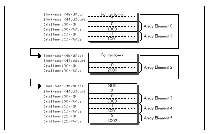

  ------------------------ --------------------------------- --------------------
  [Previous](08-02.html)   [Table of Contents](index.html)   [Next](08-04.html)
  ------------------------ --------------------------------- --------------------

**LISTING 8.1 L8-1.C**

    /* Program to search an array spanning a linked list of variable-
       sized blocks, for all entries with a specified ID number,
       and return the average of the values of all such entries. Each of
       the variable-sized blocks may contain any number of data entries,
       stored as an array of structures within the block. */

    #include <stdio.h>
    #ifdef __TURBOC__
    #include <alloc.h>
    #else
    #include <malloc.h>
    #endif

    void main(void);
    void exit(int);
    unsigned int FindIDAverage(unsigned int, struct BlockHeader *);
    /* Structure that starts each variable-sized block */
    struct BlockHeader {
       struct BlockHeader *NextBlock; /* Pointer to next block, or NULL
                                         if this is the last block in the
                                         linked list */
       unsigned int BlockCount;       /* The number of DataElement entries
                                         in this variable-sized block */
    };

    /* Structure that contains one element of the array we’ll search */
    struct DataElement {
       unsigned int ID;     /* ID # for array entry */
       unsigned int Value;  /* Value of array entry */
    };

    void main(void) {
       int i,j;
       unsigned int IDToFind;
       struct BlockHeader *BaseArrayBlockPointer,*WorkingBlockPointer;
       struct DataElement *WorkingDataPointer;
       struct BlockHeader **LastBlockPointer;

       printf(”ID # for which to find average: “);
       scanf(”%d”,&IDToFind);
       /* Build an array across 5 blocks, for testing */
       /* Anchor the linked list to BaseArrayBlockPointer */
       LastBlockPointer = &BaseArrayBlockPointer;
       /* Create 5 blocks of varying sizes */
       for (i = 1; i < 6; i++) {
          /* Try to get memory for the next block */
          if ((WorkingBlockPointer =
              (struct BlockHeader *) malloc(sizeof(struct BlockHeader) +
               sizeof(struct DataElement) * i * 10)) == NULL) {
             exit(1);
          }
          /* Set the # of data elements in this block */
          WorkingBlockPointer->BlockCount = i * 10;
          /* Link the new block into the chain */
          *LastBlockPointer = WorkingBlockPointer;
          /* Point to the first data field */
          WorkingDataPointer =
                (struct DataElement *) ((char *)WorkingBlockPointer +
                sizeof(struct BlockHeader));
          /* Fill the data fields with ID numbers and values */
          for (j = 0; j < (i * 10); j++, WorkingDataPointer++) {
             WorkingDataPointer->ID = j;
             WorkingDataPointer->Value = i * 1000 + j;
          }
          /* Remember where to set link from this block to the next */
          LastBlockPointer = &WorkingBlockPointer->NextBlock;
       }
       /* Set the last block’s “next block” pointer to NULL to indicate
          that there are no more blocks */
       WorkingBlockPointer->NextBlock = NULL;
       printf(”Average of all elements with ID %d: %u\n”,
             IDToFind, FindIDAverage(IDToFind, BaseArrayBlockPointer));
       exit(0);
    }

    /* Searches through the array of DataElement entries spanning the
       linked list of variable-sized blocks, starting with the block
       pointed to by BlockPointer, for all entries with IDs matching
       SearchedForID, and returns the average value of those entries. If
       no matches are found, zero is returned */

    unsigned int FindIDAverage(unsigned int SearchedForID,
          struct BlockHeader *BlockPointer)
    {
       struct DataElement *DataPointer;
       unsigned int IDMatchSum;
       unsigned int IDMatchCount;
       unsigned int WorkingBlockCount;

       IDMatchCount = IDMatchSum = 0;
       /* Search through all the linked blocks until the last block
          (marked with a NULL pointer to the next block) has been
          searched */
       do {
          /* Point to the first DataElement entry within this block */
          DataPointer =
                (struct DataElement *) ((char *)BlockPointer +
                sizeof(struct BlockHeader));
          /* Search all the DataElement entries within this block
             and accumulate data from all that match the desired ID */
          for (WorkingBlockCount=0;
                WorkingBlockCount<BlockPointer->BlockCount;
                WorkingBlockCount++, DataPointer++) {
             /* If the ID matches, add in the value and increment the
                match counter */
             if (DataPointer->ID == SearchedForID) {
                IDMatchCount++;
                IDMatchSum += DataPointer->Value;
             }
          }
       /* Point to the next block, and continue as long as that pointer
           isn’t NULL */
       }  while ((BlockPointer = BlockPointer->NextBlock) != NULL);
       /* Calculate the average of all matches */
       if (IDMatchCount == 0)
          return(0);            /* Avoid division by 0 */
       else
          return(IDMatchSum / IDMatchCount);
    }

The main body of Listing 8.1 constructs a linked list of memory blocks
of various sizes and stores an array of structures across those blocks,
as shown in Figure 8.2. The function **FindIDAverage** in Listing 8.1
searches through that array for all matches to a specified ID number and
returns the average value of all such matches. **FindIDAverage**
contains two nested loops, the outer one repeating once for each linked
block and the inner one repeating once for each array element in each
block. The inner loop—the critical one—is compact, containing only four
statements, and should lend itself rather well to compiler optimization.

\
 **Figure 8.2**  *Linked array storage format (version 1).*

As it happens, Microsoft C/C++ does optimize the inner loop of
**FindIDAverage** nicely. Listing 8.2 shows the code Microsoft C/C++
generates for the inner loop, consisting of a mere seven assembly
language instructions inside the loop. The compiler is smart enough to
convert the loop index variable, which counts up but is used for nothing
but counting loops, into a count-down variable so that the **LOOP**
instruction can be used.

**LISTING 8.2 L8-2.COD**

    ; Code generated by Microsoft C for inner loop of FindIDAverage.
    ;|*** for (WorkingBlockCount=0;
    ;|***       WorkingBlockCount<BlockPointer->BlockCount;
    ;|***       WorkingBlockCount++, DataPointer++) {
              mov     WORD PTR [bp-6],0         ;WorkingBlockCount
              mov     bx,WORD PTR [bp+6]        ;BlockPointer
              cmp     WORD PTR [bx+2],0
              je      $FB264
              mov     cx,WORD PTR [bx+2]
              add     WORD PTR [bp-6],cx        ;WorkingBlockCount
              mov     di,WORD PTR [bp-2]        ;IDMatchSum
              mov     dx,WORD PTR [bp-4]        ;IDMatchCount
    $L20004:
    ;|*** if (DataPointer->ID == SearchedForID) {
              mov     ax,WORD PTR [si]
              cmp     WORD PTR [bp+4],ax        ;SearchedForID
              jne     $I265
    ;|***             IDMatchCount++;
              inc     dx
    ;|***            IDMatchSum += DataPointer->Value;
              add     di,WORD PTR [si+2]
    ;|***          }
    ;|***       }
    $I265:
              add     si,4
              loop    $L20004
              mov     WORD PTR [bp-2],di        ;IDMatchSum
              mov     WORD PTR [bp-4],dx        ;IDMatchCount
    $FB264:

  ------------------------ --------------------------------- --------------------
  [Previous](08-02.html)   [Table of Contents](index.html)   [Next](08-04.html)
  ------------------------ --------------------------------- --------------------

* * * * *

Graphics Programming Black Book © 2001 Michael Abrash
