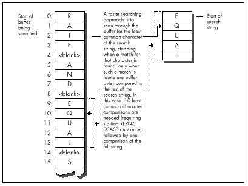

Listing 9.1 implements the scan-on-first-character approach. Listing 9.2
scans for whatever character the caller specifies. Listing 9.3 is a test
program used to compare the two approaches. How much difference does
Rob's revelation make? Plenty. Even when the entire C function call to
**FindString** is timed—**strlen** calls, parameter pushing, calling,
setup, and all—the version of **FindString** in Listing 9.2, which is
directed by Listing 9.3 to scan for the infrequently-occurring "Q," is
about 40 percent faster on a 20 MHz cached 386 for the test search of
Listing 9.3 than is the version of **FindString** in Listing 9.1, which
always scans for the first character, in this case "E." However, when
only the search loops (the code that actually does the searching) in the
two versions of **FindString** are compared, Listing 9.2 is more than
*twice* as fast as Listing 9.1—a remarkable improvement over code that
already uses **REPNZ SCASB** and **REPZ CMPS**.

What I like so much about Rob's approach is that it demonstrates that
optimization involves much more than instruction selection and cycle
counting. Listings 9.1 and 9.2 use pretty much the same instructions,
and even use the same approach of scanning with **REPNZ SCASB** and
using **REPZ CMPS** to check scanning matches.

  ------------------- ----------------------------------------------------------------------------------------------------------------------------------------------------------------------------------------------------------------------------
     *The difference between Listings 9.1 and 9.2 (which gives you more than a doubling of performance) is due entirely to understanding the nature of the data being handled, and biasing the code to reflect that knowledge.*
  ------------------- ----------------------------------------------------------------------------------------------------------------------------------------------------------------------------------------------------------------------------

\
 **Figure 9.2**  *Faster searching method for locating a text string.*

**LISTING 9.1 L9-1.ASM**

    ; Searches a text buffer for a text string. Uses REPNZ SCASB to sca"n
    ; the buffer for locations that match the first character of the
    ; searched-for string, then uses REPZ CMPS to check fully only those
    ; locations that REPNZ SCASB has identified as potential matches.
    ;
    ; Adapted from Zen of Assembly Language, by Michael Abrash
    ;
    ; C small model-callable as:
    ;    unsigned char * FindString(unsigned char * Buffer,
    ;     unsigned int BufferLength, unsigned char * SearchString,
    ;     unsigned int SearchStringLength);
    ;
    ; Returns a pointer to the first match for SearchString in Buffer,or
    ; a NULL pointer if no match is found. Buffer should not start at
    ; offset 0 in the data segment to avoid confusing a match at 0 with
    ; no match found.
    Parmsstruc
                            dw    2 dup(?) ;pushed BP/return address
    Buffer                  dw      ?      ;pointer to buffer to search
    BufferLength            dw      ?      ;length of buffer to search
    SearchString            dw      ?      ;pointer to string for which to search
    SearchStringLength      dw      ?      ;length of string for which to search
    Parmsends
          .model      small
          .code
          public _FindString
    _FindStringprocnear
          push     bp      ;preserve caller's stack frame
          mov      bp,sp   ;point to our stack frame
          push     si      ;preserve caller's register variables
          push     di
          cld              ;make string instructions increment pointers
          mov      si,[bp+SearchString]       ;pointer to string to search for
          mov      bx,[bp+SearchStringLength] ;length of string
          and bx,bx
          jz       FindStringNotFound         ;no match if string is 0 length
          movd      x,[bp+BufferLength]       ;length of buffer
          sub      dx,bx                      ;difference between buffer and string lengths
          jc      FindStringNotFound          ;no match if search string is
                                              ; longer than buffer
          inc      dx      ;difference between buffer and search string
                           ; lengths, plus 1 (# of possible string start
                           ; locations to check in the buffer)
          mov      di,ds
          mov      es,di
          mov      di,[bp+Buffer]       ;point ES:DI to buffer to search thru
          lodsb                         ;put the first byte of the search string in AL
          mov      bp,si                ;set aside pointer to the second search byte
          dec      bx                   ;don't need to compare the first byte of the
                                        ; string with CMPS; we'll do it with SCAS
    FindStringLoop:
          mov    cx,dx ;put remaining buffer search length in CX
          repnz  scasb ;scan for the first byte of the string
          jnz    FindStringNotFound ;not found, so there's no match
                                    ;found, so we have a potential match-check the
                                    ; rest of this candidate location
          push   di                 ;remember the address of the next byte to scan
          mov    dx,cx              ;set aside the remaining length to search in
                                    ; the buffer
          mov    si,bp              ;point to the rest of the search string
          mov    cx,bx              ;string length (minus first byte)
          shr    cx,1               ;convert to word for faster search
          jnc    FindStringWord     ;do word search if no odd byte
          cmpsb                     ;compare the odd byte
          jnz    FindStringNoMatch  ;odd byte doesn't match, so we
                                    ; haven't found the search string here
    FindStringWord:
          jcxz   FindStringFound    ;test whether we've already checked
                                    ; the whole string; if so, this is a match
                                    ; bytes long; if so, we've found a match
          repz   cmpsw              ;check the rest of the string a word at a time
          jz     FindStringFound    ;it's a match
    FindStringNoMatch:
          pop    di                 ;get back pointer to the next byte to scan
          and    dx,dx              ;is there anything left to check?
          jnz    FindStringLoop     ;yes-check next byte
    FindStringNotFound:
          sub    ax,ax              ;return a NULL pointer indicating that the
          jmp    FindStringDone     ; string was not found
    FindStringFound:
          pop    ax                 ;point to the buffer location at which the
          dec    ax                 ; string was found (earlier we pushed the
                                    ; address of the byte after the start of the
                                    ; potential match)
    FindStringDone:
          pop    di                 ;restore caller's register variables
          pop    si
          pop    bp                 ;restore caller's stack frame
    ret
    _FindStringendp
          end
