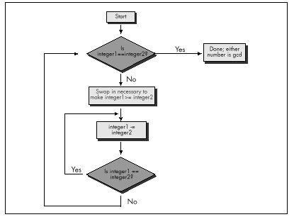
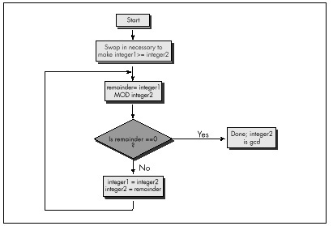

Listing 10.2 repeatedly subtracts iS from iL until iL becomes less than
or equal to iS. If iL becomes equal to iS, then that's the GCD;
alternatively, if iL becomes *less* than iS, iL and iS switch values,
and the process is repeated, as shown in Figure 10.2. The number of
iterations this approach requires relative to Listing 10.1 depends
heavily on the values of iL and iS, so it's not always faster, but, as
Table 10.1 indicates, Listing 10.2 is generally much better code.

Listing 10.2 is a far graver misstep than Listing 10.1, for all that
it's faster. Listing 10.1 is obviously a hacked-up, brute-force
approach; no one could mistake it for anything else. It could be speeded
up in any of a number of ways with a little thought. (Simply skipping
testing all the divisors between iS and iS/2, not inclusive, would cut
the worst-case time in half, for example; that's not a particularly
*good* optimization, but it illustrates how easily Listing 10.1 can be
improved.) Listing 10.1 is a hack job, crying out for inspiration.

Listing 10.2, on the other hand, has gotten the inspiration—and largely
wasted it through haste. Had Sedgewick not told me otherwise, I might
well have assumed that Listing 10.2 was optimized, a mistake I would
never have made with Listing 10.1. I experienced a conceptual
breakthrough when I understood Sedgewick's point: A smaller number can
be subtracted from a larger number without affecting their GCD, thereby
inexpensively reducing the scale of the problem. And, in my hurry to
make this breakthrough reality, I missed its full scope. As Sedgewick
says on the very next page, the number that one gets by subtracting iS
from iL until iL is less than iS is precisely the same as the remainder
that one gets by dividing iL by iS—again, this is inherent in the nature
of division—and *that* is the basis for Euclid's algorithm, shown in
Figure 10.3. Listing 10.3 is an implementation of Euclid's algorithm.

**LISTING 10.3 L10-3.C**

    /* Finds and returns the greatest common divisor of two integers.
       Uses Euclid's algorithm: divides the larger integer by the
       smaller; if the remainder is 0, the smaller integer is the GCD,
       otherwise the smaller integer becomes the larger integer, the
       remainder becomes the smaller integer, and the process is
       repeated. */

    static unsigned int gcd_recurs(unsigned int, unsigned int);

    unsigned int gcd(unsigned int int1, unsigned int int2) {
       unsigned int temp;
       /* If the two integers are the same, that's the GCD and we're
          done */
       if (int1 == int2) {
          return(int1);
       }
       /* Swap if necessary to make sure that int1 >= int2 */
       if (int1 < int2) {
          temp = int1;
          int1 = int2;
          int2 = temp;
       }

       /* Now call the recursive form of the function, which assumes
          that the first parameter is the larger of the two */
       return(gcd_recurs(int1, int2));
    }

    static unsigned int gcd_recurs(unsigned int larger_int,
          unsigned int smaller_int)
    {
       int temp;

       /* If the remainder of larger_int divided by smaller_int is 0,
          then smaller_int is the gcd */
       if ((temp = larger_int % smaller_int) == 0) {
          return(smaller_int);
       }
       /* Make smaller_int the larger integer and the remainder the
          smaller integer, and call this function recursively to
          continue the process */
       return(gcd_recurs(smaller_int, temp));
    }

As you can see from Table 10.1, Euclid's algorithm is superior,
especially for large numbers (and imagine if we were working with large
*longs!*).

  ------------------- --------------------------------------------------------------------------------------------------------------------------------------------------------------------------------------------------------------------------------------------------------------------------------------------------------------------------------------------------------------------------------------------------------------
     *Had I been implementing GCD determination without Sedgewick's help, I would surely not have settled for Listing 10.1—but I might well have ended up with Listing 10.2 in my enthusiasm over the "brilliant" discovery of subtracting the lesser Using Euclid's algorithm to find a GCD number from the greater. In a commercial product, my lack of patience and discipline could have been costly indeed.*
  ------------------- --------------------------------------------------------------------------------------------------------------------------------------------------------------------------------------------------------------------------------------------------------------------------------------------------------------------------------------------------------------------------------------------------------------

Give your mind time and space to wander around the edges of important
programming problems before you settle on any one approach. I titled
this book's first chapter "The Best Optimizer Is between Your Ears," and
that's still true; what's even more true is that the optimizer between
your ears does its best work not at the implementation stage, but at the
very beginning, when you try to imagine how what you want to do and what
a computer is capable of doing can best be brought together.

### Recursion {#Heading6}

Euclid's algorithm lends itself to recursion beautifully, so much so
that an implementation like Listing 10.3 comes almost without thought.
Again, though, take a moment to stop and consider what's really going
on, at the assembly language level, in Listing 10.3. There's recursion
and then there's recursion; code recursion and data recursion, to be
exact. Listing 10.3 is code recursion—recursion through calls—the sort
most often used because it is conceptually simplest. However, code
recursion tends to be slow because it pushes parameters and calls a
subroutine for every iteration. Listing 10.4, which uses data recursion,
is much faster and no more complicated than Listing 10.3. Actually, you
could just say that Listing 10.4 uses a loop and ignore any mention of
recursion; conceptually, though, Listing 10.4 performs the same
recursive operations that Listing 10.3 does.

**LISTING 10.4 L10-4.C**

    /* Finds and returns the greatest common divisor of two integers.
       Uses Euclid's algorithm: divides the larger integer by the
       smaller; if the remainder is 0, the smaller integer is the GCD,
       otherwise the smaller integer becomes the larger integer, the
       remainder becomes the smaller integer, and the process is
       repeated. Avoids code recursion. */

    unsigned int gcd(unsigned int int1, unsigned int int2) {
       unsigned int temp;

       /* Swap if necessary to make sure that int1 >= int2 */
       if (int1 < int2) {
          temp = int1;
          int1 = int2;
          int2 = temp;
       }
       /* Now loop, dividing int1 by int2 and checking the remainder,
          until the remainder is 0. At each step, if the remainder isn't
          0, assign int2 to int1, and the remainder to int2, then
          repeat */
       for (;;) {
          /* If the remainder of int1 divided by int2 is 0, then int2 is
             the gcd */
          if ((temp = int1 % int2) == 0) {
             return(int2);
          }
          /* Make int2 the larger integer and the remainder the
             smaller integer, and repeat the process */
          int1 = int2;
          int2 = temp;
       }
    }

#### Patient Optimization {#Heading7}

At long last, we're ready to optimize GCD determination in the classic
sense. Table 10.1 shows the performance of Listing 10.4 with and without
Microsoft C/C++'s maximum optimization, and also shows the performance
of Listing 10.5, an assembly language version of Listing 10.4. Sure, the
optimized versions are faster than the unoptimized version of Listing
10.4—but the gains are small compared to those realized from the
higher-level optimizations in Listings 10.2 through 10.4.