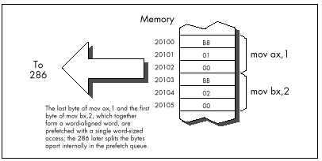
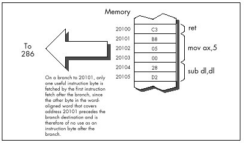

When I was developing the Zen timer, I used my trusty 10 MHz 286-based
AT clone to verify the basic functionality of the timer by measuring the
performance of simple instruction sequences. I was cruising along with
no problems until I timed the following code:

        mov    cx,1000
        call   ZTimerOn
    LoopTop:
        loop   LoopTop
        call   ZTimerOff

Now, this code *should* run in, say, about 12 cycles per loop at most.
Instead, it took over 14 cycles per loop, an execution time that I could
not explain in any way. After rolling it around in my head for a while,
I took a look at the code under a debugger...and the answer leaped out
at me. *The loop began at an odd address!* That meant that two
instruction fetches were required each time through the loop; one to get
the opcode byte of the **LOOP** instruction, which resided at the end of
one word-aligned word, and another to get the displacement byte, which
resided at the start of the next word-aligned word.

One simple change brought the execution time down to a reasonable 12.5
cycles per loop:

      mov   cx,1000
      call  ZTimerOn
      even
    LoopTop:
      loop  LoopTop
      call  ZTimerOff

While word-aligning branch destinations can improve branching
performance, it's a nuisance and can increase code size a good deal, so
it's not worth doing in most code. Besides, **EVEN** inserts a **NOP**
instruction if necessary, and the time required to execute a **NOP** can
sometimes cancel the performance advantage of having a word-aligned
branch destination.

> 
> Consequently, it's best to word-align only those branch destinations
> that can be reached solely by branching.

I recommend that you only go out of your way to word-align the start
offsets of your subroutines, as in:

              even
    FindChar  proc near
              :

In my experience, this simple practice is the one form of code alignment
that consistently provides a reasonable return for bytes and effort
expended, although sometimes it also pays to word-align tight
time-critical loops.

#### Alignment and the 386 {#Heading9 align="center"}

So far we've only discussed alignment as it pertains to the 286. What,
you may well ask, of the 386?

The 386 adds the issue of *doubleword* alignment (that is, alignment to
addresses that are multiples of four.) The rule for the 386 is:
Word-sized memory accesses should be word-aligned (it's impossible for
word-aligned word-sized accesses to cross doubleword boundaries), and
doubleword-sized memory accesses should be doubleword-aligned. However,
in real (as opposed to 32-bit protected) mode, doubleword-sized memory
accesses are rare, so the simple word-alignment rule we've developed for
the 286 serves for the 386 in real mode as well.

As for code alignment...the subroutine-start word-alignment rule of the
286 serves reasonably well there too since it avoids the worst case,
where just 1 byte is fetched on entry to a subroutine. While optimum
performance would dictate doubleword alignment of subroutines, that
takes 3 bytes, a high price to pay for an optimization that improves
performance *only* on the post 286 processors.

#### Alignment and the Stack {#Heading10 align="center"}

One side-effect of the data alignment cycle-eater of the 286 and 386 is
that you should *never* allow the stack pointer to become odd. (You can
make the stack pointer odd by adding an odd value to it or subtracting
an odd value from it, or by loading it with an odd value.) An odd stack
pointer on the 286 or 386 (or a non-doubleword-aligned stack in 32-bit
protected mode on the 386, 486, or Pentium) will significantly reduce
the performance of **PUSH,** **POP,** **CALL**, and **RET**, as well as
**INT** and **IRET**, which are executed to invoke DOS and BIOS
functions, handle keystrokes and incoming serial characters, and manage
the mouse. I know of a Forth programmer who vastly improved the
performance of a complex application on the AT simply by forcing the
Forth interpreter to maintain an even stack pointer at all times.

An interesting corollary to this rule is that you shouldn't **INC SP**
twice to add 2, even though that takes fewer bytes than **ADD SP,2**.
The stack pointer is odd between the first and second **INC**, so any
interrupt occurring between the two instructions will be serviced more
slowly than it normally would. The same goes for decrementing twice; use
**SUB SP,2** instead.

> 
> Keep the stack pointer aligned at all times.

#### The DRAM Refresh Cycle-Eater: Still an Act of God {#Heading11 align="center"}

The DRAM refresh cycle-eater is the cycle-eater that's least changed
from its 8088 form on the 286 and 386. In the AT, DRAM refresh uses a
little over five percent of all available memory accesses, slightly less
than it uses in the PC, but in the same ballpark. While the DRAM refresh
penalty varies somewhat on various AT clones and 386 computers (in fact,
a few computers are built around static RAM, which requires no refresh
at all; likewise, caches are made of static RAM so cached systems
generally suffer less from DRAM refresh), the 5 percent figure is a good
rule of thumb.

Basically, the effect of the DRAM refresh cycle-eater is pretty much the
same throughout the PC-compatible world: fairly small, so it doesn't
greatly affect performance; unavoidable, so there's no point in worrying
about it anyway; and a nuisance since it results in fractional cycle
counts when using the Zen timer. Just as with the PC, a given code
sequence on the AT can execute at varying speeds at different times as a
result of the interaction between the code and DRAM refresh.

There's nothing much new with DRAM refresh on 286/386 computers, then.
Be aware of it, but don't overly concern yourself—DRAM refresh is still
an act of God, and there's not a blessed thing you can do about it.
Happily, the internal caches of the 486 and Pentium make DRAM refresh
largely a performance non-issue on those processors.

#### The Display Adapter Cycle-Eater {#Heading12 align="center"}

Finally we come to the last of the cycle-eaters, the display adapter
cycle-eater. There are two ways of looking at this cycle-eater on
286/386 computers: (1) It's much worse than it was on the PC, or (2)
it's just about the same as it was on the PC.

Either way, the display adapter cycle-eater is extremely bad news on
286/386 computers and on 486s and Pentiums as well. In fact, this
cycle-eater on those systems is largely responsible for the popularity
of VESA local bus (VLB).

The two ways of looking at the display adapter cycle-eater on 286/386
computers are actually the same. As you'll recall from my earlier
discussion of the matter in Chapter 4, display adapters offer only a
limited number of accesses to display memory during any given period of
time. The 8088 is capable of making use of most but not all of those
slots with **REP MOVSW**, so the number of memory accesses allowed by a
display adapter such as a standard VGA is reasonably well-matched to an
8088's memory access speed. Granted, access to a VGA slows the 8088 down
considerably—but, as we're about to find out, "considerably" is a
relative term. What a VGA does to PC performance is nothing compared to
what it does to faster computers.