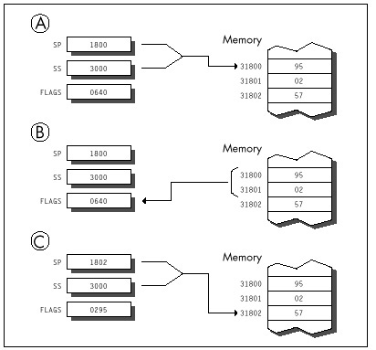
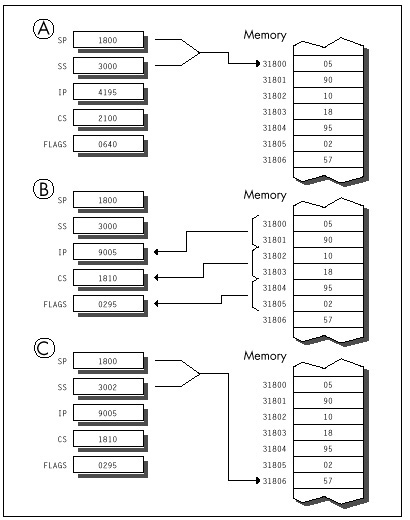
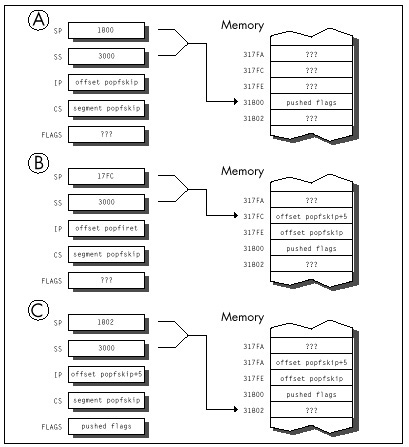

Well, there's only one instruction other than **POPF** that loads the
FLAGS register directly from the stack, and that's **IRET**, which loads
the FLAGS register from the stack as it branches, as shown in Figure
11.5. iret has no known bugs of the sort that plague **POPF**, so it's
certainly a candidate to replace popf in non-interruptible applications.
Unfortunately, **IRET** loads the FLAGS register with the *third* word
down on the stack, not the word on top of the stack, as is the case with
**POPF**; the far return address that **IRET** pops into CS:IP lies
between the top of the stack and the word popped into the FLAGS
register.

Obviously, the segment:offset that **IRET** expects to find on the stack
above the pushed flags isn't present when the stack is set up for
**POPF**, so we'll have to adjust the stack a bit before we can
substitute **IRET** for **POPF**. What we'll have to do is push the
segment:offset of the instruction after our workaround code onto the
stack right above the pushed flags. **IRET** will then branch to that
address and pop the flags, ending up at the instruction after the
workaround code with the flags popped. That's just the result that would
have occurred had we executed **POPF**—WITH the bonus that no interrupts
can accidentally occur when the Interrupt flag is 0 both before and
after the pop.

How can we push the segment:offset of the next instruction? Well,
finding the offset of the next instruction by performing a near call to
that instruction is a tried-and-true trick. We can do something similar
here, but in this case we need a far call, since **IRET** requires both
a segment and an offset. We'll also branch backward so that the address
pushed on the stack will point to the instruction we want to continue
with. The code works out like this:

          jmpshort popfskip
    popfiret:
          iret;      branches to the instruction after the
                     ; call, popping the word below the address
                     ; pushed by CALL into the FLAGS register
    popfskip:
          call  far ptr popfiret
                     ;pushes the segment:offset of the next
                     ; instruction on the stack just above
                     ; the flags word, setting things up so
                     ; that IRET will branch to the next
                     ; instruction and pop the flags
    ; When execution reaches the instruction following this comment,
    ; the word that was on top of the stack when JMP SHORT POPFSKIP
    ; was reached has been popped into the FLAGS register, just as
    ; if a POPF instruction had been executed.

The operation of this code is illustrated in Figure 11.6.

The **POPF** workaround can best be implemented as a macro; we can also
emulate a far call by pushing CS and performing a near call, thereby
shrinking the workaround code by 1 byte:

    EMULATE_POPF             macro
         local popfskip, popfiret
         jmp   short popfskip
    popfiret:
         iret
    popfskip:
         push  cs
         call  popfiret
         endm

By the way, the flags can be popped much more quickly if you're willing
to alter a register in the process. For example, the following macro
emulates **POPF** with just one branch, but wipes out AX:

    EMULATE_POPF_TRASH_AX   macro
       push  cs
       mov   ax,offset $+5
       push  ax
       iret
       endm

It's not a perfect substitute for **POPF**, since **POPF** doesn't alter
any registers, but it's faster and shorter than **EMULATE\_POPF** when
you can spare the register. If you're using 286-specific instructions,
you can use which is shorter still, alters no registers, and branches
just once. (Of course, this version of **EMULATE\_POPF** won't work on
an 8088.)

          .286
                     :
    EMULATE_POPFmacro
          pushcs
          pushoffset $+4
          iret
          endm

The standard version of **EMULATE\_POPF** is 6 bytes longer than
**POPF** and much slower, as you'd expect given that it involves three
branches. Anyone in his/her right mind would prefer **POPF** to a
larger, slower, three-branch macro—given a choice. In noncode, however,
there's no choice here; the safer—if slower—approach is the best.
(Having people associate your programs with crashed computers is *not* a
desirable situation, no matter how unfair the circumstances under which
it occurs.)

And now you know the nature of and the workaround for the **POPF** bug.
Whether you ever need the workaround or not, it's a neatly packaged
example of the tremendous flexibility of the x86 instruction set.