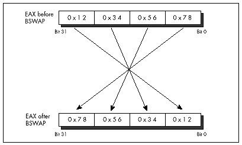

"When I looked closely as this, I realized that the two cycles for the
final **ADD** is just the sum of 1 cycle to load the data from memory,
and 1 cycle to add it to DX, so the code could just as well have been
written as shown in Listing 13.3. The final breakthrough came when I
realized that by initializing AX to zero outside the loop, I could
rearrange it as shown in Listing 13.4 and do the final **ADD DX,AX**
after the loop. This way there are two single-cycle instructions between
the first and the fourth line, avoiding all pipeline stalls, for a total
throughput of two cycles/char."

**LISTING 13.3 L13-3.ASM**

    mov bl,[di]         ;get the state value for the pair
    mov di,[bp+OFFS]    ;get the next pair of characters
    mov ax,[bx+8000h]   ;increment word and line count
    add dx,ax           ; appropriately for the pair

**LISTING 13.4 L13-4.ASM**

    mov bl,[di]         ;get the state value for the pair
    mov di,[bp+OFFS]    ;get the next pair of characters
    add dx,ax           ;increment word and line count
                        ; appropriately for the pair
    mov ax,[bx+8000h]   ;get increments for next time

I'd like to point out two fairly remarkable things. First, the single
cycle that Terje saved in Listing 13.4 sped up his entire word-counting
engine by 25 percent or more; Listing 13.4 is fully twice as fast as
Listing 13.1—all the result of nothing more than shifting an instruction
and splitting another into two operations. Second, Terje's word-counting
engine can process more than 16 million characters *per second* on a
486/33.

Clever 486 optimization can pay off big. QED.

### BSWAP: More Useful Than You Might Think {#Heading4}

There are only 3 non-system instructions unique to the 486. None is
earthshaking, but they have their uses. Consider **BSWAP. BSWAP** does
just what its name implies, swapping the bytes (not bits) of a 32-bit
register from one end of the register to the other, as shown in Figure
13.2. (**BSWAP** can only work with 32-bit registers; memory locations
and 16-bit registers are not valid operands.) The obvious use of
**BSWAP** is to convert data from Intel format (least significant byte
first in memory, also called *little endian*) to Motorola format (most
significant byte first in memory, or *big endian*), like so:

    lodsd
    bswap
    stosd

**BSWAP** can also be useful for reversing the order of pixel bits from
a bitmap so that they can be rotated 32 bits at a time with an
instruction such as **ROR EAX,1**. Intel's byte ordering for multiword
values (least-significant byte first) loads pixels in the wrong order,
so far as word rotation is concerned, but **BSWAP** can take care of
that.

\
 **Figure 13.2**  *BSWAP in operation.*

As it turns out, though, **BSWAP** is also useful in an unexpected way,
having to do with making efficient use of the upper half of 32-bit
registers. As any assembly language programmer knows, the x86 register
set is too small; or, to phrase that another way, it sure would be nice
if the register set were bigger. As any 386/486 assembly language
programmer knows, there are many cases in which 16 bits is plenty. For
example, a 16-bit scan-line counter generally does the trick nicely in a
video driver, because there are *very* few video devices with more than
65,535 addressable scan lines. Combining these two observations yields
the obvious conclusion that it would be great if there were some way to
use the upper and lower 16 bits of selected 386 registers as separate
16-bit registers, effectively increasing the available register space.

Unfortunately, the x86 instruction set doesn't provide any way to work
directly with only the upper half of a 32-bit register. The next best
solution is to rotate the register to give you access in the lower 16
bits to the half you need at any particular time, with code along the
lines of that in Listing 13.5. Having to rotate the 16-bit fields into
position certainly isn't as good as having direct access to the upper
half, but surely it's better than having to get the values out of
memory, isn't it?

**LISTING 13.5 L13-5.ASM**

    mov   cx,[initialskip]
    shl   ecx,16       ;put skip value in upper half of ECX
    mov   cx,100       ;put loop count in CX
    looptop:
           :
          ror   ecx,16      ;make skip value word accessible in CX
          add   bx,cx       ;skip BX ahead
          inc   cx          ;set next skip value
          ror   ecx,16      ;put loop count in CX
          dec   cx          ;count down loop
          jnz   looptop

Not necessarily. Shifts and rotates are among the worst performing
instructions of the 486, taking 2 to 3 cycles to execute. Thus, it takes
2 cycles to rotate the skip value into CX in Listing 13.5, and 2 more
cycles to rotate it back to the upper half of ECX. I'd say four cycles
is a pretty steep price to pay, especially considering that a **MOV** to
or from memory takes only one cycle. Basically, using **ROR** to access
a 16-bit value in the upper half of a 16-bit register is a pretty
marginal technique, unless for some reason you can't access memory at
all (for example, if you're using BP as a working register, temporarily
making the stack frame inaccessible).