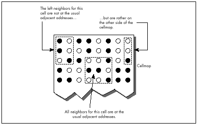
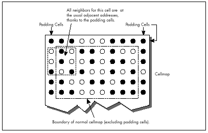

There's a kicker here, though, and that's the counting of neighbors for
cells at the edge of the cellmap. When cellmap wrapping is enabled (so
that the cellmap becomes essentially a toroid, with each edge joined
seamlessly to the opposite edge, as opposed to having a border of
off-cells), neighbors that reside on the other edge of the cellmap can't
be accessed by the standard fixed offset, as shown in Figure 17.1. So,
in general, we could improve performance by hard-wiring our
neighbor-counting for the bit-per-cell cellmap format, but it seems we'd
need a lot of conditional code to handle wrapping, and that would slow
things back down again.



When a problem doesn't lend itself well to optimization, make it a
practice to see if you can change the problem definition to one that
allows for greater efficiency. In this case, we'll change the problem by
putting padding bytes around the edge of the cellmap, and duplicating
each edge of the cellmap in the padding bytes at the opposite side, as
shown in Figure 17.2. That way, a hard-wired neighbor count will find
exactly what it should—the opposite edge—without any special code at
all.

But doesn't that extra copying of the edges take time? Sure, but only a
little; we can build it into the cellmap copying function, and then
frankly we won't even notice it. Avoiding tens or hundreds of thousands
of calls to `cell_state()`, on the other hand, will be *very*
noticeable. Listing 17.3 shows the alterations to Listing 17.1 required
to implement a hard-wired neighbor-counting function. This is a minor
change, in truth, implemented in about half an hour and not making the
code significantly larger—but Listing 17.3 is 3.6 times faster than
Listing 17.1, as shown in Table 17.1. We're up to about 10 generations
per second on a 486; not where we want to be, but it is a vast
improvement.



**LISTING 17.3 L17-3.CPP**

```cpp
/* cellmap class definition, constructor, copy_cells(), set_cell(),
   clear_cell(), cell_state(), count_neighbors(), and
   next_generation() for fast, hard-wired neighbor count approach.
   Otherwise, the same as Listing 17.1 */

class cellmap {
private:
   unsigned char *cells;
   unsigned int width;
   unsigned int width_in_bytes;
   unsigned int height;
   unsigned int length_in_bytes;
public:
   cellmap(unsigned int h, unsigned int v);
   ~cellmap(void);
   void copy_cells(cellmap &sourcemap);
   void set_cell(unsigned int x, unsigned int y);
   void clear_cell(unsigned int x, unsigned int y);
   int cell_state(int x, int y);
   int count_neighbors(int x, int y);
   void next_generation(cellmap& dest_map);
};

/* cellmap constructor. Pads around cell storage area with 1 extra
   byte, used for handling edge wrapping. */
cellmap::cellmap(unsigned int h, unsigned int w)
{
   width = w;
   width_in_bytes = ((w + 7) / 8) + 2; // pad each side with
                                      // 1 extra byte
   height = h;
   length_in_bytes = width_in_bytes * (h + 2);     // pad top/bottom
                                                   // with 1 extra byte
   cells = new unsigned char[length_in_bytes];     // cell storage
   memset(cells, 0, length_in_bytes);              // clear all cells, to start
}

/* Copies one cellmap's cells to another cellmap. If wrapping is
   enabled, copies edge (wrap) bytes into opposite padding bytes in
   source first, so that the padding bytes off each edge have the
   same values as would be found by wrapping around to the opposite
   edge. Both cellmaps are assumed to be the same size. */
void cellmap::copy_cells(cellmap &sourcemap)
{
   unsigned char *cell_ptr;
   int i;

#if WRAP_EDGES
// Copy left and right edges into padding bytes on right and left
   cell_ptr = sourcemap.cells + width_in_bytes;
   for (i=0; i<height; i++) {
      *cell_ptr = *(cell_ptr + width_in_bytes - 2);
      *(cell_ptr + width_in_bytes - 1) = *(cell_ptr + 1);
      cell_ptr += width_in_bytes;
   }
// Copy top and bottom edges into padding bytes on bottom and top
   memcpy(sourcemap.cells, sourcemap.cells + length_in_bytes -
         (width_in_bytes * 2), width_in_bytes);
   memcpy(sourcemap.cells + length_in_bytes - width_in_bytes,
         sourcemap.cells + width_in_bytes, width_in_bytes);
#endif
   // Copy all cells to the destination
   memcpy(cells, sourcemap.cells, length_in_bytes);
}

/* Turns cell on. x and y are offset by 1 byte down and to the right, to compensate for the
padding bytes around the cellmap. */
void cellmap::set_cell(unsigned int x, unsigned int y)
{
   unsigned char *cell_ptr =
         cells + ((y + 1) * width_in_bytes) + ((x / 8) + 1);

   *(cell_ptr) |= 0x80 >> (x & 0x07);
}

/* Turns cell off. x and y are offset by 1 byte down and to the right,
to compensate for the padding bytes around the cell map. */
void cellmap::clear_cell(unsigned int x, unsigned int y)
{
   unsigned char *cell_ptr =
         cells + ((y + 1) * width_in_bytes) + ((x / 8) + 1);

   *(cell_ptr) &= ~(0x80 >> (x & 0x07));
}

/* Returns cell state (1=on or 0=off). x and y are offset by 1 byte
   down and to the right, to
compensate for the padding bytes around
   the cell map. */
int cellmap::cell_state(int x, int y)
{
   unsigned char *cell_ptr =
         cells + ((y + 1) * width_in_bytes) + ((x / 8) + 1);

   return (*cell_ptr & (0x80 >> (x & 0x07))) ? 1 : 0;
}

/* Counts the number of neighboring on-cells for specified cell. */
int cellmap::count_neighbors(int x, int y)
{
   unsigned char *cell_ptr, mask;
   unsigned int neighbor_count;

   // Point to upper left neighbor
   cell_ptr = cells + ((y * width_in_bytes) + ((x + 7) / 8));
   mask = 0x80 >> ((x - 1) & 0x07);
   // Count upper left neighbor
   neighbor_count = (*cell_ptr & mask) ? 1 : 0;
   // Count left neighbor
   if ((*(cell_ptr + width_in_bytes) & mask)) neighbor_count++;
   // Count lower left neighbor
   if ((*(cell_ptr + (width_in_bytes * 2)) & mask)) neighbor_count++;

   // Point to upper neighbor
   if ((mask >>= 1) == 0) {
      mask = 0x80;
      cell_ptr++;
   }
   // Count upper neighbor
   if ((*cell_ptr & mask)) neighbor_count++;
   // Count lower neighbor
   if ((*(cell_ptr + (width_in_bytes * 2)) & mask))  neighbor_count++;

   // Point to upper right neighbor
   if ((mask >>= 1) == 0) {
      mask = 0x80;
      cell_ptr++;
   }
   // Count upper right neighbor
   if ((*cell_ptr & mask)) neighbor_count++;
   // Count right neighbor
   if ((*(cell_ptr + width_in_bytes) & mask)) neighbor_count++;
   // Count lower right neighbor
   if ((*(cell_ptr + (width_in_bytes * 2)) & mask))  neighbor_count++;

   return neighbor_count;
}

/* Calculates the next generation of current_map and stores it in
   next_map. */
void cellmap::next_generation(cellmap& next_map)
{
   unsigned int x, y, neighbor_count;

   for (y=0; y<height; y++) {
      for (x=0; x<width; x++) {
         neighbor_count = count_neighbors(x, y);
         if (cell_state(x, y) == 1) {
            if ((neighbor_count != 2) && (neighbor_count != 3)) {
               next_map.clear_cell(x, y);    // turn it off
               draw_pixel(x, y, OFF_COLOR);
            }
         } else {
            if (neighbor_count == 3) {
               next_map.set_cell(x, y);      // turn it on
               draw_pixel(x, y, ON_COLOR);
            }
         }
      }
   }
}
```
