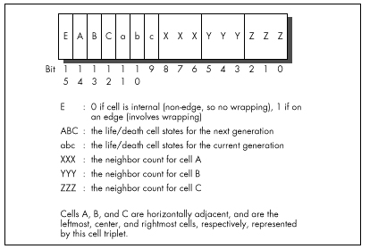

**LISTING 18.3 MAIN.C**

    // MAIN.C
    //
    // David Stafford
    //

    #include <stdlib.h>
    #include <stdio.h>
    #include <conio.h>
    #include <time.h>
    #include <bios.h>
    #include "life.h"

    // functions in VIDEO.C
    void enter_display_mode( void );
    void exit_display_mode( void );
    void show_text( int x, int y, char *text );

    void InitCellmap( void )
      {
      unsigned int i, j, t, x, y, init;

      for( init = (HEIGHT * WIDTH * 3) / 2; init; init— )
        {
        x = random( WIDTH * 3 );
        y = random( HEIGHT );

        CellMap[ (y * WIDTH) + x / 3 ] |= 0x1000 << (2 - (x % 3));
        }

      for( i = j = 0; i < WIDTH * HEIGHT; i++ )
        {
        if( CellMap[ i ] & 0x7000 )
          {
          ChangeList1[ j++ ] = (short)&CellMap[ i ];
          }
        }

      NextGen();   // Set cell states, prime the pump.
      }

    void main( void )
      {
      unsigned long generation = 0;
      char gen_text[ 80 ];
      long start_time, end_time;
      unsigned int seed;

      printf( "Seed (0 for random seed): " );
      scanf( "%d", &seed );
      if( seed == 0 )  seed = (unsigned) time(NULL);
      srand( seed );

      #ifndef NODRAW
      enter_display_mode();
      show_text( 0, 10, "Generation:" );
      #endif

      InitCellmap();       // randomly initialize cell map

      _bios_timeofday( _TIME_GETCLOCK, &start_time );

      do
        {
        NextGen();
        generation++;

        #ifndef NOCOUNTER
        sprintf( gen_text, "%10lu", generation );
        show_text( 0, 12, gen_text );
        #endif
        }
      #ifdef GEN
      while( generation < GEN );
      #else
      while( !kbhit() );
      #endif

      _bios_timeofday( _TIME_GETCLOCK, &end_time );
      end_time -= start_time;

      #ifndef NODRAW
      getch();    // clear keypress
      exit_display_mode();
      #endif

      printf( "Total generations: %ld\nSeed: %u\n", generation, seed );
      printf( "%ld ticks\n", end_time );
      printf( "Time: %f generations/second\n",
              (double)generation / (double)end_time * 18.2 );
      }

**LISTING 18.4 VIDEO.C**

    /* VGA mode 13h functions for Game of Life.
       Tested with Borland C++. */
    #include <stdio.h>
    #include <conio.h>
    #include <dos.h>

    #define TEXT_X_OFFSET   28
    #define SCREEN_WIDTH_IN_BYTES 320

    #define SCREEN_SEGMENT  0xA000

    /* Mode 13h mode-set function. */
    void enter_display_mode()
    {
       union REGS regset;

       regset.x.ax = 0x0013;
       int86(0x10, &regset, &regset);
    }

    /* Text mode mode-set function. */
    void exit_display_mode()
    {
       union REGS regset;

       regset.x.ax = 0x0003;
       int86(0x10, &regset, &regset);
    }

    /* Text display function. Offsets text to non-graphics area of
       screen. */
    void show_text(int x, int y, char *text)
    {
       gotoxy(TEXT_X_OFFSET + x, y);
       puts(text);
    }

**LISTING 18.5 LIFE.H**

    void far NextGen( void );

    extern unsigned short CellMap[];
    extern unsigned short far ChangeList1[];

    #define LEFT        (-2)
    #define RIGHT       (+2)
    #define UP          (WIDTH * LEFT)
    #define DOWN        (WIDTH * RIGHT)
    #define UPPERLEFT   (UP + LEFT)
    #define UPPERRIGHT  (UP + RIGHT)
    #define LOWERLEFT   (DOWN + LEFT)
    #define LOWERRIGHT  (DOWN + RIGHT)
    #define WRAPLEFT    (RIGHT * (WIDTH - 1))
    #define WRAPRIGHT   (LEFT  * (WIDTH - 1))
    #define WRAPUP      (DOWN  * (HEIGHT - 1))
    #define WRAPDOWN    (UP    * (HEIGHT - 1))

### Keeping Track of Change with a Change List {#Heading5}

In my earlier optimizations to the Game of Life, described in the last
chapter, I noted that most cells in a Life cellmap are dead, and in most
cases all the neighbors are dead as well. This observation enabled me to
get a major speed-up by scanning the cellmap for the few non-zero bytes
(cells that were either alive or have neighbors that are alive).
Although that was a big improvement, it still required my code to touch
every cell to check its state. David has improved on this by maintaining
a *change list;* that is, a list of pointers to cells that change in the
current generation. Only those cells and their neighbors need to be
checked or touched in any way in order to create the next generation,
saving a great many instructions and also a great many cache misses due
to the fact that cellmaps are too big to fit into the 486's internal
cache. During a given generation, David runs down the list of cells that
changed from the previous generation to make the changes for this
generation, and in the process generates the change list for the next
generation.

That's the overall approach, but this being David Stafford, it's not
that simple, of course. I'll let him tell you how his implementation
works in his own words. (I've edited David's text a bit, and added my
own comments in square brackets, so blame me for any errors.)

"Each three cells in the life grid are packed into two bytes, as shown
in Figure 18.1. So, it is convenient if the width of the cell array is
an even multiple of three. There's nothing in the algorithm that
prevents it from supporting any arbitrary size, but the code is a bit
simpler this way. So if you want a 200x200 grid, I recommend just using
a 201x200 grid, and be happy with the extra free column. Otherwise the
edge wrapping code gets more complex.

"Since every cell has from zero to eight neighbors, you may be wondering
how I can manage to keep track of them with only three bits. Each cell
really has only a maximum of seven neighbors since we only need to keep
track of neighbors *outside* of the current cell word. That is, if cell
‘B' changes state then we don't need to reflect this in the neighbor
counts of cells ‘A' and ‘C.' Updating is made a little faster. [In other
words, when David picks up a word representing three cells, each of the
three cells has at least one of the other cells in that word as a
neighbor, and the state of that neighbor is stored right in that word,
as shown in Figure 18.1. Therefore, the neighbor count for a given cell
never needs to reflect more than seven neighbors, because at least one
of the eight neighbors' states is already encoded in the word.]

\
 **Figure 18.1**  *Cell triplet storage.*