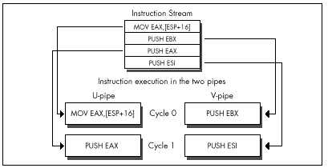

  ------------------------ --------------------------------- --------------------
  [Previous](20-01.html)   [Table of Contents](index.html)   [Next](20-03.html)
  ------------------------ --------------------------------- --------------------

### V-Pipe-Capable Instructions {#Heading4}

Any instruction can go through the U-pipe, and, for practical purposes,
the U-pipe is always executing instructions. (The exceptions are when
the U-pipe execution unit is waiting for instruction or data bytes after
a cache miss, and when a U-pipe instruction finishes before a paired
V-pipe instruction, as I'll discuss below.) Only the instructions shown
in Table 20.1 can go through the V-pipe. In addition, the V-pipe can
execute a separate instruction only when one of the instructions listed
in Table 20.2 is executing in the U-pipe; superscalar execution is not
possible while any instruction not listed in Table 20.2 is executing in
the U-pipe. So, for example, if you use **SHR EDX,CL**, which takes 4
cycles to execute, no other instructions can execute during those 4
cycles; if, on the other hand, you use **SHR EDX,10**, it will take 1
cycle to execute in the U-pipe, and another instruction can potentially
execute concurrently in the V-pipe. (As you can see, similar instruction
sequences can have vastly different performance characteristics on the
Pentium.)

Basically, after the current instruction or pair of instructions is
finished (that is, once neither the U- nor V-pipe is executing
anything), the Pentium sends the next instruction through the U-pipe. If
the instruction after the one in the U-pipe is an instruction the V-pipe
can handle, if the instruction in the U-pipe is pairable, and if
register contention doesn't occur, then the V-pipe starts executing that
instruction, as shown in Figure 20.2. Otherwise, the second instruction
waits until the first instruction is done, then executes in the U-pipe,
possibly pairing with the next instruction in line if all pairing
conditions are met.

* * * * *

    MOV      reg,reg          (1 cycle)
             mem,reg          (1 cycle)
             reg,mem          (1 cycle)
             reg,immediate    (1 cycle)
             mem,immediate    (1 cycle)†

    AND/OR/XOR/ADD/SUB   reg,reg         (1 cycle)
                         mem,reg         (3 cycles)
                         reg,mem         (2 cycles)
                         reg,immediate   (1 cycle)
                         mem,immediate   (3 cycles)†

    INC/DEC  reg     (1 cycle)
             mem     (3 cycles)

    CMP      reg,reg         (1 cycle)
             mem,reg         (2 cycles)
             reg,mem         (2 cycles)
             reg,immediate   (1 cycle)
             mem,immediate   (2 cycles)†

    TEST     reg,reg         (1 cycle)
             EAX,immediate   (1 cycle)

    PUSH/POP reg             (1 cycle)
             immediate       (1 cycle)

    LEA      reg,mem         (1 cycle)

    JCC     near       (1 cycle if predicted correctly;
                        5 cycles otherwise in V-pipe,
                        4 cycles otherwise in U-pipe)

    JMP/CALL near      (1 cycle if predicted correctly;
                        3 cycles otherwise)

    † Can't execute in V-pipe if address contains a displacement

**Table 20.1 Instructions that can execute in the V-pipe.**

* * * * *

The list of instructions the V-pipe can handle is not very long, and the
list of U-pipe pairable instructions is not much longer, but these
actually constitute the bulk of the instructions used in PC software. As
a result, a fair amount of pairing happens even in normal,
non-Pentium-optimized code. This fact, plus the 64-bit 66 MHz bus,
branch prediction, dual 8K internal caches, and other Pentium features,
together mean that a Pentium is considerably faster than a 486 at the
same clock speed, even without Pentium-specific optimization, contrary
to some reports.

Besides, almost all operations can be performed by combinations of
pairable instructions. For example, **PUSH [*mem*]** is not on either
list, but both **MOV *reg*,[*mem*]** and **PUSH *reg*** are, and those
two instructions can be used to push a value stored in memory. In fact,
given the proper instruction stream, the discrete instructions can
perform this operation effectively in just 1 cycle (taking one-half of
each of 2 cycles, for 2\*0.5 = 1 cycle total execution time), as shown
in Figure 20.3—a full cycle *faster* than **PUSH [*mem*]**, which takes
2 cycles.

* * * * *

    MOV      reg,reg           (1 cycle)
             mem,reg           (1 cycle)
             reg,mem           (1 cycle)
             reg,immediate     (1 cycle)
             mem,immediate     (1 cycle)†

    AND/OR/XOR/ADD/SUB/ADC/SBB  reg,reg         (1 cycle)
                                mem,reg         (3 cycles)
                                reg,mem         (2 cycles)
                                reg,immediate   (1 cycle)
                                mem,immediate   (3 cycles)†

    INC/DEC  reg     (1 cycle)
             mem     (3 cycles)

    CMP      reg,reg         (1 cycle)
             mem,reg         (2 cycles)
             reg,mem         (2 cycles)
             reg,immediate   (1 cycle)
             mem,immediate   (2 cycles)†

    TEST     reg,reg         (1 cycle)
             EAX,immediate   (1 cycle)

    PUSH/POP reg             (1 cycle)
             immediate       (1 cycle)

    LEA      reg,mem         (1 cycle)

    SHL/SHR/SAL/SAR  reg,immediate   (1 cycle)††

    ROL/ROR/RCL/RCR  reg,1           (1 cycle)

    †   Can't pair if address contains a displacement
    †† Includes shift-by-1 forms of instructions

**Table 20.2 Instructions that, when executed in the U-pipe, allow
V-pipe-executable instructions to execute simultaneously (pair) in the
V-pipe.**

* * * * *

  ------------------- -------------------------------------------------------------------------------------------------------------------------------------------------------------------------------------------------------------------------------------------------------------------------------------------------------------------------------------------------------------------------------------------------------------------------------------------------------------------
     *A fundamental rule of Pentium optimization is that it pays to break complex instructions into equivalent simple instructions, then shuffle the simple instructions for maximum use of the V-pipe. This is true partly because most of the pairable instructions are simple instructions, and partly because breaking instructions into pieces allows more freedom to rearrange code to avoid the AGIs and register contention I'll discuss in the next chapter.*
  ------------------- -------------------------------------------------------------------------------------------------------------------------------------------------------------------------------------------------------------------------------------------------------------------------------------------------------------------------------------------------------------------------------------------------------------------------------------------------------------------

\
 **Figure 20.2**  *Instruction flow through the two pipes.*

One downside of this "RISCification" (turning complex instructions into
simple, RISC-like ones) of Pentium-optimized code is that it makes for
substantially larger code. For example,

    push dword ptr [esi]

is one byte smaller than this sequence:

    mov eax,[esi]
    push eax

\
 **Figure 20.3**  *Pushing a value from memory effectively in one
cycle.*

A more telling example is the following

    add [MemVar],eax

versus the equivalent:

    mov  edx,[MemVar]
    add  edx,eax
    mov  [MemVar],edx

The single complex instruction takes 3 cycles and is 6 bytes long; with
proper sequencing, interleaving the simple instructions with other
instructions that don't use EDX or **Mem Var**, the three-instruction
sequence can be reduced to 1.5 cycles, but it is *14* bytes long.

  ------------------- ------------------------------------------------------------------------------------------------------------------------------------------------------------------------------------------------------------------------------------------
     *It's not unusual for Pentium optimization to approximately double both performance and code size at the same time. In an important loop, go for performance and ignore the size, but on a program-wide basis, the size bears watching.*
  ------------------- ------------------------------------------------------------------------------------------------------------------------------------------------------------------------------------------------------------------------------------------

  ------------------------ --------------------------------- --------------------
  [Previous](20-01.html)   [Table of Contents](index.html)   [Next](20-03.html)
  ------------------------ --------------------------------- --------------------

* * * * *

Graphics Programming Black Book © 2001 Michael Abrash
