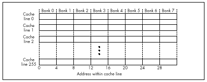

### Lockstep Execution {#Heading5}

You may wonder why anyone would bother breaking **ADD [MemVar],EAX**
into three instructions, given that this instruction can go through
either pipe with equal ease. The answer is that while the
memory-accessing instructions other than **MOV, PUSH**, and **POP**
listed in Table 20.1 (that is, **INC/DEC [*mem*],
ADD/SUB/XOR/AND/OR/CMP/ADC/SBB *reg*,[*mem*]**, and
**ADD/SUB/XOR/AND/OR/CMP/ADC/SBB [*mem*],*reg/immed***) can be paired,
they do not provide the 100 percent overlap that we seek. If you look at
Tables 20.1 and 20.2, you will see that instructions taking from 1 to 3
cycles can pair. However, any pair of instructions goes through the two
pipes in lockstep. This means, for example, that if **ADD [EBX],EDX** is
going through the U-pipe, and **INC EAX** is going through the V-pipe,
the V-pipe will be idle for 2 of the 3 cycles that the U-pipe takes to
execute its instruction, as shown in Figure 20.4. Out of the theoretical
6 cycles of work that can be done during this time, we actually get only
4 cycles of work, or 67 percent utilization. Even though these
instructions pair, then, this sequence fails to make maximum use of the
Pentium's horsepower.

The key here is that when two instructions pair, both execution units
are tied up until both instructions have finished (which means at least
for the amount of time required for the longer of the two to execute,
plus possibly some extra cycles for pairable instructions that can't
fully overlap, as described below). The logical conclusion would seem to
be that we should strive to pair instructions of the same lengths, but
that is often not correct.

  ------------------- ------------------------------------------------------------------------------------------------------------------------------------------------------------------------------------------------------------------------------------------------------------------------
     *The actual rule is that we should strive to pair one-cycle instructions (or, at most, two-cycle instructions, but not three-cycle instructions), which in turn leads to the corollary that we should, in general, use mostly one-cycle instructions when optimizing.*
  ------------------- ------------------------------------------------------------------------------------------------------------------------------------------------------------------------------------------------------------------------------------------------------------------------

\
 **Figure 20.4**  *Lockstep execution and idle time in the V-pipe.*

Here's why. The Pentium is fully capable of handling instructions that
use memory operands in either pipe, or, if necessary, in both pipes at
once. Each pipe has its own write FIFO, which buffers the last few
writes and takes care of writing the data out while the Pentium
continues processing. The Pentium also has a write-back internal data
cache, so data that is frequently changed doesn't have to be written to
external memory (which is much slower than the cache) very often. This
combination means that unless you write large blocks of data at a high
speed, the Pentium should be able to keep up with both pipes' memory
writes without stalling execution.

The Pentium is also designed to satisfy both pipes' needs for reading
memory operands with little waiting. The data cache is constructed so
that both pipes can read from the cache *on the same cycle*. This feat
is accomplished by organizing the data cache as eight-banked memory, as
shown in Figure 20.5, with each 32-byte cache line consisting of 8
dwords, 1 in each bank. The banks are independent of one another, so as
long as the desired data is in the cache and the U- and V-pipes don't
try to read from the same bank on the same cycle, both pipes can read
memory operands on the same cycle. (If there is a cache bank collision,
the V-pipe instruction stalls for one cycle.)

Normally, you won't pay close attention to which of the eight dword
banks your paired memory accesses fall in—that's just too much work—but
you might want to watch out for simultaneously read addresses that have
the same values for address

\
 **Figure 20.5**  *The Pentium's eight bank data cache.*

bits 2, 3, and 4 (fall in the same bank) in tight loops, and you should
also avoid sequences like

    mov  bl,[esi]
    mov  bh,[esi+1]

because both operands will generally be in the same bank. An alternative
is to place another instruction between the two instructions that access
the same bank, as in this sequence:

    mov  bl,[esi]
    mov  edi,edx
    mov  bh,[esi+1]

By the way, the reason a code sequence that takes two instructions to
load a single word is attractive in a 32-bit segment is because it takes
only one cycle when the two instructions can be paired with other
instructions; by contrast, the obvious way of loading BX

    mov bx,[esi]

takes 1.5 to two cycles because the size prefix can't pair, as described
below. This is yet another example of how different Pentium optimization
can be from everything we've learned about its predecessors.

The problem with pairing non-single-cycle instructions arises when a
pipe executes an instruction other than **MOV** that has an explicit
memory operand. (I'll call these *complex memory instructions*. They're
the only pairable instructions, other than branches, that take more than
one cycle.) We've already seen that, because instructions go through the
pipes in lockstep, if one pipe executes a complex memory instruction
such as **ADD EAX,[EBX]** while the other pipe executes a single-cycle
instruction, the pipe with the faster instruction will sit idle for part
of the time, wasting cycles. You might think that if both pipes execute
complex instructions of the same length, then neither would lie idle,
but that turns out to not always be the case. Two two-cycle instructions
(instructions with register destination operands) can indeed pair and
execute in two cycles, so it's okay to pair two instructions such as
these:

    add esi,[SourceSkip]        ;U-pipe cycles 1 and 2
    add edi,[DestinationSkip]   ;V-pipe cycles 1 and 2
