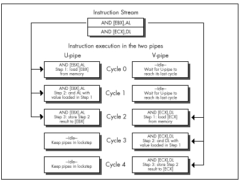
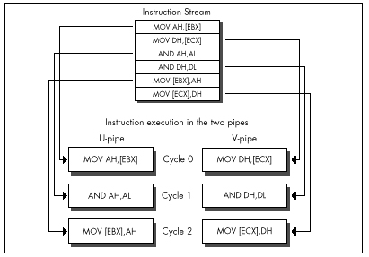
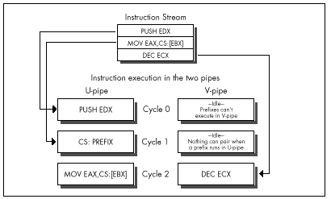

  ------------------------ --------------------------------- --------------------
  [Previous](20-03.html)   [Table of Contents](index.html)   [Next](21-01.html)
  ------------------------ --------------------------------- --------------------

However, this beneficial pairing does not extend to non-**MOV**
instructions with explicit memory destination operands, such as **ADD
[EBX],EAX**. The Pentium executes only one such memory instruction at a
time; if two memory-destination complex instructions get paired, first
the U-pipe instruction is executed, and then the V-pipe instruction,
with only one cycle of overlap, as shown in Figure 20.6. I don't know
for sure, but I'd guess that this is to guarantee that the two pipes
will never perform out-of-order access to any given memory location.
Thus, even though **AND [EBX],AL** pairs with **AND [ECX],DL**, the two
instructions take 5 cycles in all to execute, and 4 cycles of idle
time—2 in the U-pipe and 2 in the V-pipe, out of 10 cycles in all—are
incurred in the process.

\
 **Figure 20.6**  *Non-overlapped lockstep execution.*

\
 **Figure 20.7**  *Interleaving simple instructions for maximum
performance.*

The solution is to break the instructions into simple instructions and
interleave them, as shown in Figure 20.7, which accomplishes the same
task in 3 cycles, with no idle cycles whatsoever. Figure 20.7 is a good
example of what optimized Pentium code generally looks like: mostly
one-cycle instructions, mixed together so that at least two operations
are in progress at once. It's not the easiest code to read or write, but
it's the only way to get both pipes running at capacity.

### Superscalar Notes {#Heading6}

You may well ask why it's necessary to interleave operations, as is done
in Figure 20.7. It seems simpler just to turn

    and [ebx],al

into

    mov   dl,[ebx]
    and   dl,al
    mov   [ebx],dl

and be done with it. The problem here is one of dependency. Before the
Pentium can execute **AND DL,AL,**, it must first know what is in DL,
and it can't know that until it loads DL from the address pointed to by
EBX. Therefore, **AND DL,AL** can't happen until the cycle after **MOV
DL,[EBX]** executes. Likewise, the result can't be stored until the
cycle after **AND DL,AL** has finished. This means that these
instructions, as written, can't possibly pair, so the sequence takes the
same three cycles as **AND [EBX],AL**. (Now it should be clear why **AND
[EBX]**, AL takes 3 cycles.) Consequently, it's necessary to interleave
these instructions with instructions that use other registers, so this
set of operations can execute in one pipe while the other, unrelated set
executes in the other pipe, as is done in Figure 20.7.

What we've just seen is the read-after-write form of the superscalar
hazard known as *register contention*. I'll return to the subject of
register contention in the next chapter; in the remainder of this
chapter I'd like to cover a few short items about superscalar execution.

#### Register Starvation {#Heading7}

The above examples should make it pretty clear that effective
superscalar programming puts a lot of strain on the Pentium's relatively
small register set. There are only seven general-purpose registers (I
strongly suggest using EBP in critical loops), and it does not help to
have to sacrifice one of those registers for temporary storage on each
complex memory operation; in pre-superscalar days, we used to employ
those handy CISC memory instructions to do all that stuff without using
any extra registers.

  ------------------- -------------------------------------------------------------------------------------------------------------------------------------------------------------------------------------------------------------------------------------------------------------------------------------------------------------------------------------------------------------------------------
     *More problematic still is that for maximum pairing, you'll typically have two operations proceeding at once, one in each pipe, and trying to keep two operations in registers at once is difficult indeed. There's not much to be done about this, other than clever and Spartan register usage, but be aware that it's a major element of Pentium performance programming.*
  ------------------- -------------------------------------------------------------------------------------------------------------------------------------------------------------------------------------------------------------------------------------------------------------------------------------------------------------------------------------------------------------------------------

Also be aware that prefixes of every sort, with the sole exception of
the 0FH prefix on non-short conditional jumps, always execute in the
U-pipe, and that Intel's documentation indicates that no pairing can
happen while a prefix byte executes. (As I'll discuss in the next
chapter, my experiments indicate that this rule doesn't always apply to
multiple-cycle instructions, but you still won't go far wrong by
assuming that the above rule is correct and trying to eliminate prefix
bytes.) A prefix byte takes one cycle to execute; after that cycle, the
actual prefixed instruction itself will go through the U-pipe, and if it
and the following instruction are mutually pairable, then they will
pair. Nonetheless, prefix bytes are very expensive, effectively taking
at least as long as two normal instructions, and possibly, if a prefixed
instruction could otherwise have paired in the V-pipe with the previous
instruction, taking as long as three normal instructions, as shown in
Figure 20.8.

Finally, bear in mind that if the instructions being executed have not
already been executed at least once since they were loaded into the
internal cache, they can pair only if the first (U-pipe) instruction is
not only pairable but also exactly 1 byte long, a category that includes
only **INC *reg*, DEC *reg*, PUSH *reg***, and **POP *reg***. Knowing
this can help you understand why sometimes, timing reveals that your
code runs slower than it seems it should, although this will generally
occur only when the cache working set for the code you're timing is on
the order of 8K or more—an awful lot of code to try to optimize.

It should be excruciatingly clear by this point that you *must* time
your Pentium-optimized code if you're to have any hope of knowing if
your optimizations are working as well as you think they are; there are
just too many details involved for you to be sure your optimizations are
working properly without checking. My most basic optimization rule has
always been to grab the Zen timer and *measure actual performance*—and
nowhere is this more true than on the Pentium. Don't believe it until
you measure it!

\
 **Figure 20.8**  *Prefix delays.*

  ------------------------ --------------------------------- --------------------
  [Previous](20-03.html)   [Table of Contents](index.html)   [Next](21-01.html)
  ------------------------ --------------------------------- --------------------

* * * * *

Graphics Programming Black Book © 2001 Michael Abrash
