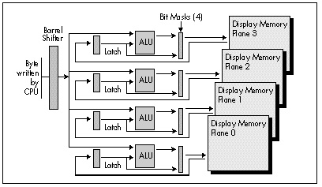
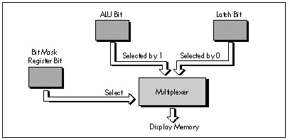

  ------------------------ --------------------------------- --------------------
  [Previous](24-03.html)   [Table of Contents](index.html)   [Next](25-02.html)
  ------------------------ --------------------------------- --------------------

Chapter 25\
 VGA Data Machinery {#Heading1}
-------------------

### The Barrel Shifter, Bit Mask, and Set/Reset Mechanisms {#Heading2}

In the last chapter, we examined a simplified model of data flow within
the GC portion of the VGA, featuring the latches and ALUs. Now we're
ready to expand that model to include the barrel shifter, bit mask, and
the set/reset capabilities, leaving only the write modes to be explored
over the next few chapters.

### VGA Data Rotation {#Heading3}

Figure 25.1 shows an expanded model of GC data flow, featuring the
barrel shifter and bit mask circuitry. Let's look at the barrel shifter
first. A barrel shifter is circuitry capable of shifting—or rotating, in
the VGA's case—data an arbitrary number of bits in a single operation,
as opposed to being able to shift only one bit position at a time. The
barrel shifter in the VGA can rotate incoming CPU data up to seven bits
to the right (toward the least significant bit), with bit 0 wrapping
back to bit 7, after which the VGA continues processing the rotated byte
just as it normally processes unrotated CPU data. Thanks to the nature
of barrel shifters, this rotation requires no extra processing time over
unrotated VGA operations. The number of bits by which CPU data is
shifted is controlled by bits 2-0 of GC register 3, the Data Rotate
register, which also contains the ALU function select bits (data
unmodified, AND, OR, and XOR) that we looked at in the last chapter.

\
 **Figure 25.1**  *Data flow through the Graphics Controller.*

The barrel shifter is powerful, but (as sometimes happens in this
business) it sounds more useful than it really is. This is because the
GC can only rotate CPU data, a task that the CPU itself is perfectly
capable of performing. Two **OUT**s are needed to select a given
rotation: one to set the GC Index register, and one to set the Data
Rotate register. However, with careful programming it's sometimes
possible to leave the GC Index always pointing to the Data Rotate
register, so only one **OUT** is needed. Even so, it's often easier
and/or faster to simply have the CPU rotate the data of interest CL
times than to set the Data Rotate register. (Bear in mind that a single
**OUT** takes from 11 to 31 cycles on a 486—and longer if the VGA is
sluggish at responding to OUTs, as many VGAs are.) If only the VGA could
rotate *latched* data, then there would be all sorts of useful
applications for rotation, but, sadly, only CPU data can be rotated.

The drawing of bit-mapped text is one use for the barrel shifter, and
I'll demonstrate that application below. In general, though, don't knock
yourself out trying to figure out how to work data rotation into your
programs—it just isn't all that useful in most cases.

### The Bit Mask {#Heading4}

The VGA has bit mask circuitry for each of the four memory planes. The
four bit masks operate in parallel and are all driven by the same mask
data for each operation, so they're generally referred to in the
singular, as "the bit mask." Figure 25.2 illustrates the operation of
one bit of the bit mask for one plane. This circuitry occurs eight times
in the bit mask for a given plane, once for each bit of the byte written
to display memory. Briefly, the bit mask determines on a bit-by-bit
basis whether the source for each byte written to display memory is the
ALU for that plane or the latch for that plane.

\
 **Figure 25.2**  *Bit mask operation.*

The bit mask is controlled by GC register 8, the Bit Mask register. If a
given bit of the Bit Mask register is 1, then the corresponding bit of
data from the ALUs is written to display memory for all four planes,
while if that bit is 0, then the corresponding bit of data from the
latches for the four planes is written to display memory unchanged. (In
write mode 3, the actual bit mask that's applied to data written to
display memory is the logical AND of the contents of the Bit Mask
register and the data written by the CPU, as we'll see in Chapter 26.)

The most common use of the bit mask is to allow updating of selected
bits within a display memory byte. This works as follows: The display
memory byte of interest is latched; the bit mask is set to preserve all
but the bit or bits to be changed; the CPU writes to display memory,
with the bit mask preserving the indicated latched bits and allowing ALU
data through to change the other bits. Remember, though, that it is not
possible to alter selected bits in a display memory byte *directly;* the
byte must first be latched by a CPU read, and then the bit mask can keep
selected bits of the latched byte unchanged.

Listing 25.1 shows a program that uses the bit mask data rotation
capabilities of the GC to draw bitmapped text at any screen location.
The BIOS only draws characters on character boundaries; in 640x480
graphics mode the default font is drawn on byte boundaries horizontally
and every 16 scan lines vertically. However, with direct bitmapped text
drawing of the sort used in Listing 25.1, it's possible to draw any font
of any size anywhere on the screen (and a lot faster than via DOS or the
BIOS, as well).

  ------------------------ --------------------------------- --------------------
  [Previous](24-03.html)   [Table of Contents](index.html)   [Next](25-02.html)
  ------------------------ --------------------------------- --------------------

* * * * *

Graphics Programming Black Book © 2001 Michael Abrash
