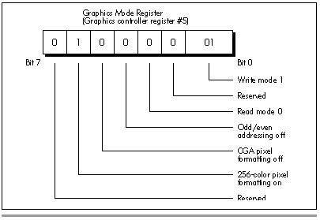

Does that do it for color selection? Yes and no. For the EGA, we've
covered the whole of color selection—but not so for the VGA. The VGA can
emulate everything we've discussed, but actually performs one 4-bit to
8-bit translation (except in 256-color modes, where all 256 colors are
simultaneously available), followed by yet another translation, this one
8-bit to 18-bit. What's more, the VGA has the ability to flip instantly
through as many as 16 16-color sets. The VGA's color selection
capabilities, which are supported by another set of BIOS functions, can
be used to produce stunning color effects, as we'll see when we cover
them starting in Chapter 33.

### Modifying VGA Registers {#Heading7}

EGA registers are not readable. VGA registers are readable. This
revelation will not come as news to most of you, but many programmers
still insist on setting entire VGA registers even when they're modifying
only selected bits, as if they were programming the EGA. This comes to
mind because I recently received a query inquiring why write mode 1 (in
which the contents of the latches are copied directly to display memory)
didn't work in Mode X. (I'll go into Mode X in detail later in this
book.) Actually, write mode 1 does work in Mode X; it didn't work when
this particular correspondent enabled it because he did so by writing
the value 01H to the Graphics Mode register. As it happens, the write
mode field is only one of several fields in that register, as shown in
Figure 29.4. In 256-color modes, one of the other fields—bit 6, which
enables 256-color pixel formatting—is not 0, and setting it to 0 messes
up the screen quite thoroughly.

The correct way to set a field within a VGA register is, of course, to
read the register, mask off the desired field, insert the desired
setting, and write the result back to the register. In the case of
setting the VGA to write mode 1, do this:

```nasm
mov   dx,3ceh          ;Graphics controller index
mov   al,5             ;Graphics mode reg index
out   dx,al            ;point GC index to G_MODE
inc   dx               ;Graphics controller data
in    al,dx            ;get current mode setting
and   al,not 3         ;mask off write mode field
or    al,1             ;set write mode field to 1
out   dx,al            ;set write mode 1
```

This approach is more of a nuisance than simply setting the whole
register, but it's safer. It's also slower; for cases where you must set
a field repeatedly, it might be worthwhile to read and mask the register
once at the start, and save it in a variable, so that the value is
readily available in memory and need not be repeatedly read from the
port. This approach is especially attractive because **IN**s are much
slower than memory accesses on 386 and 486 machines.

Astute readers may wonder why I didn't put a delay sequence, such as
**JMP \$+2**, between the **IN** and **OUT** involving the same
register. There are, after all, guidelines from IBM, specifying that a
certain period should be allowed to elapse before a second access to an
I/O port is attempted, because not all devices can respond as rapidly as
a 286 or faster CPU can access a port. My answer is that while I can't
guarantee that a delay isn't needed, I've never found a VGA that
required one; I suspect that the delay specification has more to do with
motherboard chips such as the timer, the interrupt controller, and the
like, and I sure hate to waste the delay time if it's not necessary.
However, I've never been able to find anyone with the definitive word on
whether delays might ever be needed when accessing VGAs, so if you know
the gospel truth, or if you know of a VGA/processor combo that does
require delays, please let me know by contacting me through the
publisher. You'd be doing a favor for a whole generation of graphics
programmers who aren't sure whether they're skating on thin ice without
those legendary delays.


