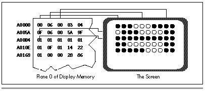

The key to solving this problem lies in recalling that the VGA is
designed to drive a monitor that sweeps the electron beam across the
screen at exactly the same speed, no matter what mode the VGA is in. If
the monitor always sweeps at the same speed, how does the VGA manage to
display both 640 pixels across the screen (in high-resolution graphics
modes) and 720 pixels across the screen (in 80-column text modes)? Good
question indeed—and the answer is that the VGA has not one but *two*
clocks on board, and one of those clocks is just sufficiently faster
than the other clock so that an extra 80 (or 40) pixels can be displayed
on each scan line.

In other words, there's a slow clock (about 25 MHz) that's usually used
in graphics modes to get 640 (or 320) pixels on the screen during each
scan line, and a second, fast clock (about 28 MHz) that's usually used
in text modes to crank out 720 (or 360) pixels per scan line. In
particular, 320x400 256-color mode uses the 25 MHz clock.

I'll bet that you can see where I'm headed: We can switch from the 25
MHz clock to the 28 MHz clock in 320x480 256mode in order to get more
pixels. It takes two clocks to produce one 256-color pixel, so we'll get
40 rather than 80 extra pixels by doing this, bringing our horizontal
resolution to the desired 360 pixels.

Switching horizontal resolutions sounds easy, doesn't it? Alas, it's
not. There's no standard VGA mode that uses the 28 MHz clock to draw 8
rather than 9 dots per character, so the timing parameters have to be
calculated from scratch. John Bridges has already done that for us, but
I want you to appreciate that producing this mode took some work. The
registers controlling the total number of characters per scan line, the
number of characters displayed, the horizontal sync pulse, horizontal
blanking, the offset from the start of one line to the start of the
next, and the clock speed all have to be altered in order to set up
360x480 256-color mode. The function **Set360x480Mode** in Listing 32.1
does all that, and sets up the registers that control vertical
resolution, as well.

Once all that's done, the VGA is in 360x480 mode, awaiting our every
high-resolution 256-color graphics whim.

#### Accessing Display Memory in 360x480 256-Color Mode {#Heading8}

Setting up for 360x480 256-color mode proved to be quite a task. Is
drawing in this mode going to be as difficult?

No. In fact, if you know how to draw in 320x400 256-color mode, you
already know how to draw in 360x480 256-color mode; the conversion
between the two is a simple matter of changing the working screen width
from 320 pixels to 360 pixels. In fact, if you were to take the 320x400
256-color pixel reading and pixel writing code from Chapter 31 and
change the **SCREEN\_WIDTH** equate from 320 to 360, those routines
would work perfectly in 360x480 256-color mode.

The organization of display memory in 360x480 256-color mode is almost
exactly the same as in 320x400 256-color mode, which we covered in
detail in the last chapter. However, as a quick refresher, each byte of
display memory controls one 256-color pixel, just as in mode 13H. The
VGA is reprogrammed by the mode set so that adjacent pixels lie in
adjacent planes of display memory. Look back to Figure 31.1 in the last
chapter to see the organization of the first few pixels on the screen;
the bytes controlling those pixels run cross-plane, advancing to the
next address only every fourth pixel. The address of the pixel at screen
coordinate (*x,y*) is

*address* = ((*y*\*360)+*x*)/4

and the plane of a given pixel is:

*plane* = *x* modulo 4

A new scan line starts every 360 pixels, or 90 bytes, as shown in Figure
32.1. This is the major programming difference between the 360x480 and
320x400 256-color modes; in the 320x400 mode, a new scan line starts
every 80 bytes.

The other programming difference between the two modes is that the area
of display memory mapped to the screen is longer in 360x480 256-color
mode, which is only common sense given that there are more pixels in
that mode. The exact amount of memory required in 360x480 256-color mode
is 360 times 480 = 172,800 bytes. That's more than half of the VGA's 256
Kb memory complement, so page-flipping is out; however, there's no
reason you couldn't use that extra memory to create a virtual screen
larger than 360x480, around which you could then scroll, if you wish.

That's really all there is to drawing in 360x480 256-color mode. From a
programming perspective, this mode is no more complicated than 320x400
256-color mode once the mode set is completed, and should be capable of
good performance given some clever coding. It's not particular
straightforward to implement bitblt, block move, or fast line-drawing
code for any of the extended 256-color modes, but it can be done—and
it's worth the trouble. Even the small taste we've gotten of the
capabilities of these modes shows that they put the traditional CGA,
EGA, and generally even VGA modes to shame.

There's more and better to come, though; in later chapters, we'll return
to high-resolution 256-color programming in a big way, by exploring the
tremendous potential of these modes for real time 2-D and 3-D animation.
