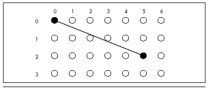
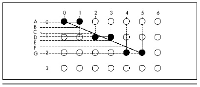

Let's examine the case of drawing a line where the horizontal, or X
length of the line is greater than the vertical, or Y length, and both
lengths are greater than 0. For example, suppose we are drawing a line
from (0,0) to (5,2), as shown in Figure 35.2. Note that Figure 35.2
shows the upper-left-hand corner of the screen as (0,0), rather than
placing (0,0) at its more traditional lower-left-hand corner location.
Due to the way in which the PC's graphics are mapped to memory, it is
simpler to work within this framework, although a translation of Y from
increasing downward to increasing upward could be effected easily enough
by simply subtracting the Y coordinate from the screen height minus 1;
if you are more comfortable with the traditional coordinate system, feel
free to modify the code in Listings 35.1 and 35.3.

In Figure 35.2, the endpoints of the line fall exactly on displayed
pixels. However, no other part of the line squarely intersects the
center of a pixel, meaning that all other pixels will have to be plotted
as approximations of the line. The approach to approximation that
Bresenham's algorithm takes is to move exactly 1 pixel along the major
dimension of the line each time a new pixel is drawn, while moving 1
pixel along the minor dimension each time the line moves more than
halfway between pixels along the minor dimension.

In Figure 35.2, the X dimension is the major dimension. This means that
6 dots, one at each of X coordinates 0, 1, 2, 3, 4, and 5, will be
drawn. The trick, then, is to decide on the correct Y coordinates to
accompany those X coordinates.

It's easy enough to select the Y coordinates by eye in Figure 35.2. The
appropriate Y coordinates are 0, 0, 1, 1, 2, 2, based on the Y
coordinate closest to the line for each X coordinate. Bresenham's
algorithm makes the same selections, based on the same criterion. The
manner in which it does this is by keeping a running record of the error
of the line—that is, how far from the true line the current Y coordinate
is—at each X coordinate, as shown in Figure 35.3. When the running error
of the line indicates that the current Y coordinate deviates from the
true line to the extent that the adjacent Y coordinate would be closer
to the line, then the current Y coordinate is changed to that adjacent Y
coordinate.

Let's take a moment to follow the steps Bresenham's algorithm would go
through in drawing the line in Figure 35.3. The initial pixel is drawn
at (0,0), the starting point of the line. At this point the error of the
line is 0.

Since X is the major dimension, the next pixel has an X coordinate of 1.
The Y coordinate of this pixel will be whichever of 0 (the last Y
coordinate) or 1 (the adjacent Y coordinate in the direction of the end
point of the line) the true line at this X coordinate is closer to. The
running error at this point is B minus A, as shown in Figure 35.3. This
amount is less than 1/2 (that is, less than halfway to the next Y
coordinate), so the Y coordinate does not change at X equal to 1.
Consequently, the second pixel is drawn at (1,0).

The third pixel has an X coordinate of 2. The running error at this
point is C minus A, which is greater than 1/2 and therefore closer to
the next than to the current Y coordinate. The third pixel is drawn at
(2,1), and 1 is subtracted from the running error to compensate for the
adjustment of one pixel in the current Y coordinate. The running error
of the pixel actually drawn at this point is C minus D.

The fourth pixel has an X coordinate of 3. The running error at this
point is E minus D; since this is less than 1/2, the current Y
coordinate doesn't change. The fourth pixel is drawn at (3,1).

The fifth pixel has an X coordinate of 4. The running error at this
point is F minus D; since this is greater than 1/2, the current Y
coordinate advances. The third pixel is drawn at (4,2), and 1 is
subtracted from the running error. The error of the pixel drawn at this
point is G minus F.

Finally, the sixth pixel is the end point of the line. This pixel has an
X coordinate of 5. The running error at this point is G minus G, or 0,
indicating that this point is squarely on the true line, as of course it
should be given that it's the end point, so the current Y coordinate
remains the same. The end point of the line is drawn at (5,2), and the
line is complete.

That's really all there is to Bresenham's algorithm. The algorithm is a
process of drawing a pixel at each possible coordinate along the major
dimension of the line, each with the closest possible coordinate along
the minor dimension. The running error is used to keep track of when the
coordinate along the minor dimension must change in order to remain as
close as possible to the true line. The above description of the case
where X is the major dimension, Y is the minor dimension, and both
dimensions are greater than zero is readily generalized to all eight
octants in which lines could be drawn, as we will see in the C
implementation.

The above discussion summarizes the nature rather than the exact
mechanism of Bresenham's line-drawing algorithm. I'll provide a brief
seat-of-the-pants discussion of the algorithm in action when we get to
the C implementation of the algorithm; for a full mathematical
treatment, I refer you to pages 433-436 of Foley and Van Dam's
*Fundamentals of Interactive Computer Graphics* (Addison-Wesley, 1982),
or pages 72-78 of the second edition of that book, which was published
under the name *Computer Graphics: Principles and Practice*
(Addison-Wesley, 1990). These sources provide the derivation of the
integer-only, divide-free version of the algorithm, as well as Pascal
code for drawing lines in one of the eight possible octants.

#### Strengths and Weaknesses {#Heading5}

The overwhelming strength of Bresenham's line-drawing algorithm is
speed. With no divides, no floating-point operations, and no need for
variables that won't fit in 16 bits, it is perfectly suited for PCs.

The weakness of Bresenham's algorithm is that it produces relatively
low-quality lines by comparison with most other line-drawing algorithms.
In particular, lines generated with Bresenham's algorithm can tend to
look a little jagged. On the PC, however, jagged lines are an inevitable
consequence of relatively low resolution and a small color set, so lines
drawn with Bresenham's algorithm don't look all that much different from
lines drawn in other ways. Besides, in most applications, users are far
more interested in the overall picture than in the primitive elements
from which that picture is built. As a general rule, any collection of
pixels that trend from point A to point B in a straight fashion is
accepted by the eye as a line. Bresenham's algorithm is successfully
used by many current PC programs, and by the standard of this wide
acceptance the algorithm is certainly good enough.

Then, too, users hate waiting for their computer to finish drawing. By
any standard of drawing performance, Bresenham's algorithm excels.
