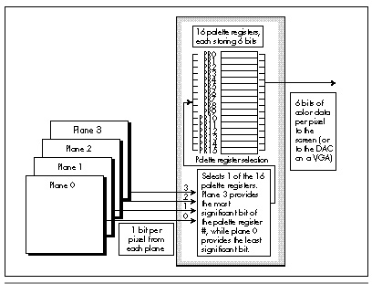
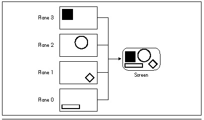
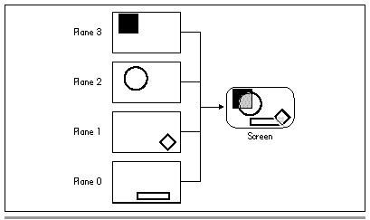

## Chapter 43\
 Bit-Plane Animation {#Heading1}

### A Simple and Extremely Fast Animation Method for Limited Color {#Heading2}

When it comes to computers, my first love is animation. There's nothing
quite like the satisfaction of fooling the eye and creating a miniature
reality simply by rearranging a few bytes of display memory. What makes
animation particularly interesting is that it has to happen fast (as
measured in human time), and without blinking and flickering, or else
you risk destroying the illusion of motion and solidity. Those
constraints make animation the toughest graphics challenge—and also the
most rewarding.

It pains me to hear industry pundits rag on the PC when it comes to
animation. Okay, I'll grant you that the PC isn't a Silicon Graphics
workstation and never will be, but then neither is anything else on the
market. The VGA offers good resolution and color, and while the hardware
wasn't *designed* for animation, that doesn't mean we can't put it to
work in that capacity. One lesson that any good PC graphics or assembly
programmer learns quickly is that it's what the PC's hardware *can*
do—not what it was intended to do—that's important. (By the way, if I
were to pick one aspect of the PC to dump on, it would be sound, not
animation. The PC's sound circuity really is lousy, and it's hard to
understand why that should be, given that a cheap sound chip—which even
the almost-forgotten PC*jr*had—would have changed everything. I guess
IBM figured "serious" computer users would be put off by a computer that
could make fun noises.)

Anyway, my point is that the PC's animation capabilities are pretty
good. There's a trick, though: You can only push the VGA to its
animation limits by stretching your mind a bit and using some unorthodox
approaches to animation. In fact, stretching your mind is the key to
producing good code for *any* task on the PC—that's the topic of the
first part of this book. For most software, however, it's not fatal if
your code isn't excellent—there's slow but functional software all over
the place. When it comes to VGA animation, though, you won't get to
first base without a clever approach.

So, what clever approaches do I have in mind? All sorts. The resources
of the VGA (or even its now-ancient predecessor, the EGA) are many and
varied, and can be applied and combined in hundreds of ways to produce
effective animation. For example, refer back to Chapter 23 for an
example of page flipping. Or look at the July 1986 issue of *PC Tech
Journal*, which describes the basic block-move animation technique, or
the August 1987 issue of *PC Tech Journal*, which shows a
software-sprite scheme built around the EGA's vertical interrupt and the
AND-OR image drawing technique. Or look over the rest of this book,
which contains dozens of tips and tricks that can be applied to
animation, including Mode X-based techniques starting in Chapter 47 that
are the basis for many commercial games.

This chapter adds yet another sort of animation to the list. We're going
to take advantage of the bit-plane architecture and color palette of the
VGA to develop an animation architecture that can handle several
overlapping images with terrific speed and with virtually perfect visual
quality. This technique produces no overlap effects or flicker and
allows us to use the fastest possible method to draw images—the **REP
MOVS** instruction. It has its limitations, but unlike Mode X and some
other animation techniques, the techniques I'll show you in this chapter
will also work on the EGA, which may be important in some applications.

As with any technique on the PC, there are tradeoffs involved with
bit-plane animation. While bit-plane animation is extremely attractive
as far as performance and visual quality are concerned, it is somewhat
limited. Bit-plane animation supports only four colors plus the
background color at any one time, each image must consist of only one of
the four colors, and it's preferable that images of the same color not
intersect.

It doesn't much matter if bit-plane animation isn't perfect for all
applications, though. The real point of showing you bit-plane animation
is to bring home the reality that the VGA is a complex adapter with many
resources, and that you can do remarkable things if you understand those
resources and come up with creative ways to put them to work at specific
tasks.

### Bit-Planes: The Basics {#Heading3}

The underlying principle of bit-plane animation is extremely simple. The
VGA has four separate bit planes in modes 0DH, 0EH, 10H, and 12H. Plane
0 normally contains data for the blue component of pixel color, plane 1
normally contains green pixel data, plane 2 red pixel data, and plane 3
intensity pixel data—but we're going to mix that up a bit in a moment,
so we'll simply refer to them as planes 0, 1, 2, and 3 from now on.

Each bit plane can be written to independently. The contents of the four
bit planes are used to generate pixels, with the four bits that control
the color of each pixel coming from the four planes. However, the bits
from the planes go through a look-up stage on the way to becoming
pixels—they're used to look up a 6-bit color from one of the sixteen
palette registers. Figure 43.1 shows how the bits from the four planes
feed into the palette registers to select the color of each pixel. (On
the VGA specifically, the output of the palette registers goes to the
DAC for an additional look-up stage, as described in Chapters 33 and 34
and also Chapter A on the companion CD-ROM.)

Take a good look at Figure 43.1. Any light bulbs going on over your head
yet? If not, consider this. The general problem with VGA animation is
that it's complex and time-consuming to manipulate images that span the
four planes (as most do), and that it's hard to avoid interference
problems when images intersect, since those images share the same bits
in display memory. Since the four bit planes can be written to and read
from independently, it should be apparent that if we could come up with
a way to display images from each plane independently of whatever images
are stored in the other planes, we would have four sets of images that
we could manipulate very easily. There would be no interference effects
between images in different planes, because images in one plane wouldn't
share bits with images in another plane. What's more, since all the bits
for a given image would reside in a single plane, we could do away with
the cumbersome programming of the VGA's complex hardware that is needed
to manipulate images that span multiple planes.

\
 **Figure 43.1**  *How 4 bits of video data become 6 bits of color.*

All in all, it would be a good deal if we could store each image in a
single plane, as shown in Figure 43.2. However, a problem arises when
images in different planes overlap, as shown in Figure 43.3. The
combined bits from overlapping images generate new colors, so the
overlapping parts of the images don't look like they belong to either of
the two images. What we really want, of course, is for one of the images
to appear to be in front of the other. It would be better yet if the
rearward image showed through any transparent (that is,
background-colored) parts of the forward image. Can we do that?

You bet.

\
 **Figure 43.2**  *Storing images in separate planes.*

\
 **Figure 43.3**  *The problem of overlapping colors.*
