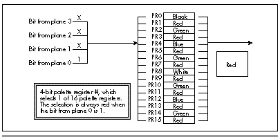

#### Stacking the Palette Registers {#Heading4}

Suppose that instead of viewing the four bits per pixel coming out of
display memory as selecting one of sixteen colors,we view those bits as
selecting one of *four* colors. If the bit from plane 0 is 1, that would
select color 0 (say, red). The bit from plane 1 would select color 1
(say, green), the bit from plane 2 would select color 2 (say, blue), and
the bit from plane 3 would select color 3 (say, white). Whenever more
than 1 bit is 1, the 1 bit from the lowest-numbered plane would
determine the color, and 1 bits from all other planes would be ignored.
Finally, the absence of any 1 bits at all would select the background
color (say, black).

That would give us four colors and the background color. It would also
give us nifty image precedence, with images in plane 0 appearing to be
in front of images from the other planes, images in plane 1 appearing to
be in front of images from planes 2 and 3, and so on. It would even give
us transparency, where rearward images would show through holes within
and around the edges of images in forward planes. Finally, and most
importantly, it would meet all the criteria needed to allow us to store
each image in a single plane, letting us manipulate the images very
quickly and with no reprogramming of the VGA's hardware other than the
few `OUT` instructions required to select the plane we want to write
to.

Which leaves only one question: How do we get this magical
pixel-precedence scheme to work? As it turns out, all we need to do is
reprogram the palette registers so that the 1 bit from the plane with
the highest precedence determines the color. The palette RAM settings
for the colors described above are summarized in Table 43.1.

Remember that the 4-bit values coming from display memory select which
palette register provides the actual pixel color. Given that, it's easy
to see that the rightmost 1-bit of the four bits coming from display
memory in Table 43.1 selects the pixel color. If the bit from plane 0 is
1, then the color is red, no matter what the other bits are, as shown in
Figure 43.4. If the bit from plane 0 is 0, then if the bit from plane 1
is 1 the color is green, and so on for planes 2 and 3. In other words,
with the palette register settings we instantly have exactly what we
want, which is an approach that keeps images in one plane from
interfering with images in other planes while providing precedence and
transparency.

| Bit Value For Plane\
 3 2 1 0 | Palette Register | Register setting |
|-----------------------------|------------------|------------------|
| 0 0 0 0                     | 0                | 00H (black)      |
| 0 0 0 1                     | 1                | 3CH (red)        |
| 0 0 1 0                     | 2                | 3AH (green)      |
| 0 0 1 1                     | 3                | 3CH (red)        |
| 0 1 0 0                     | 4                | 39H (blue)       |
| 0 1 0 1                     | 5                | 3CH (red)        |
| 0 1 1 0                     | 6                | 3AH (green)      |
| 0 1 1 1                     | 7                | 3CH (red)        |
| 1 0 0 0                     | 8                | 3FH (white)      |
| 1 0 0 1                     | 9                | 3CH (red)        |
| 1 0 1 0                     | 10               | 3AH (green)      |
| 1 0 1 1                     | 11               | 3CH (red)        |
| 1 1 0 0                     | 12               | 39H (blue)       |
| 1 1 0 1                     | 13               | 3CH (red)        |
| 1 1 1 0                     | 14               | 3AH (green)      |
| 1 1 1 1                     | 15               | 3CH (red)        |

Table: Table 43.1 Palette RAM settings for bit-plane animation.

Seems almost too easy, doesn't it? Nonetheless, it works beautifully, as
we'll see very shortly. First, though, I'd like to point out that
there's nothing sacred about plane 0 having precedence. We could
rearrange the palette register settings so that any plane had the
highest precedence, followed by the other planes in any order. I've
chosen to make plane 0 the highest precedence only because it seems
simplest to think of plane 0 as appearing in front of plane 1, which is
in front of plane 2, which is in front of plane 3.

### Bit-Plane Animation in Action {#Heading5}

Without further ado, Listing 43.1 shows bit-plane animation in action.
Listing 43.1 animates 13 rather large images (each 32 pixels on a side)
over a complex background at a good clip *even on a primordial
8088-based PC*. Five of the images move very quickly, while the other 8
bounce back and forth at a steady pace.
