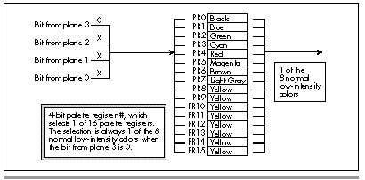

  ------------------------ --------------------------------- --------------------
  [Previous](43-04.html)   [Table of Contents](index.html)   [Next](43-06.html)
  ------------------------ --------------------------------- --------------------

Another limitation of bit-plane animation is that it's best if images
stored in the same plane never cross each other. Why? Because when
images do cross, the blank fringe

* * * * *

Palette Register

Register Setting

* * * * *

0

00H (black)

1

01H (blue)

2

02H (green)

3

03H (cyan)

4

04H (red)

5

05H (magenta)

6

14H (brown)

7

07H (light gray)

8

3EH (yellow)

9

3EH (yellow)

10

3EH (yellow)

1

13EH (yellow)

12

3EH (yellow)

13

3EH (yellow)

14

3EH (yellow)

15

3EH (yellow)

* * * * *

Table 43.2 Palette RAM settings for two-plane animation.

* * * * *

around each image can temporarily erase the overlapped parts of the
other image or images, resulting in momentary flicker. While that's not
fatal, it certainly detracts from the rock-solid animation effect of
bit-plane animation.

Not allowing images in the same plane to overlap is actually less of a
limitation than it seems. Run Listing 43.1 again. Unless you were
looking for it, you'd never notice that images of the same color almost
never overlap—there's plenty of action to distract the eye, and the
trajectories of images of the same color are arranged so that they have
a full range of motion without running into each other. The only
exception is the chain of green images, which occasionally doubles back
on itself when it bounces directly into a corner and reverses direction.
Here, however, the images are moving so quickly that the brief moment
during which one image's fringe blanks a portion of another image is
noticeable only upon close inspection, and not particularly unaesthetic
even then.

\
 **Figure 43.5**  *Pixel precedence for plane 3 only.*

When a technique has such tremendous visual and performance advantages
as does bit-plane animation, it behooves you to design your animation
software so that the limitations of the animation technique don't get in
the way. For example, you might design a shooting gallery game with all
the images in a given plane marching along in step in a continuous band.
The images could never overlap, so bit-plane animation would produce
very high image quality.

### Shearing and Page Flipping {#Heading7}

As Listing 43.1 runs, you may occasionally see an image shear, with the
top and bottom parts of the image briefly offset. This is a consequence
of drawing an image directly into memory as that memory is being scanned
for video data. Occasionally the CRT controller scans a given area of
display memory for pixel data just as the program is changing that same
memory. If the CRT controller scans memory faster than the CPU can
modify that memory, then the CRT controller can scan out the bytes of
display memory that have been already been changed, pass the point in
the image that the CPU is currently drawing, and start scanning out
bytes that haven't yet been changed. The result: Mismatched upper and
lower portions of the image.

  ------------------------ --------------------------------- --------------------
  [Previous](43-04.html)   [Table of Contents](index.html)   [Next](43-06.html)
  ------------------------ --------------------------------- --------------------

* * * * *

Graphics Programming Black Book © 2001 Michael Abrash
