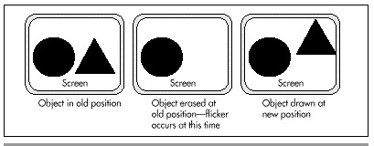
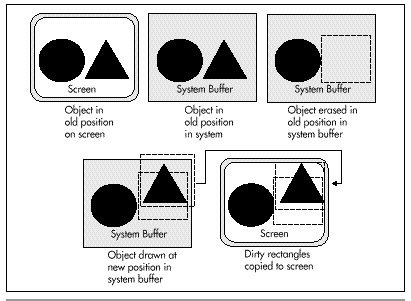

Of course, VGA display memory has its own performance problems. The
fastest ISA bus VGA can, at best, support sustained write times of about
10 cycles per word-sized write on a 486/33; 15 or 20 cycles is more
common, even for relatively fast SuperVGAs; the worst case I've seen is
65 cycles per byte. However, intermittent writes, mixed with a lot of
register and cache-only code, can effectively execute in one cycle,
thanks to the caching design of many VGAs and the 486's 4-deep write
buffer, which stores pending writes while the CPU continues executing
instructions. Display memory reads tend to take longer, because
coprocessing isn't possible—one microsecond is a reasonable rule of
thumb for VGA reads, although there's considerable variation. So VGA
memory tends not to be as bad as VGA I/O, but lord knows it isn't
*good*.

* * * * *

OUT Time in Microseconds and Cycles

OUT Instruction

Official Time

486 \#1/16-bit VGA \#1

486 \#2/16-bit VGA \#2

* * * * *

OUT DX,AL

repeated 1,000 times nonstop\
 (maximum byte access)

0.300 s\
 10 cycles

2.546 s\
 84 cycles

0.813 s\
 27 cycles

OUT DX,AX

repeated 1,000 times nonstop\
 (maximum word access)

0.300 s\
 10 cycles

3.820 s\
 126 cycles

1.066 s\
 35 cycles

OUT DX,AL

repeated 1,000 times,\
 but interspersed with MULs\
 (random byte access)

0.300 s\
 10 cycles

1.610 s\
 53 cycles

0.780 s\
 26 cycles

OUT DX,AX

repeated 1,000 times,\
 but interspersed with MULs\
 (random word access)

0.300 s\
 10 cycles

2.830 s\
 93 cycles

1.010 s\
 33 cycles

**Table 45.1 Results of I/O performance tests run under the Phar
Lap386|DOS-Extender.**

* * * * *

  ------------------- -------------------------------------------------------------------------------------------------------------------------------------------------------------------------------------------------------------------------------------------------------------------------------------------------------------------------------------------
     ***OUT**s, in general, are lousy on the 486 (and to think they only took three cycles on the 286!). **OUT**s to VGAs are particularly lousy. Display memory performance is pretty poor, especially for reads. The conclusions are obvious, I would hope. Structure your graphics code, and, in general, all 486 code, to avoid **OUT**s.*
  ------------------- -------------------------------------------------------------------------------------------------------------------------------------------------------------------------------------------------------------------------------------------------------------------------------------------------------------------------------------------

For graphics, this especially means using write mode 3 rather than the
bit-mask register. When you must use the bit mask, arrange drawing so
that you can set the bit mask once, then do a lot of drawing with that
mask. For example, draw a whole edge at once, then the middle, then the
other edge, rather than setting the bit mask several times on each scan
line to draw the edge and middle bytes together. Don't read from display
memory if you don't have to. Write each pixel once and only once.

It is indeed a strange concept: The key to fast graphics is staying away
from the graphics adapter as much as possible.

### Dirty-Rectangle Animation {#Heading5}

The relative slowness of VGA hardware is part of the appeal of the
technique that I call "dirty-rectangle" animation, in which a complete
copy of the contents of display memory is maintained in offscreen system
(nondisplay) memory. All drawing is done to this system buffer. As
offscreen drawing is done, a list is maintained of the bounding
rectangles for the drawn-to areas; these are the *dirty rectangles*,
"dirty" in the sense that that have been altered and no longer match the
contents of the screen. After all drawing for a frame is completed, all
the dirty rectangles for that frame are copied to the screen in a burst,
and then the cycle of off-screen drawing begins again.

Why, exactly, would we want to go through all this complication, rather
than simply drawing to the screen in the first place? The reason is
visual quality. If we were to do all our drawing directly to the screen,
there'd be a lot of flicker as objects were erased and then redrawn.
Similarly, overlapped drawing done with the painter's algorithm (in
which farther objects are drawn first, so that nearer objects obscure
them) would flicker as farther objects were visible for short periods.
With dirty-rectangle animation, only the finished pixels for any given
frame ever appear on the screen; intermediate results are never visible.
Figure 45.1 illustrates the visual problems associated with drawing
directly to the screen; Figure 45.2 shows how dirty-rectangle animation
solves these problems.

\
 **Figure 45.1**  *Drawing directly to the screen.*

\
 **Figure 45.2**  *Dirty rectangle animation.*

#### So Why Not Use Page Flipping? {#Heading6}

Well, then, if we want good visual quality, why not use page flipping?
For one thing, not all adapters and all modes support page flipping. The
CGA and MCGA don't, and neither do the VGA's 640x480 16-color or 320x200
256-color modes, or many SuperVGA modes. In contrast, *all* adapters
support dirty-rectangle animation. Another advantage of dirty-rectangle
animation is that it's generally faster. While it may seem strange that
it would be faster to draw off-screen and then copy the result to the
screen, that is often the case, because dirty-rectangle animation
usually reduces the number of times the VGA's hardware needs to be
touched, especially in 256-color modes.

This reduction comes about because when dirty rectangles are erased,
it's done in system memory, not in display memory, and since most
objects move a good deal less than their full width (that is, the new
and old positions overlap), display memory is written to fewer times
than with page flipping. (In 16-color modes, this is not necessarily the
case, because of the parallelism obtained from the VGA's planar
hardware.) Also, read/modify/write operations are performed in fast
system memory rather than slow display memory, so display memory rarely
needs to be read. This is particularly good because display memory is
generally even slower for reads than for writes.
