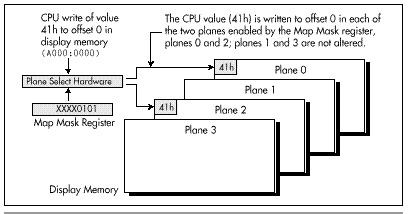

### Hardware Assist from an Unexpected Quarter {#Heading6}

Listing 47.5 illustrates the benefits of designing code from a Mode X
perspective; this is the software aspect of Mode X optimization, which
suffices to make Mode X about as fast as mode 13H. That alone makes Mode
X an attractive mode, given its square pixels, page flipping, and
offscreen memory, but superior performance would nonetheless be a
pleasant addition to that list. Superior performance is indeed possible
in Mode X, although, oddly enough, it comes courtesy of the VGA's
hardware, which was never designed to be used in 256-color modes.

All of the VGA's hardware assist features are available in Mode X,
although some are not particularly useful. The VGA hardware feature
that's truly the key to Mode X performance is the ability to process
four planes' worth of data in parallel; this includes both the latches
and the capability to fan data out to any or all planes. For rectangular
fills, we'll just need to fan the data out to various planes, so I'll
defer a discussion of other hardware features for now. (By the way, the
ALUs, bit mask, and most other VGA hardware features are also available
in mode 13H—but parallel data processing is not.)

In planar modes, such as Mode X, a byte written by the CPU to display
memory may actually go to anywhere between zero and four planes, as
shown in Figure 47.2. Each plane for which the setting of the
corresponding bit in the Map Mask register is 1 receives the CPU data,
and each plane for which the corresponding bit is 0 is not modified.

In 16-color modes, each plane contains one-quarter of each of eight
pixels, with the 4 bits of each pixel spanning all four planes. Not so
in Mode X. Look at Figure 47.1 again; each plane contains one pixel in
its entirety, with four pixels at any given address, one per plane.
Still, the Map Mask register does the same job in Mode X as in 16-color
modes; set it to 0FH (all 1-bits), and all four planes will be written
to by each CPU access. Thus, it would seem that up to four pixels could
be set by a single Mode X byte-sized write to display memory,
potentially speeding up operations like rectangle fills by four times.

And, as it turns out, four-plane parallelism works quite nicely indeed.
Listing 47.6 is yet another rectangle-fill routine, this time using the
Map Mask to set up to four pixels per **STOS.** The only trick to
Listing 47.6 is that any left or right edge that isn't aligned to a
multiple-of-four pixel column (that is, a column at which one four-pixel
set ends and the next begins) must be clipped via the Map Mask register,
because not all pixels at the address containing the edge are modified.
Performance is as expected; Listing 47.6 is nearly ten times faster at
clearing the screen than Listing 47.4 and just about four times faster
than Listing 47.5—and also about four times faster than the same
rectangle fill in mode 13H. Understanding the bitmap organization and
display hardware of Mode X does indeed pay.

Note that the return from Mode X's parallelism is not always 4x; some
adapters lack the underlying memory bandwidth to write data that fast.
However, Mode X parallel access should always be faster than mode 13H
access; the only question on any given adapter is how *much* faster.
