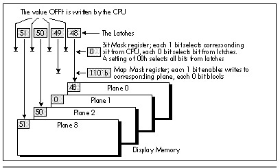

  ------------------------ --------------------------------- --------------------
  [Previous](47-07.html)   [Table of Contents](index.html)   [Next](48-02.html)
  ------------------------ --------------------------------- --------------------

Chapter 48\
 Mode X Marks the Latch {#Heading1}
-----------------------

### The Internals of Animation’s Best Video Display Mode {#Heading2}

In the previous chapter, I introduced you to what I call Mode X, an
undocumented 320x240 256-color mode of the VGA. Mode X is distinguished
from mode 13H, the documented 320x200 256-color VGA mode, in that it
supports page flipping, makes off-screen memory available, has square
pixels, and, above all, lets you use the VGA’s hardware to increase
performance by as much as four times. (Of course, those four times come
at the cost of more complex and demanding programming, to be sure—but
end users care about results, not how hard the code was to write, and
Mode X delivers results in a big way.) In the previous chapter we saw
how the VGA’s plane-oriented hardware can be used to speed solid fills.
That’s a nice technique, but now we’re going to move up to the big
guns—the VGA latches.

The VGA has four latches, one for each plane of display memory. Each
latch stores exactly one byte, and that byte is always the last byte
read from the corresponding plane of display memory, as shown in Figure
48.1. Furthermore, whenever a given address in display memory is read,
all four planes’ bytes at that address are read and stored in the
corresponding latches, regardless of which plane supplied the byte
returned to the CPU (as determined by the Read Map register). As with so
much else about the VGA, the above will make little sense to VGA
neophytes, but the important point is this: By reading one display
memory byte, 4 bytes—one from each plane—can be loaded into the latches
at once. Any or all of those 4 bytes can then be written anywhere in
display memory with a single byte-sized write, as shown in Figure 48.2.

\
 **Figure 48.1**  *How the VGA latches are loaded.*

\
 **Figure 48.2**  *Writing 4 bytes to display memory in a single
operation.*

The upshot is that the latches make it possible to copy data around from
one part of display memory to another, 32 bits (four pixels) at a
time—four times as fast as normal. (Recall from the previous chapter
that in Mode X, pixels are stored one per byte, with four pixels in a
row stored in successive planes at the same address, one pixel per
plane.) However, any one latch can only be loaded from and written to
the corresponding plane, so an individual latch can only work with every
fourth pixel on the screen; the latch for plane 0 can work with pixels
0, 4, 8..., the latch for plane 1 with pixels 1, 5, 9..., and so on.

The latches aren’t intended for use in 256-color mode—they were designed
to allow individual bits of display memory to be modified in 16-color
mode—but they are nonetheless very useful in Mode X, particularly for
patterned fills and screen-to-screen copies, including scrolls.
Patterned filling is a good place to start, because patterns are widely
used in windowing environments for desktops, window backgrounds, and
scroll bars, and for textures and color dithering in drawing and game
software.

Fast Mode X fills using patterns that are four pixels in width can be
performed by drawing the pattern once to the four pixels at any one
address in display memory, reading that address to load the pattern into
the latches, setting the Bit Mask register to 0 to specify that all bits
drawn to display memory should come from the latches, and then
performing the fill pretty much as we did in the previous chapter—except
that each line of the pattern must be loaded into the latches before the
corresponding scan line on the screen is filled. Listings 48.1 and 48.2
together demonstrate a variety of fast Mode X four-by-four pattern
fills. (The mode set function called by Listing 48.1 is from the
previous chapter’s listings.)

**LISTING 48.1 L48-1.C**

    /* Program to demonstrate Mode X (320x240, 256 colors) patterned
       rectangle fills by filling the screen with adjacent 80x60
       rectangles in a variety of patterns. Tested with Borland C++
       in C compilation mode and the small model */
    #include <conio.h>
    #include <dos.h>

    void Set320x240Mode(void);
    void FillPatternX(int, int, int, int, unsigned int, char*);

    /* 16 4x4 patterns */
    static char Patt0[]={10,0,10,0,0,10,0,10,10,0,10,0,0,10,0,10};
    static char Patt1[]={9,0,0,0,0,9,0,0,0,0,9,0,0,0,0,9};
    static char Patt2[]={5,0,0,0,0,0,5,0,5,0,0,0,0,0,5,0};
    static char Patt3[]={14,0,0,14,0,14,14,0,0,14,14,0,14,0,0,14};
    static char Patt4[]={15,15,15,1,15,15,1,1,15,1,1,1,1,1,1,1};
    static char Patt5[]={12,12,12,12,6,6,6,12,6,6,6,12,6,6,6,12};
    static char Patt6[]={80,80,80,80,80,80,80,80,80,80,80,80,80,80,80,15};
    static char Patt7[]={78,78,78,78,80,80,80,80,82,82,82,82,84,84,84,84};
    static char Patt8[]={78,80,82,84,80,82,84,78,82,84,78,80,84,78,80,82};
    static char Patt9[]={78,80,82,84,78,80,82,84,78,80,82,84,78,80,82,84};
    static char Patt10[]={0,1,2,3,4,5,6,7,8,9,10,11,12,13,14,15};
    static char Patt11[]={0,1,2,3,0,1,2,3,0,1,2,3,0,1,2,3};
    static char Patt12[]={14,14,9,9,14,9,9,14,9,9,14,14,9,14,14,9};
    static char Patt13[]={15,8,8,8,15,15,15,8,15,15,15,8,15,8,8,8};
    static char Patt14[]={3,3,3,3,3,7,7,3,3,7,7,3,3,3,3,3};
    static char Patt15[]={0,0,0,0,0,64,0,0,0,0,0,0,0,0,0,89};
    /* Table of pointers to the 16 4x4 patterns with which to draw */
    static char* PattTable[] = {Patt0,Patt1,Patt2,Patt3,Patt4,Patt5,Patt6,
          Patt7,Patt8,Patt9,Patt10,Patt11,Patt12,Patt13,Patt14,Patt15};
    void main() {
       int i,j;
       union REGS regset;

       Set320x240Mode();
       for (j = 0; j < 4; j++) {
          for (i = 0; i < 4; i++) {
             FillPatternX(i*80,j*60,i*80+80,j*60+60,0,PattTable[j*4+i]);
          }
       }
       getch();
       regset.x.ax = 0x0003;   /* switch back to text mode and done */
       int86(0x10, &regset, &regset);
    }

  ------------------------ --------------------------------- --------------------
  [Previous](47-07.html)   [Table of Contents](index.html)   [Next](48-02.html)
  ------------------------ --------------------------------- --------------------

* * * * *

Graphics Programming Black Book © 2001 Michael Abrash
