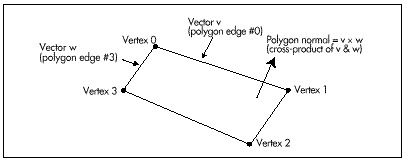

  ------------------------ --------------------------------- --------------------
  [Previous](51-01.html)   [Table of Contents](index.html)   [Next](51-03.html)
  ------------------------ --------------------------------- --------------------

For a single convex polyhedron, removal of polygons that aren’t facing
the viewer would solve all hidden surface problems. In a convex
polyhedron, any polygon facing the viewer can never be obscured by any
other polygon in that polyhedron; this falls out of the definition of a
convex polyhedron. Likewise, any polygon facing away from the viewer can
never be visible. Therefore, in order to draw a convex polyhedron, if
you draw all polygons facing toward the viewer but none facing away from
the viewer, everything will work out properly, with no additional
checking for overlap and hidden surfaces needed.

Unfortunately, backface removal completely solves the hidden surface
problem for convex polyhedrons *only*, and only if there’s a single
convex polyhedron involved; when convex polyhedrons overlap, other
methods must be used. Nonetheless, backface removal does instantly halve
the number of polygons to be handled in rendering any particular scene.
Backface removal can also speed hidden-surface handling if objects are
built out of convex polyhedrons. In this chapter, though, we have only
one convex polyhedron to deal with, so backface removal alone will do
the trick.

Given that I’ve convinced you that backface removal would be a handy
thing to have, how do we actually do it? A logical approach, often
implemented in the PC literature, would be to calculate the plane
equation for the plane in which the polygon lies, and see which way the
normal (perpendicular) vector to the plane points. That works, but
there’s a more efficient way to calculate the normal to the polygon: as
the cross-product of two of the polygon’s edges.

The cross-product of two vectors is defined as the vector shown in
Figure 51.1. One interesting property of the cross-product vector is
that it is perpendicular to the plane in which the two original vectors
lie. If we take the cross-product of the vectors that form two edges of
a polygon, the result will be a vector perpendicular to the polygon;
then, we’ll know that the polygon is visible if and only if the
cross-product vector points toward the viewer. We need one more thing to
make the cross-product approach work, though. The cross-product can
actually point either way, depending on which edges of the polygon we
choose to work with and the order in which we evaluate them, so we must
establish some conventions for defining polygons and evaluating the
cross-product.

\
 **Figure 51.1**  *The cross-product of two vectors.*

We’ll define only convex polygons, with the vertices defined in
clockwise order, as viewed from the outside; that is, if you’re looking
at the visible side of the polygon, the vertices will appear in the
polygon definition in clockwise order. With those assumptions, the
cross-product becomes a quick and easy indicator of polygon orientation
with respect to the viewer; we’ll calculate it as the cross-product of
the first and last vectors in a polygon, as shown in Figure 51.2, and if
it’s pointing toward the viewer, we’ll know that the polygon is visible.
Actually, we don’t even have to calculate the entire cross-product
vector, because the Z component alone suffices to tell us which way the
polygon is facing: positive Z means visible, negative Z means not. The Z
component can be calculated very efficiently, with only two multiplies
and a subtraction.

The question remains of the proper space in which to perform backface
removal. There’s a temptation to perform it in view space, which is,
after all, the space defined with respect to the viewer, but view space
is not a good choice. Screen space—the space in which perspective
projection has been performed—is the best choice. The purpose of
backface removal is to determine whether each polygon is visible to the
viewer, and, despite its name, view space does not provide that
information; unlike screen space, it does not reflect perspective
effects.

\
 **Figure 51.2**  *Using the cross product to generate a polygon
normal.*

Backface removal may also be performed using the polygon vertices in
screen coordinates, which are integers. This is less accurate than using
the screen space coordinates, which are floating point, but is, by the
same token, faster. In Listing 51.3, which we’ll discuss shortly,
backface removal is performed in screen coordinates in the interests of
speed.

Backface removal, as implemented in Listing 51.3, will not work reliably
if the polygon is not convex, if the vertices don’t appear in clockwise
order, if either the first or last edge in a polygon has zero length, or
if the first and last edges are collinear. These latter two points are
the reason it’s preferable to work in screen space rather than screen
coordinates (which suffer from rounding problems), speed considerations
aside.

#### Backface Removal in Action {#Heading4}

Listings 51.1 through 51.5 together form a program that rotates a solid
cube in real-time under user control. Listing 51.1 is the main program;
Listing 51.2 performs transformation and projection; Listing 51.3
performs backface removal and draws visible faces; Listing 51.4
concatenates incremental rotations to the object-to-world transformation
matrix; Listing 51.5 is the general header file. Also required from
previous chapters are: Listings 50.1 and 50.2 from Chapter 50 (draw
clipped line list, matrix math functions); Listings 47.1 and 47.6 from
Chapter 47, (Mode X mode set, rectangle fill); Listing 49.6 from Chapter
49; Listing 39.4 from Chapter 39 (polygon edge scan); and the
**FillConvexPolygon()** function from Listing 38.1 from Chapter 38. All
necessary modules, along with a project file, will be present in the
subdirectory for this chapter on the listings diskette, whether they
were presented in this chapter or some earlier chapter. This may crowd
the listings diskette a little bit, but it will certainly reduce
confusion!

  ------------------------ --------------------------------- --------------------
  [Previous](51-01.html)   [Table of Contents](index.html)   [Next](51-03.html)
  ------------------------ --------------------------------- --------------------

* * * * *

Graphics Programming Black Book © 2001 Michael Abrash
