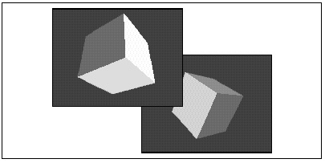

**LISTING 51.2 L51-2.C**

    /* Transforms all vertices in the specified object into view spa ce, then
       perspective projects them to screen space and maps them to screen coordinates,
       storing the results in the object. */
    #include <math.h>
    #include "polygon.h"/

    void XformAndProjectPoints(double Xform[4][4],
       struct Object * ObjectToXform)
    {
       int i, NumPoints = ObjectToXform->NumVerts;
       struct Point3 * Points = ObjectToXform->VertexList;
       struct Point3 * XformedPoints = ObjectToXform->XformedVertexList;
       struct Point3 * ProjectedPoints = ObjectToXform->ProjectedVertexList;
       struct Point * ScreenPoints = ObjectToXform->ScreenVertexList;

       for (i=0; i<NumPoints; i++, Points++, XformedPoints++,
             ProjectedPoints++, ScreenPoints++) {
          /* Transform to view space */
          XformVec(Xform, (double *)Points, (double *)XformedPoints);
          /* Perspective-project to screen space */
          ProjectedPoints->X = XformedPoints->X / XformedPoints->Z *
                PROJECTION_RATIO * (SCREEN_WIDTH / 2.0);
          ProjectedPoints->Y = XformedPoints->Y / XformedPoints->Z *
                PROJECTION_RATIO * (SCREEN_WIDTH / 2.0);
          ProjectedPoints->Z = XformedPoints->Z;
          /* Convert to screen coordinates. The Y coord is negated to
             flip from increasing Y being up to increasing Y being down,
             as expected by the polygon filler. Add in half the screen
             width and height to center on the screen. */
          ScreenPoints->X = ((int) floor(ProjectedPoints->X + 0.5)) + SCREEN_WIDTH/2;
          ScreenPoints->Y = (-((int) floor(ProjectedPoints->Y + 0.5))) +
                   SCREEN_HEIGHT/2;
       }
    }

**LISTING 51.3 L51-3.C**

    /* Draws all visible faces (faces pointing toward the viewer) in the specified
       object. The object must have previously been transformed and projected, so
       that the ScreenVertexList array is filled in. */
    #include "polygon.h"

    void DrawVisibleFaces(struct Object * ObjectToXform)
    {
       int i, j, NumFaces = ObjectToXform->NumFaces, NumVertices;
       int * VertNumsPtr;
       struct Face * FacePtr = ObjectToXform->FaceList;
       struct Point * ScreenPoints = ObjectToXform->ScreenVertexList;
       long v1,v2,w1,w2;
       struct Point Vertices[MAX_POLY_LENGTH];
       struct PointListHeader Polygon;

       /* Draw each visible face (polygon) of the object in turn */
       for (i=0; i<NumFaces; i++, FacePtr++) {
          NumVertices = FacePtr->NumVerts;
          /* Copy over the face's vertices from the vertex list */
          for (j=0, VertNumsPtr=FacePtr->VertNums; j<NumVertices; j++)
             Vertices[j] = ScreenPoints[*VertNumsPtr++];
          /* Draw only if outside face showing (if the normal to the
             polygon points toward the viewer; that is, has a positive
             Z component) */
          v1 = Vertices[1].X - Vertices[0].X;
          w1 = Vertices[NumVertices-1].X - Vertices[0].X;
          v2 = Vertices[1].Y - Vertices[0].Y;
          w2 = Vertices[NumVertices-1].Y - Vertices[0].Y;
          if ((v1*w2 - v2*w1) > 0) {
             /* It is facing the screen, so draw */
             /* Appropriately adjust the extent of the rectangle used to
                erase this page later */
             for (j=0; j<NumVertices; j++) {
                if (Vertices[j].X > EraseRect[NonDisplayedPage].Right)
                   if (Vertices[j].X < SCREEN_WIDTH)
                      EraseRect[NonDisplayedPage].Right = Vertices[j].X;
                   else EraseRect[NonDisplayedPage].Right = SCREEN_WIDTH;
                if (Vertices[j].Y > EraseRect[NonDisplayedPage].Bottom)
                   if (Vertices[j].Y < SCREEN_HEIGHT)
                      EraseRect[NonDisplayedPage].Bottom = Vertices[j].Y;
                   else EraseRect[NonDisplayedPage].Bottom=SCREEN_HEIGHT;
                if (Vertices[j].X < EraseRect[NonDisplayedPage].Left)
                   if (Vertices[j].X > 0)
                      EraseRect[NonDisplayedPage].Left = Vertices[j].X;
                   else EraseRect[NonDisplayedPage].Left = 0;
                if (Vertices[j].Y < EraseRect[NonDisplayedPage].Top)
                   if (Vertices[j].Y > 0)
                      EraseRect[NonDisplayedPage].Top = Vertices[j].Y;
                   else EraseRect[NonDisplayedPage].Top = 0;
             }
             /* Draw the polygon */
             DRAW_POLYGON(Vertices, NumVertices, FacePtr->Color, 0, 0);
          }
       }
    }

The sample program, as shown in Figure 51.3, places a cube, floating in
three-space, under the complete control of the user. The arrow keys may
be used to move the cube left, right, up, and down, and the A and T keys
may be used to move the cube away from or toward the viewer. The F1 and
F2 keys perform rotation around the Z axis, the axis running from the
viewer straight into the screen. The 4 and 6 keys perform rotation
around the Y (vertical) axis, and the 2 and 8 keys perform rotation
around the X axis, which runs horizontally across the screen; the latter
four keys are most conveniently used by flipping the keypad to the
numeric state.

\
 **Figure 51.3**  *Sample screens from the 3-D cube program.*

The demo involves six polygons, one for each side of the cube. Each of
the polygons must be transformed and projected, so it would seem that 24
vertices (four for each polygon) must be handled, but some steps have
been taken to improve performance. All vertices for the object have been
stored in a single list; the definition of each face contains not the
vertices for that face themselves, but rather indexes into the object's
vertex list, as shown in Figure 51.4. This reduces the number of
vertices to be manipulated from 24 to 8, for there are, after all, only
eight vertices in a cube, with three faces sharing each vertex. In this
way, the transformation burden is lightened by two-thirds. Also, as
mentioned earlier, backface removal is performed with integers, in
screen coordinates, rather than with floating-point values in screen
space. Finally, the **RecalcXForm** flag is set whenever the user
changes the object-to-world transformation. Only when this flag is set
is the full object-to-view transformation recalculated and the object's
vertices transformed and projected again; otherwise, the values already
stored within the object are reused. In the sample application, this
brings no visual improvement, because there's only the one object, but
the underlying mechanism is sound: In a full-blown 3-D animation
application, with multiple objects moving about the screen, it would
help a great deal to flag which of the objects had moved with respect to
the viewer, performing a new transformation and projection only for
those that had.

\
 **Figure 51.4**  *The object data structure*
