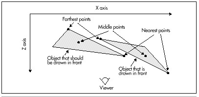

### Raw Speed, Part II: Look it Up {#Heading4}

It's a funny thing about Turbo Profiler: Time spent in the Borland C++
80x87 emulator doesn't show up directly anywhere that I can see in the
timing results. The only way to detect it is by way of the line that
reports what percent of total time is represented by all the areas that
were profiled; if you're profiling all areas, whatever's not explicitly
accounted for seems to be the floating-point emulator time. This quirk
fooled me for a while, leading me to think sine and cosine weren't major
drags on performance, because the **sin()** and **cos()** functions
spend most of their time in the emulator, and that time doesn't show up
in Turbo Profiler's statistics on those functions. Once I figured out
what was going on, it turned out that not only were **sin()** and
**cos()** major drags, they were taking up over half the total execution
time by themselves.

The solution is a lookup table. Listing 53.1 contains a function called
**CosSin()** that calculates both the sine and cosine of an angle, via a
lookup table. The function accepts angles in tenths of degrees; I
decided to use tenths of degrees rather than radians because that way
it's always possible to look up the sine and cosine of the exact angle
requested, rather than approximating, as would be required with radians.
Tenths of degrees should be fine enough control for most purposes; if
not, it's easy to alter **CosSin()** for finer gradations yet. GENCOS.C,
the program used to generate the lookup table (COSTABLE.INC), included
in Listing 53.1, can be found in the XSHARP22 subdirectory on the
listings diskette. GENCOS.C can generate a cosine table with any
integral number of steps per degree.

FIXED.ASM (Listing 53.1) speeds X-Sharp up quite a bit, and it changes
the performance balance a great deal. When we started out with 3-D
animation, calculation time was the dragon we faced; more than 90
percent of the total time was spent doing matrix and projection math.
Additional optimizations in the area of math could still be made (using
32-bit multiplies in the backface-removal code, for example), but
fixed-point math, the sine and cosine lookup, and selective assembly
optimizations have done a pretty good job already. The bulk of the time
taken by X-Sharp is now spent drawing polygons, drawing rectangles (to
erase objects), and waiting for the page to flip. In other words, we've
slain the dragon of 3-D math, or at least wounded it grievously; now
we're back to the dragon of polygon filling. We'll address faster
polygon filling soon, but for the moment, we have more than enough
horsepower to have some fun with. First, though, we need one more
feature: hidden surfaces.

#### Hidden Surfaces {#Heading5}

So far, we've made a number of simplifying assumptions in order to get
the animation to look good; for example, all objects must currently be
convex polyhedrons. What's more, right now, objects can never pass
behind or in front of each other. What that means is that it's time to
have a look at hidden surfaces.

There are a passel of ways to do hidden surfaces. Way off at one end
(the slow end) of the spectrum is Z-buffering, whereby each pixel of
each polygon is checked as it's drawn to see whether it's the frontmost
version of the pixel at those coordinates. At the other end is the
technique of simply drawing the objects in back-to-front order, so that
nearer objects are drawn on top of farther objects. The latter approach,
depth sorting, is the one we'll take today. (Actually, true depth
sorting involves detecting and resolving possible ambiguities when
objects overlap in Z; in this chapter, we'll simply sort the objects on
Z and leave it at that.)

This limited version of depth sorting is fast but less than perfect. For
one thing, it doesn't address the issue of nonconvex objects, so we'll
have to stick with convex polyhedrons. For another, there's the question
of what part of each object to use as the sorting key; the nearest
point, the center, and the farthest point are all possibilities—and,
whichever point is used, depth sorting doesn't handle some overlap cases
properly. Figure 53.1 illustrates one case in which back-to-front
sorting doesn't work, regardless of what point is used as the sorting
key.

For photo-realistic rendering, these are serious problems. For fast
PC-based animation, however, they're manageable. Choose objects that
aren't too elongated; arrange their paths of travel so they don't
intersect in problematic ways; and, if they do overlap incorrectly,
trust that the glitch will be lost in the speed of the animation and the
complexity of the screen.

Listing 53.2 shows X-Sharp file OLIST.C, which includes the key routines
for depth sorting. Objects are now stored in a linked list. The initial,
empty list, created by **InitializeObjectList(),** consists of a
sentinel entry at either end, one at the farthest possible z coordinate,
and one at the nearest. New entries are inserted by **AddObject()** in
z-sorted order. Each time the objects are moved, before they're drawn at
their new locations, **SortObjects()** is called to Z-sort the object
list, so that drawing will proceed from back to front. The Z-sorting is
done on the basis of the objects' center points; a center-point field
has been added to the object structure to support this, and the center
point for each object is now transformed along with the vertices. That's
really all there is to depth sorting—and now we can have objects that
overlap in X and Y.

\
 **Figure 53.1**  *Why back-to-front sorting doesn't always work
properly.*
