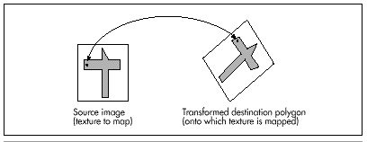
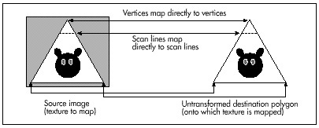

## Chapter 56\
 Pooh and the Space Station {#Heading1}

### Using Fast Texture Mapping to Place Pooh on a Polygon {#Heading2}

So, here's where Winnie the Pooh lives: in a space station orbiting
Saturn. No, really; I have it straight from my daughter, and an
eight-year-old wouldn't make up something that important, would she? One
day she wondered aloud, "Where is the Hundred Acre Wood, exactly?" and
before I could give one of those boring parental responses about how it
was imaginary—but A.A. Milne probably imagined it to be somewhere near
London—my daughter announced that the Hundred Acre Wood was in a space
station orbiting Saturn, and there you have it.

As it turns out, that's a very good location for the Hundred Acre Wood,
leading to many exciting adventures for Pooh and Piglet. Consider the
time they went down to the Jupiter gravity level (we're talking
centrifugal force here; the station is spinning, of course) and nearly
turned into pancakes of the Pooh and Piglet varieties, respectively. Or
the time they drifted out into the free-fall area at the core and had to
be rescued by humans with wings strapped on (a tip of the hat to Robert
Heinlein here). Or the time they were caught up by the current in the
river through the Wood and drifted for weeks around the circumference of
the station, meeting many cultures and finding many adventures along the
way. (Yes, Farmer's Riverworld; no one said the stories you tell your
children need to be purely original, just interesting.)

(If you think Pooh and Piglet in a space station is a tad peculiar, then
I won't even mention Karla, the woman who invented agriculture,
medicine, sanitation, reading and writing, peace, and just about
everything else while travelling the length of the Americas with her
mountain lion during the last Ice Age; or the Mars Cats and their trip
in suspended animation to the Lesser Magellenic Cloud and beyond; or
most assuredly Little Whale, the baby Universe Whale that is naughty
enough to eat inhabited universes. But I digress.)

Anyway, I bring up Pooh and the space station because the time has come
to discuss fast texture mapping. *Texture mapping* is the process of
mapping an image (in our case, a bitmap) onto the surface of a polygon
that's been transformed in the process of 3-D drawing. Up to this point,
each polygon we've drawn in X-Sharp has been a single, solid color. Over
the last couple of chapters we added the ability to shade polygons
according to lighting, but each polygon was still a single color. Thus,
in order to produce any sort of intricate design, a great many tiny
polygons would have to be drawn. That would be very slow, so we need
another approach. One such approach is texture mapping; that is, mapping
the bitmap containing the desired image onto the pixels contained within
the transformed polygon. Done properly, this should make it possible to
change X-Sharp's output from a bland collection of monocolor facets to a
lively, detailed, and much more realistic scene.

"What sort of scene?" you may well ask. This is where Pooh and the space
station came in. When I sat down to think of a sample texture-mapping
application, it occurred to me that the shaded ball demo we added to
X-Sharp recently looked at least a bit like a spinning, spherical space
station, and that the single unshaded, yellow polygon looked somewhat
like a window in the space station, and it might be a nice example if
someone were standing in the window....

The rest is history.

### Principles of Quick-and-Dirty Texture Mapping {#Heading3}

The key to our texture-mapping approach will be to quickly determine
what pixel value to draw for each pixel in the transformed destination
polygon. These polygon pixel values will be determined by mapping each
destination pixel in the transformed polygon back to the image bitmap,
via a reverse transformation, and seeing what color resides at the
corresponding location in the image bitmap, as shown in Figure 56.1. It
might seem more intuitive to map pixels the other way, from the image
bitmap to the transformed polygon, but in fact it's crucial that the
mapping proceed backward from the destination to avoid gaps in the final
image. With the approach of finding the right value for each destination
pixel in turn, via a backward mapping, there's no way we can miss any
destination pixels. On the other hand, with the forward-mapping method,
some destination pixels may be skipped or double-drawn, because this is
not necessarily a one-to-one or one-to-many mapping. Although we're not
going to take advantage of it now, mapping back to the source makes it
possible to average several neighboring image pixels together to
calculate the value for each destination pixel; that is, to antialias
the image. This can greatly improve texture quality, although it is
slower.

\
 **Figure 56.1**  *Using reverse transformation to find the source pixel
color.*

#### Mapping Textures Made Easy {#Heading4}

To understand how we're going to map textures, consider Figure 56.2,
which maps a bitmapped image directly onto an untransformed polygon.
Here, we simply map the origin of the polygon's untransformed coordinate
system somewhere within the image, then map the vertices to the
corresponding image pixels. (For simplicity, I'll assume in this
discussion that the polygon's coordinate system is in units of pixels,
but scaling images to polygons is eminently doable. This will become
clearer when we look at mapping images onto transformed polygons, next.)
Mapping the image to the polygon is then a simple matter of stepping one
scan line at a time in both the image and the polygon, each time
advancing the X coordinates of the edges according to the slopes of the
lines, just as is normally done when filling a polygon. Since the
polygon is untransformed, the stepping is identical in both the image
and the polygon, and the pixel mapping is one-to-one, so the appropriate
part of each scan line of the image can simply be block copied to the
destination.

\
 **Figure 56.2**  *Mapping a texture onto an untransformed polygon.*

Now, matters get more complicated. What if the destination polygon is
rotated in two dimensions? We no longer have a neat direct mapping from
image scan lines to destination polygon scan lines. We still want to
draw across each destination scan line, but the proper source pixels for
each destination scan line may now track across the source bitmap at an
angle, as shown in Figure 56.3. What can we do?

The solution is remarkably simple. We'll just map each transformed
vertex to the corresponding vertex in the bitmap; this is easy, because
the vertices are at the same indices in the original and transformed
vertex lists. Each time we select a new edge to scan for the destination
polygon, we'll select the corresponding edge in the source bitmap, as
well. Then—and this is crucial—each time we step a destination edge one
scan line, we'll step the corresponding source image edge an equivalent
amount.
