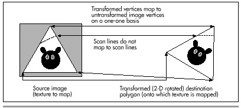
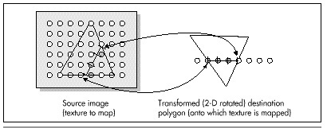
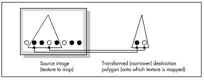

Ah, but what is an "equivalent amount"? Think of it this way. If a
destination edge is 100 scan lines high, it will be stepped 100 times.
Then, we'll divide the **SourceXWidth** and **SourceYHeight** lengths of
the source edge by 100, and add those amounts to the source edge's
coordinates each time the destination is stepped one scan line. Put
another way, we have, as usual, arranged things so that in the
destination polygon we step **DestYHeight** times, where **DestYHeight**
is the height of the destination edge. The this approach arranges to
step the source image edge **DestYHeight** times also, to match what the
destination is doing.

\
 **Figure 56.3**  *Mapping a texture onto a 2-D rotated polygon.*

Now we're able to track the coordinates of the polygon edges through the
source image in tandem with the destination edges. Stepping across each
destination scan line uses precisely the same technique, as shown in
Figure 56.4. In the destination, we step **DestXWidth** times across
each scan line of the polygon, once for each pixel on the scan line.
(**DestXWidth** is the horizontal distance between the two edges being
scanned on any given scan line.) To match this, we divide
**SourceXWidth** and **SourceYHeight** (the lengths of the scan line in
the source image, as determined by the source edge points we've been
tracking, as just described) by the width of the destination scan line,
**DestXWidth**, to produce **SourceXStep** and **SourceYStep**. Then, we
just step **DestXWidth** times, adding **SourceXStep** and
**SourceYStep** to **SourceX** and **SourceY** each time, and choose the
nearest image pixel to (**SourceX**,**SourceY**) to copy to (**DestX**,
**DestY**). (Note that the names used above, such as **SourceXWidth**,
are used for descriptive purposes, and don't necessarily correspond to
the actual variable names used in Listing 56.2.)

That's a workable approach for 2-D rotated polygons—but what about 3-D
rotated polygons, where the visible dimensions of the polygon can vary
with 3-D rotation and perspective projection? First, I'd like to make it
clear that texture mapping takes place from the source image to the
destination polygon after the destination polygon is projected to the
screen. That is, the image will be mapped after the destination polygon
is in its final, drawable form. Given that, it should be apparent that
the above approach automatically compensates for all changes in the
dimensions of a polygon. You see, this approach divides source edges and
scan lines into however many steps the destination polygon requires. If
the destination polygon is much narrower than the source polygon, as a
result of 3-D rotation and perspective projection, we just end up taking
bigger steps through the source image and skipping a lot of source image
pixels, as shown in Figure 56.5. The upshot is that the above approach
handles all transformations and projections effortlessly. It could also
be used to scale source images up to fit in larger polygons; all that's
needed is a list of where the polygon's vertices map into the source
image, and everything else happens automatically. In fact, mapping from
any polygonal area of a bitmap to any destination polygon will work,
given only that the two polygons have the same number of vertices.

\
 **Figure 56.4**  *Mapping a horizontal destination scan line back to
the source image.*

\
 **Figure 56.5**  *Mapping a texture onto a narrower polygon.*

#### Notes on DDA Texture Mapping\
 \
 {#Heading5}

That's all there is to quick-and-dirty texture mapping. This technique
basically uses a two-stage digital differential analyzer (DDA) approach
to step through the appropriate part of the source image in tandem with
the normal scan-line stepping through the destination polygon, so I'll
call it "DDA texture mapping." It's worth noting that there is no need
for any trigonometric functions at all, and only two divides are
required per scan line.

This isn't a perfect approach, of course. For one thing, it isn't
anywhere near as fast as drawing solid polygons; the speed is more
comparable to drawing each polygon as a series of lines. Also, the DDA
approach results in far from perfect image quality, since source pixels
may be skipped or selected twice. I trust, however, that you can see how
easy it would be to improve image quality by antialiasing with the DDA
approach. For example, we could simply average the four surrounding
pixels as we did for simple, unweighted antialiasing in Chapters F,
G,Chapter K on the companion CD-ROM. Or, we could take a Wu antialiasing
approach (see Chapter 57) and average the two bracketing pixels along
each axis according to proximity. If we had cycles to waste (which,
given that this is real-time animation on a PC, we don't), we could
improve image quality by putting the source pixels through a low-pass
filter sized in X and Y according to the ratio of the source and
destination dimensions (that is, how much the destination is scaled up
or down from the source).

Even more important is that the sort of texture mapping I'll do in
X-Sharp doesn't correct for perspective. That doesn't much matter for
small polygons or polygons that are nearly parallel to the screen in
3-space, but it can produce very noticeable bowing of textures on large
polygons at an angle to the screen. Perspective texture mapping is a
complex subject that's outside the scope of this book, but you should be
aware of its existence, because perspective texture mapping is a key
element of many games these days.

Finally, I'd like to point out that this sort of DDA texture mapping is
display-hardware dependent, because the bitmap for each image must be
compatible with the number of bits per pixel in the destination. That's
actually a fairly serious issue. One of the nice things about X-Sharp's
polygon orientation is that, until now, the only display dependent part
of X-Sharp has been the transformation from RGB color space to the
adapter's color space. Compensation for aspect ratio, resolution, and
the like all happens automatically in the course of projection. Still,
we need the ability to display detailed surfaces, and it's hard to
conceive of a fast way to do so that's totally hardware independent. (If
you know of one, let me know care of the publisher.)

For now, all we need is fast texture mapping of adequate quality, which
the straightforward, non-antialiased DDA approach supplies. I'm sure
there are many other fast approaches, and, as I've said, there are more
accurate approaches, but DDA texture mapping works well, given the
constraints of the PC's horsepower. Next, we'll look at code that
performs DDA texture mapping. First, though, I'd like to take a moment
to thank Jim Kent, author of Autodesk Animator and a frequent
correspondent, for getting me started with the DDA approach.
