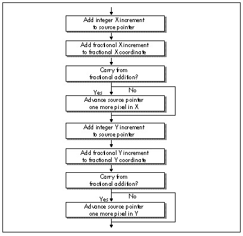
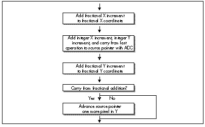

  ------------------------ --------------------------------- --------------------
  [Previous](58-02.html)   [Table of Contents](index.html)   [Next](58-04.html)
  ------------------------ --------------------------------- --------------------

I'd like to emphasize that algorithmically and conceptually, there is
*no* difference between scanning out a polygon top to bottom and
scanning it out left to right; it is only in conjunction with the
hardware organization of Mode X that the scanning direction matters in
the least.

  ------------------- ------------------------------------------------------------------------------------------------------------------------------------------------------------------------------------------------------------------------------------------------------------------------------------------------------------------------------------------------------------------------------------------------------------------------------------------------------------------------------------------------------------------------------------------------------------------------------------------------------------------------------------------------------------------------------------------------------------------------------------------------------------------------------------------------------------------------------
     *That's what Zen programming is all about, though; tying together two pieces of seemingly unrelated information to good effect—and that's what I had failed to do. Like Robert Heinlein—like all of us—I had viewed the world through a filter composed of my ingrained assumptions, and one of those assumptions, based on all my past experience, was that pixel processing proceeds left to right. Eventually, I might have come up with Chris's approach; but I would only have come up with it when and if I relaxed and stepped back a little, and allowed myself—almost dared myself—to think of it. When you're optimizing, be sure to leave quiet, nondirected time in which to conjure up those less obvious solutions, and periodically try to figure out what assumptions you're making—and then question them!*
  ------------------- ------------------------------------------------------------------------------------------------------------------------------------------------------------------------------------------------------------------------------------------------------------------------------------------------------------------------------------------------------------------------------------------------------------------------------------------------------------------------------------------------------------------------------------------------------------------------------------------------------------------------------------------------------------------------------------------------------------------------------------------------------------------------------------------------------------------------------

\
 **Figure 58.3**  *Texture mapping a single vertical column.*

There are a few complications with Chris's approach, not least that
X-Sharp's polygon-filling convention (top and left edges included,
bottom and right edges excluded) is hard to reproduce for
column-oriented texture mapping. I solved this in X-Sharp version 22 by
tweaking the edge-scanning code to allow column-oriented texture mapping
to match the current convention. (You'll find X-Sharp 22 on the listings
diskette in the directory for this chapter.)

Chris also illustrated another important principle of optimization: A
second pair of eyes is invaluable. Even the best of us have blind spots
and get caught up in particular implementations; if you bounce your
ideas off someone, you may well find them coming back with an
unexpected—and welcome—spin.

### That's Nice—But it Sure as Heck Ain't 9 Cycles {#Heading6}

Excellent as Chris's suggestion was, I still had work to do: Listing
58.2 is still more than twice as slow as John Miles's code.
Traditionally, I start the optimization process with algorithmic
optimization, then try to tie the algorithm and the hardware together
for maximum efficiency, and finish up with instruction-by-instruction,
take-no-prisoners optimization. We've already done the first two steps,
so it's time to get down to the bare metal.

Listing 58.2 contains three functional parts: Drawing the pixel,
advancing the destination pointer, and advancing the source texture
pointer. Each of the three parts is amenable to further acceleration.

Drawing the pixel is difficult to speed up, given that it consists of
only two instructions—difficult, but not impossible. True, the
instructions themselves are indeed irreducible, but if we can get rid of
the ES: prefix (and, as we shall see, we can), we can rearrange the code
to make it run faster on the Pentium. Without a prefix, the instructions
execute as follows on the Pentium:

    MOV  AH,[BX]    ;cycle 1 U-pipe
                    ;cycle 1 V-pipe idle; reg contention
    MOV  [DI],AH    ;cycle 2 U-pipe

The second **MOV**, being dependent on the value loaded into AH by the
first **MOV**, can't execute until the first **MOV** is finished, so the
Pentium's second pipe, the V-pipe, lies idle for a cycle. We can reclaim
that cycle simply by shuffling another instruction between the two
**MOV**s.

Advancing the destination pointer is easy to speed up: Just build the
offset from one scanline to the next into each pixel-drawing instruction
as a constant, as in

    MOV [EDI+SCANOFFSET],AH

and advance EDI only once per unrolled loop iteration.

Advancing the source texture pointer is more complex, but
correspondingly more rewarding. Listing 58.2 uses a variant form of
32-bit fixed-point arithmetic to advance the source pointer, with the
source texture coordinates and increments stored in 16.16 (16 bits of
integer, 16 bits of fraction) format. The source coordinates are stored
in a slightly unusual format, whereby the fractional X and Y coordinates
are stored and advanced separately, but a single integer value, the
source pointer, is used to reflect both the X and Y coordinates. In
Listing 58.2, the integer and fractional parts are added into the
current coordinates with four separate 16-bit operations, and carries
from fractional to integer parts are detected via conditional jumps, as
shown in Figure 58.4. There's quite a lot we can do to improve this.

\
 **Figure 58.4**  *Original method for advancing the source texture
pointer.*

First, we can sum the X and Y integer advance amounts outside the loop,
then add them both to the source pointer with a single instruction.
Second, we can recognize that X advances exactly one extra byte when its
fractional part carries, and use **ADC** to account for X carries, as
shown in Figure 58.5. That single **ADC** can add in not only any X
carry, but both the X and Y integer advance amounts as well, thereby
eliminating a good chunk of the source-advance code in Listing 58.2.
Furthermore, we should somehow be able to use 32-bit registers and
instructions to help with the 32-bit fixed-point arithmetic; true, the
size override prefix (because we're in a 16-bit segment) will cost a
cycle per 32-bit instruction, but that's better than the 3 cycles it
takes to do 32-bit arithmetic with 16-bit instructions. It isn't
obvious, but there's a nifty trick we can use here, again courtesy of
Chris Hecker (who, as you can tell, has done a fair amount of thinking
about the complexities of texture mapping).

We can store the current fractional parts of both the X *and* Y source
coordinates in a single 32-bit register, EDX, as shown in Figure 58.6.
It's important to note that the Y fraction is actually only 15 bits,
with bit 15 of EDX always kept at zero; this allows bit 15 to store the
carry status from each Y advance. We can similarly store the fractional
X and Y advance amounts in ECX, and can store the sum of the integer
parts of the X and Y advance amounts in BP. With this arrangement, the
single instruction **ADD EDX,ECX** advances the fractional parts of both
X and Y, and the following instruction **ADC SI,BP** finishes advancing
the source pointer in X. That's a mere 3 cycles, and all that remains is
to finish advancing the source pointer in Y.

\
 **Figure 58.5**  *Efficient method for advancing source texture
pointer.*

\
 **Figure 58.6**  *Storing both X and Y fractional coordinates in one
register.*

Actually, we also advanced the source pointer by the Y integer amount
back when we added BP to SI; all that's left is to detect whether our
addition to the Y fractional current coordinate produced a carry. That's
easily done by testing bit 15 of EDX; if it's zero, there was no carry
and we're done; otherwise, Y carried, so we have to reset bit 15 and
advance the source pointer by one scanline. The resulting program flow
is shown in Figure 58.7. Note that unlike the X fractional addition, we
can't get away with just adding in the carry from the Y fractional
addition, because when the Y fraction carries, it indicates a move not
from one pixel to the next on a scanline (a single byte), but rather
from one scanline to the next (a full scanline width).

  ------------------------ --------------------------------- --------------------
  [Previous](58-02.html)   [Table of Contents](index.html)   [Next](58-04.html)
  ------------------------ --------------------------------- --------------------

* * * * *

Graphics Programming Black Book © 2001 Michael Abrash
