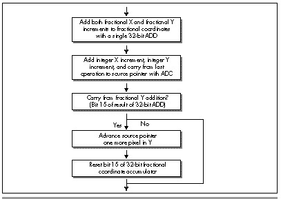

All of the above optimizations together get us to 10 cycles—*very* close
to John Miles, but not there yet. We have one more trick up our sleeve,
though: Suppose we point SS to the segment containing our textures, and
point DS to the screen? (This requires either setting up a stack in the
texture segment or ensuring that interrupts and other stack activity
can't happen while SS points to that segment.) Then, we could swap the
functions of SI and BP; that would let us use BP, which accesses SS by
default, to get at the textures, and DI to access the screen—all with no
segment prefixes at all. By gosh, that would get us exactly one more
cycle, and would bring us down to the same 9 cycles John Miles attained;
Listing 58.3 shows that code. At long last, the Holy Grail attained and
our honor defended, we can rest.

Or can we?

**LISTING 58.3 L58-3.ASM**

    ; Inner loop to draw a single texture-mapped vertical column,
    ; rather than a horizontal scanline. Maxed-out 16-bit version.
    ;
    ; At this point:
    ;       AX = source pointer increment to advance one in Y
    ;       ECX = fractional Y advance in lower 15 bits of CX,
    ;             fractional X advance in high word of ECX, bit
    ;             15 set to 0

    ;       EDX = fractional source texture Y coordinate in lower
    ;             15 bits of CX, fractional source texture X coord
    ;             in high word of ECX, bit 15 set to 0
    ;       SI = sum of integral X & Y source pointer advances
    ;       DS:DI = initial destination pointer
    ;       SS:BP = initial source texture pointer

    SCANOFFSET=0

         REPT LOOP_UNROLL

         mov   bl,[bp]                        ;get texture pixel
         mov   [di+SCANOFFSET],bl             ;set screen pixel

         add   edx,ecx                        ;advance frac Y in DX,
                                              ; frac X in high word of EDX
         adc   bp,si                          ;advance source pointer by integral
                                              ; X & Y amount, also accounting for
                                              ; carry from X fractional addition
         test  dh,80h                         ;carry from Y fractional addition?
         jz    @F                             ;no
         add   bp,ax                          ;yes, advance Y by one
         and   dh,not 80h                     ;reset the Y fractional carry bit
    @@:

    SCANOFFSET = SCANOFFSET + SCANWIDTH

         ENDM

#### Don't Stop Thinking about Those Cycles {#Heading7}

Remember what I said at the outset, that knowing something has been done
makes it much easier to do? A corollary is that pushing past that point,
once attained, is very difficult. It's only natural to want to relax in
the satisfaction of a job well done; then, too, the very nature of the
work changes. Getting from 44 cycles down to John's 9 cycles was a huge
leap, but we knew it could be done—therefore the nature of the problem
was to figure out *how* it was done; in cases like this, if we're sharp
enough (and of course we are!), we're guaranteed eventual gratification.
Now that we've reached John's level of performance, the problem becomes
*whether* the code can be made faster yet, and that's a different kettle
of fish altogether, for it may well be that after thinking about it for
a while, we'll conclude that it can't. Not only will we have wasted
time, but we'll also never be sure we were right; we'll know only that
*we* couldn't find a solution. That way lies madness.

And yet—*someone* has to blaze the trail to higher performance, and that
someone might as well be us. Let's look for weaknesses in Listing 58.3.
None are readily apparent; the only cycle that looks even slightly
wasted is the size prefix on **ADD EDX,ECX**. As it turns out, that
cycle really *is* wasted, for there's a way to make the size prefix
vanish without losing the benefits of 32-bit instructions: Move the code
into a 32-bit segment and make *all* the instructions 32-bit. That's
what Listing 58.4 does; this code is similar to Listing 58.3, but runs
in 8 cycles per pixel, a 12.5 percent speedup over Listing 58.3. Whether
Listing 58.4 actually draws more pixels per second than Listing 58.3
depends on whether display memory is fast enough to handle pixels as
rapidly as Listing 58.4 can deliver them. That speed, one pixel every
122 nanoseconds on a 486/66, is one that ISA adapters can't hope to
match, but fast VLB and PCI adapters can handle with ease. Be aware,
too, that cache misses when reading the source texture will generally
reduce performance below the calculated 8-cycles-per-pixel level,
especially because textures, which can be scanned across at any angle,
are rarely accessed at consecutive addresses, which is the arrangement
that would make for the fewest cache misses.
