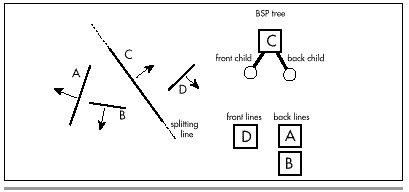
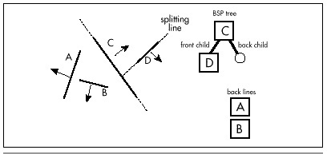
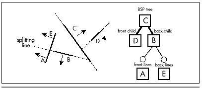
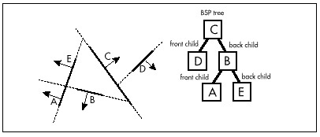
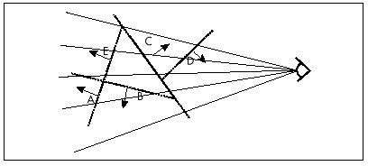
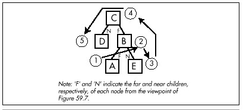

Creating a BSP tree is a recursive process, so we'll perform the first
split and go from there. Figure 59.3 shows the world carved along the
line of wall C into two parts: walls that are in front of wall C, and
walls that are behind. (Any of the walls would have been an equally
valid choice for the initial split; we'll return to the issue of
choosing splitting walls in the next chapter.) This splitting into front
and back is the essential dualism of BSP trees.

\
 **Figure 59.3**  *Initial split along the line of wall C.*

Next, in Figure 59.4, the front subspace of wall C is split by wall D.
This is the only wall in that subspace, so we're done with wall C's
front subspace.

Figure 59.5 shows the back subspace of wall C being split by wall B.
There's a difference here, though: Wall A straddles the splitting line
generated from wall B. Does wall A belong in the front or back subspace
of wall B?

\
 **Figure 59.4**  *Split of wall C's front subspace along the line of
wall D.*

\
 **Figure 59.5**  *Split of wall C's back subspace along the line of
wall B.*

Both, actually. Wall A gets split into two pieces, which I'll call wall
A and wall E; each piece is assigned to the appropriate subspace and
treated as a separate wall. As shown in Figure 59.6, each of the split
pieces then has a subspace to itself, and each becomes a leaf of the
tree. The BSP tree is now complete.

#### Visibility Ordering {#Heading7}

Now that we've successfully built a BSP tree, you might justifiably be a
little puzzled as to how any of this helps with visibility ordering. The
answer is that each BSP node can definitively determine which of its
child trees is nearer and which is farther from any and all viewpoints;
applied throughout the tree, this principle makes it possible to
establish visibility ordering for all the line segments or planes in a
BSP tree, no matter what the viewing angle.

Consider the world of Figure 59.2 viewed from an arbitrary angle, as
shown in Figure 59.7. The viewpoint is in front of wall C; this tells us
that all walls belonging to the front tree that descends from wall C are
nearer along every ray from the viewpoint than wall C is (that is, they
can't be occluded by wall C). All the walls in wall C's back tree are
likewise farther away than wall C along any ray. Thus, for this
viewpoint, we know for sure that if we're using the painter's algorithm,
we want to draw all the walls in the back tree first, then wall C, and
then the walls in the front tree. If the viewpoint had been on the back
side of wall C, this order would have been reversed.

Of course, we need more ordering information than wall C alone can give
us, but we get that by traversing the tree recursively, making the same
far-near decision at each node. Figure 59.8 shows the painter's
algorithm (back-to-front) traversal order of the tree for the viewpoint
of Figure 59.7. At each node, we decide whether we're seeing the front
or back side of that node's wall, then visit whichever of the wall's
children is on the far side from the viewpoint, draw the wall, and then
visit the node's nearer child, in that order. Visiting a child is
recursive, involving the same far-near visiting order.

\
 **Figure 59.6**  *The final BSP tree.*

\
 **Figure 59.7**  *Viewing the BSP tree from an arbitrary angle.*

The key is that each BSP splitting line separates all the walls in the
current subspace into two groups relative to the viewpoint, and every
single member of the farther group is guaranteed not to occlude every
single member of the nearer. By applying this ordering recursively, the
BSP tree can be traversed to provide back-to-front or front-to-back
ordering, with each node being visited only once.

\
 **Figure 59.8**  *Back-to-front traversal of the BSP tree as viewed in
Figure 59.7.*

The type of tree walk used to produce front-to-back or back-to-front BSP
traversal is known as an *inorder* walk. More on this very shortly;
you're also likely to find a discussion of inorder walking in any good
data structures book. The only special aspect of BSP walks is that a
decision has to be made at each node about which way the node's wall is
facing relative to the viewpoint, so we know which child tree is nearer
and which is farther.

Listing 59.1 shows a function that draws a BSP tree back-to-front. The
decision whether a node's wall is facing forward, made by
**WallFacingForward()** in Listing 59.1, can, in general, be made by
generating a normal to the node's wall in screenspace
(perspective-corrected space as seen from the viewpoint) and checking
whether the z component of the normal is positive or negative, or by
checking the sign of the dot product of a viewspace (non-perspective
corrected space as seen from the viewpoint) normal and a ray from the
viewpoint to the wall. In 2-D, the decision can be made by enforcing the
convention that when a wall is viewed from the front, the start vertex
is leftmost; then a simple screenspace comparison of the x coordinates
of the left and right vertices indicates which way the wall is facing.

**Listing 59.1 L59\_1.C**

    void WalkBSPTree(NODE *pNode)
    {
       if (WallFacingForward(pNode) {
          if (pNode->BackChild) {
             WalkBSPTree(pNode->BackChild);
          }
          Draw(pNode);
          if (pNode->FrontChild) {
             WalkBSPTree(pNode->FrontChild);
          }
       } else {
          if (pNode->FrontChild) {
             WalkBSPTree(pNode->FrontChild);
          }
          Draw(pNode);
          if (pNode->BackChild) {
             WalkBSPTree(pNode->BackChild);
          }
       }
    }

  ------------------- -----------------------------------------------------------------------------------------------------------------------------------------------------------------------------------------------------------------------------------------------------------------------------------------------------------------------------------------------------------------------------------------------------------------------------------
     *Be aware that BSP trees can often be made smaller and more efficient by detecting collinear surfaces (like aligned wall segments) and generating only one BSP node for each collinear set, with the collinear surfaces stored in, say, a linked list attached to that node. Collinear surfaces partition space identically and can't occlude one another, so it suffices to generate one splitting node for each collinear set.*
  ------------------- -----------------------------------------------------------------------------------------------------------------------------------------------------------------------------------------------------------------------------------------------------------------------------------------------------------------------------------------------------------------------------------------------------------------------------------
