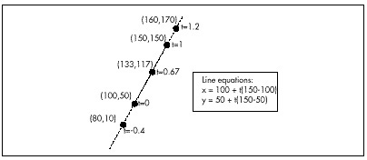
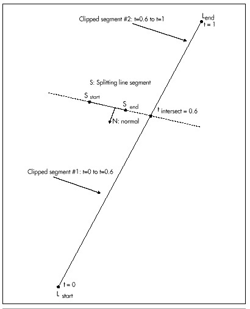

If you find any of the above confusing (and it would be understandable
if that were the case; BSP trees are not easy to get the hang of), you
might want to refer back to the previous chapter. It would also be a
good idea to get hold of the visual BSP compiler I'll discuss shortly;
when it comes to understanding BSP trees, there's nothing quite like
seeing one being built.

So there are really only two interesting operations in building a BSP
tree: choosing a root node for the current subspace (a "splitter") and
assigning surfaces to one side or another of the current root node,
splitting any that straddle the splitter. We'll get to the issue of
choosing splitters shortly, but first let's look at the process of
splitting and assigning. To do that, we need to understand parametric
lines.

#### Parametric Lines {#Heading4}

We're all familiar with lines described in slope-intercept form, with y
as a function of x

y = mx + b

but there's another sort of line description that's very useful for
clipping (and for a variety of 3-D purposes, such as curved surfaces and
texture mapping): *parametric lines*. In parametric lines, x and y are
decoupled from one another, and are instead described as a function of
the parameter t:

x = x~start~ + t(x~end~ - x~start~)\
 y = y~start~ + t(y~end~ - y~start~)

This can be summarized as

L = L~start~ + t(L~end~ - L~start~)

where L = (x, y).

Figure 60.1 shows how a parametric line works. The t parameter describes
how far along a line segment the current x and y coordinates are. Note
that this description is valid not only for the line segment, but also
for the entire infinite line; however, only points with t values between
0 and 1 are actually on the line segment.

In our 2-D BSP compiler (as you'll recall from the previous chapter,
we're working with 2-D trees for simplicity, but the principles
generalize to 3-D), we'll represent our walls (all vertical) as line
segments viewed from above. The segments will be stored in parametric
form, with the endpoints of the original line segment and two t values
describing the endpoints of the current (possibly clipped) segment
providing a complete specification for each segment, as shown in Figure
60.2.

What does that do for us? For one thing, it keeps clipping errors from
creeping in, because clipped line segments are always based on the
original line segment, not derived from clipped versions. Also, it's
potentially a more compact format, because we need to store the
endpoints only for the original line segments; for clipped line
segments, we can just store pairs of t values, along with a pointer to
the original line segment. The biggest win, however, is that it allows
us to use parametric line clipping, a very clean form of clipping,
indeed.

#### Parametric Line Clipping {#Heading5}

In order to assign a line segment to one subspace or the other of a
splitter, we must somehow figure out whether the line segment straddles
the splitter or falls on one side or the other. In order to determine
that, we first plug the line segment and splitter into the following
parametric line intersection equation

number = N (L~start~ - S~start~) (Equation 1)\
 denom = -N (L~end~ - L~start~) (Equation 2)\
 t~intersect~ = number / denom (Equation 3)

where N is the normal of the splitter, S~start~ is the start point of
the splitting line segment in standard (x,y) form, and L~start~ and
L~end~ are the endpoints of the line segment being split, again in (x,y)
form. Figure 60.3 illustrates the intersection calculation. Due to lack
of space, I'm just going to present this equation and its implications
as fact, rather than deriving them; if you want to know more, there's an
excellent explanation on page 117 of *Computer Graphics: Principles and
Practice,* by Foley and van Dam (Addison Wesley, ISBN 0-201-12110-7), a
book that you should certainly have in your library.

If the denominator is zero, we know that the lines are parallel and
don't intersect, so we don't divide, but rather check the sign of the
numerator, which tells us which side of the splitter the line segment is
on. Otherwise, we do the division, and the result is the t value for the
intersection point, as shown in Figure 60.3. We then simply compare the
t value to the t values of the endpoints of the line segment being
split. If it's between them, that's where we split the line segment,
otherwise, we can tell which side of the splitter the line segment is on
by which side of the line segment's t range it's on. Simple comparisons
do all the work, and there's no need to do the work of generating actual
x and y values. If you look closely at Listing 60.1, the core of the BSP
compiler, you'll see that the parametric clipping code itself is
exceedingly short and simple.

One interesting point about Listing 60.1 is that it generates normals to
splitting surfaces simply by exchanging the x and y lengths of the
splitting line segment and negating the resultant y value, thereby
rotating the line 90 degrees. In 3-D, it's not that simple to come by a
normal; you could calculate the normal as the cross-product of two of
the polygon's edges, or precalculate it when you build the world
database.

#### The BSP Compiler {#Heading6}

Listing 60.1 shows the core of a BSP compiler—the code that actually
builds the BSP tree. (Note that Listing 60.1 is excerpted from a C++
.CPP file, but in fact what I show here is very close to straight C. It
may even compile as a .C file, though I haven't checked.) The compiler
begins by setting up an empty tree, then passes that tree and the
complete set of line segments from which a BSP tree is to be generated
to `SelectBSPTree()`, which chooses a root node and calls
`BuildBSPTree()` to add that node to the tree and generate child trees
for each of the node's two subspaces. `BuildBSPTree()` calls
`SelectBSPTree()` recursively to select a root node for each of those
child trees, and this continues until all lines have been assigned
nodes. `SelectBSP()` uses parametric clipping to decide on the
splitter, as described below, and `BuildBSPTree()` uses parametric
clipping to decide which subspace of the splitter each line belongs in,
and to split lines, if necessary.
