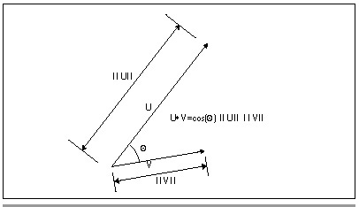
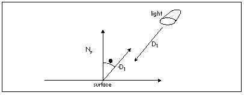

  ------------------------ --------------------------------- --------------------
  [Previous](61-01.html)   [Table of Contents](index.html)   [Next](61-03.html)
  ------------------------ --------------------------------- --------------------

I'll be working in a left-handed coordinate system, whereby if you wrap
the fingers of your left hand around the z axis with your thumb pointing
in the positive z direction, your fingers will curl from the positive x
axis to the positive y axis. The positive x axis runs left to right
across the screen, the positive y axis runs bottom to top across the
screen, and the positive z axis runs into the screen.

For our purposes, *projection* is the process of mapping coordinates
onto a line or surface. *Perspective projection* projects 3-D
coordinates onto a viewplane, scaling coordinates according to their z
distance from the viewpoint in order to provide proper perspective.
*Objectspace* is the coordinate space in which an object is defined,
independent of other objects and the world itself. *Worldspace* is the
absolute frame of reference for a 3-D world; all objects' locations and
orientations are with respect to worldspace, and this is the frame of
reference around which the viewpoint and view direction move.
*Viewspace* is worldspace as seen from the viewpoint, looking in the
view direction. *Screenspace* is viewspace after perspective projection
and scaling to the screen.

Finally, *transformation* is the process of converting points from one
coordinate space into another; in our case, that'll mean rotating and
translating (moving) points from objectspace or worldspace to viewspace.

For additional information, you might want to check out Foley & van
Dam's *Computer Graphics* (ISBN 0-201-12110-7), or the chapters in this
book dealing with my X-Sharp 3-D graphics library.

### The Dot Product {#Heading5}

Now we're ready to move on to the dot product. Given two vectors **U** =
[u~1~ u~2~ u~3~] and **V** = [v~1~ v~2~ v~3~], their dot product,
denoted by the symbol •, is calculated as:

(eq. 2)

As you can see, the result is a scalar value (a single real-valued
number), *not* another vector.

Now that we know how to calculate a dot product, what does that get us?
Not much. The dot product isn't of much use for graphics until you start
thinking of it this way

(eq. 3)

where q is the angle between the two vectors, and the other two terms
are the lengths of the vectors, as shown in Figure 61.1. Although it's
not immediately obvious, equation 3 has a wide variety of applications
in 3-D graphics.

#### Dot Products of Unit Vectors {#Heading6}

The simplest case of the dot product is when both vectors are *unit
vectors*; that is, when their lengths are both one, as calculated as in
Equation 1. In this case, equation 3 simplifies to:

(eq. 4)

In other words, the dot product of two unit vectors is the cosine of the
angle between them.

One obvious use of this is to find angles between unit vectors, in
conjunction with an inverse cosine function or lookup table. A more
useful application in 3-D graphics lies in lighting surfaces, where the
cosine of the angle between incident light and the normal (perpendicular
vector) of a surface determines the fraction of the light's full
intensity at which the surface is illuminated, as in

(eq. 5)

\
 **Figure 61.1**  *The dot product.*

where **I**~s~ is the intensity of illumination of the surface, **I**~l~
is the intensity of the light, and q is the angle between **-D**~l~
(where **D**~l~ is the light direction vector) and the surface normal.
If the inverse light vector and the surface normal are both unit
vectors, then this calculation can be performed with four multiplies and
three additions—and no explicit cosine calculations—as

(eq. 6)

where **N**~s~ is the surface unit normal and **D**~l~ is the light unit
direction vector, as shown in Figure 61.2.

### Cross Products and the Generation of Polygon Normals {#Heading7}

One question equation 6 begs is where the surface unit normal comes
from. One approach is to store the end of a surface normal as an extra
data point with each polygon (with the start being some point that's
already in the polygon), and transform it along with the rest of the
points. This has the advantage that if the normal starts out as a unit
normal, it will end up that way too, if only rotations and translations
(but not scaling and shears) are performed.

The problem with having an explicit normal is that it will remain a
normal—that is, perpendicular to the surface—only through viewspace.
Rotation, translation, and scaling preserve right angles, which is why
normals are still normals in viewspace, but perspective projection does
not preserve angles, so vectors that were surface normals in viewspace
are no longer normals in screenspace.

\
 **Figure 61.2**  *The dot product as used in calculating lighting
intensity.*

  ------------------------ --------------------------------- --------------------
  [Previous](61-01.html)   [Table of Contents](index.html)   [Next](61-03.html)
  ------------------------ --------------------------------- --------------------

* * * * *

Graphics Programming Black Book © 2001 Michael Abrash
