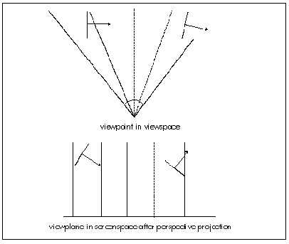
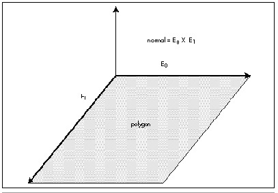
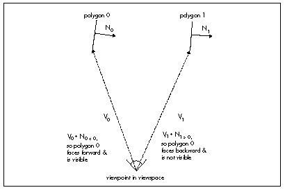

  ------------------------ --------------------------------- --------------------
  [Previous](61-02.html)   [Table of Contents](index.html)   [Next](61-04.html)
  ------------------------ --------------------------------- --------------------

Why does this matter? It matters because, on average, half the polygons
in any scene are facing away from the viewer, and hence shouldn't be
drawn. One way to identify such polygons is to see whether they're
facing toward or away from the viewer; that is, whether their normals
have negative z values (so they're visible) or positive z values (so
they should be culled). However, we're talking about screenspace normals
here, because the perspective projection can shift a polygon relative to
the viewpoint so that although its viewspace normal has a negative z,
its screenspace normal has a positive z, and vice-versa, as shown in
Figure 61.3. So we need screenspace normals, but those can't readily be
generated by transformation from worldspace.

\
 **Figure 61.3**  *A problem with determining front/back visibility.*

The solution is to use the cross product of two of the polygon's edges
to generate a normal. The formula for the cross product is:

(eq. 7)

(Note that the cross product operation is denoted by an X.) Unlike the
dot product, the result of the cross product is a vector. Not just any
vector, either; the vector generated by the cross product is
perpendicular to both of the original vectors. Thus, the cross product
can be used to generate a normal to any surface for which you have two
vectors that lie within the surface. This means that we can generate the
screenspace normals we need by taking the cross product of two adjacent
polygon edges, as shown in Figure 61.4.

  ------------------- --------------------------------------------------------------------------------------------------------------------------------------------------------------------------------------------------------------------------------------------------------------------------------------------------------------------------------------------------------------------------------------------------------------------
     *In fact, we can cull with only one-third the work needed to generate a full cross product; because we're interested only in the sign of the z component of the normal, we can skip entirely calculating the x and y components. The only caveat is to be careful that neither edge you choose is zero-length and that the edges aren't collinear, because the dot product can't produce a normal in those cases.*
  ------------------- --------------------------------------------------------------------------------------------------------------------------------------------------------------------------------------------------------------------------------------------------------------------------------------------------------------------------------------------------------------------------------------------------------------------

\
 **Figure 61.4**  *How the cross product of polygon edge vectors
generates a polygon normal.*

Perhaps the most often asked question about cross products is "Which way
do normals generated by cross products go?" In a left-handed coordinate
system, curl the fingers of your left hand so the fingers curl through
an angle of less than 180 degrees from the first vector in the cross
product to the second vector. Your thumb now points in the direction of
the normal.

If you take the cross product of two orthogonal (right-angle) unit
vectors, the result will be a unit vector that's orthogonal to both of
them. This means that if you're generating a new coordinate space—such
as a new viewing frame of reference—you only need to come up with unit
vectors for two of the axes for the new coordinate space, and can then
use their cross product to generate the unit vector for the third axis.
If you need unit normals, and the two vectors being crossed aren't
orthogonal unit vectors, you'll have to normalize the resulting vector;
that is, divide each of the vector's components by the length of the
vector, to make it a unit long.

### Using the Sign of the Dot Product {#Heading8}

The dot product is the cosine of the angle between two vectors, scaled
by the magnitudes of the vectors. Magnitudes are always positive, so the
sign of the cosine determines the sign of the result. The dot product is
positive if the angle between the vectors is less than 90 degrees,
negative if it's greater than 90 degrees, and zero if the angle is
exactly 90 degrees. This means that just the sign of the dot product
suffices for tests involving comparisons of angles to 90 degrees, and
there are more of those than you'd think.

Consider, for example, the process of backface culling, which we
discussed above in the context of using screenspace normals to determine
polygon orientation relative to the viewer. The problem with that
approach is that it requires each polygon to be transformed into
viewspace, then perspective projected into screenspace, before the test
can be performed, and that involves a lot of time-consuming calculation.
Instead, we can perform culling way back in worldspace (or even earlier,
in objectspace, if we transform the viewpoint into that frame of
reference), given only a vertex and a normal for each polygon and a
location for the viewer.

Here's the trick: Calculate the vector from the viewpoint to any vertex
in the polygon and take its dot product with the polygon's normal, as
shown in Figure 61.5. If the polygon is facing the viewpoint, the result
is negative, because the angle between the two vectors is greater than
90 degrees. If the polygon is facing away, the result is positive, and
if the polygon is edge-on, the result is 0. That's all there is to
it—and this sort of backface culling happens before any transformation
or projection at all is performed, saving a great deal of work for the
half of all polygons, on average, that are culled.

Backface culling with the dot product is just a special case of
determining which side of a plane any point (in this case, the
viewpoint) is on. The same trick can be applied whenever you want to
determine whether a point is in front of or behind a plane, where a
plane is described by any point that's on the plane (which I'll call the
plane origin), plus a plane normal. One such application is in clipping
a line (such as a polygon edge) to a plane. Just do a dot product
between the plane normal and the vector from one line endpoint to the
plane origin, and repeat for the other line endpoint. If the signs of
the dot products are the same, no clipping is needed; if they differ,
clipping is needed. And yes, the dot product is also the way to do the
actual clipping; but before we can talk about that, we need to
understand the use of the dot product for projection.

\
 **Figure 61.5**  *Backface culling with the dot product.*

  ------------------------ --------------------------------- --------------------
  [Previous](61-02.html)   [Table of Contents](index.html)   [Next](61-04.html)
  ------------------------ --------------------------------- --------------------

* * * * *

Graphics Programming Black Book © 2001 Michael Abrash
