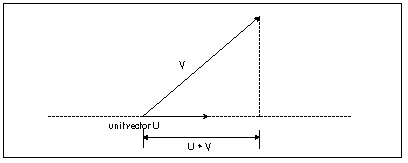
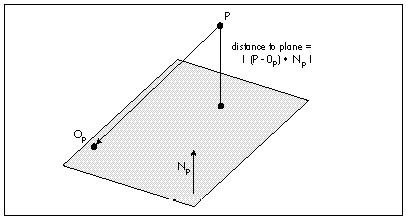
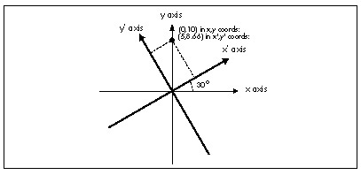

  ------------------------ --------------------------------- --------------------
  [Previous](61-03.html)   [Table of Contents](index.html)   [Next](62-01.html)
  ------------------------ --------------------------------- --------------------

### Using the Dot Product for Projection {#Heading9}

Consider Equation 3 again, but this time make one of the vectors, say
**V**, a unit vector. Now the equation reduces to:

(eq. 8)

In other words, the result is the cosine of the angle between the two
vectors, scaled by the magnitude of the non-unit vector. Now, consider
that cosine is really just the length of the adjacent leg of a right
triangle, and think of the non-unit vector as the hypotenuse of a right
triangle, and remember that all sides of similar triangles scale
equally. What it all works out to is that the value of the dot product
of any vector with a unit vector is the length of the first vector
projected onto the unit vector, as shown in Figure 61.6.

\
 **Figure 61.6**  *How the dot product with a unit vector performs a
projection.*

This unlocks all sorts of neat stuff. Want to know the distance from a
point to a plane? Just dot the vector from the point **P** to the plane
origin **O**~p~ with the plane unit normal **N**~p~, to project the
vector onto the normal, then take the absolute value

    distance = |(P - Op) • Np|

as shown in Figure 61.7.

Want to clip a line to a plane? Calculate the distance from one endpoint
to the plane, as just described, and dot the whole line segment with the
plane normal, to get the full length of the line along the plane normal.
The ratio of the two dot products is then how far along the line from
the endpoint the intersection point is; just move along the line segment
by that distance from the endpoint, and you're at the intersection
point, as shown in Listing 61.1.

**LISTING 61.1 L61\_1.C**

    // Given two line endpoints, a point on a plane, and a unit normal
    // for the plane, returns the point of intersection of the line
    // and the plane in intersectpoint.
    #define DOT_PRODUCT(x,y)   (x[0]*y[0]+x[1]*y[1]+x[2]*y[2])
    void LineIntersectPlane (float *linestart, float *lineend,
       float *planeorigin, float *planenormal, float *intersectpoint)
    {
       float vec1[3], projectedlinelength, startdistfromplane, scale;
       vec1[0] = linestart[0] - planeorigin[0];
       vec1[1] = linestart[1] - planeorigin[1];
       vec1[2] = linestart[2] - planeorigin[2];
       startdistfromplane = DOT_PRODUCT(vec1, planenormal);
       if (startdistfromplane == 0)
       {
            // point is in plane
            intersectpoint[0] = linestart[0];
            intersectpoint[1] = linestart[1];
            intersectpoint[2] = linestart[1];
            return;
       }
       vec1[0] = linestart[0] - lineend[0];
       vec1[1] = linestart[1] - lineend[1];
       vec1[2] = linestart[2] - lineend[2];
       projectedlinelength = DOT_PRODUCT(vec1, planenormal);
       scale = startdistfromplane / projectedlinelength;
       intersectpoint[0] = linestart[0] - vec1[0] * scale;
       intersectpoint[1] = linestart[1] - vec1[1] * scale;
       intersectpoint[2] = linestart[1] - vec1[2] * scale;
    }

### Rotation by Projection {#Heading10}

We can use the dot product's projection capability to look at rotation
in an interesting way. Typically, rotations are represented by matrices.
This is certainly a workable representation that encapsulates all
aspects of transformation in a single object, and is ideal for
concatenations of rotations and translations. One problem with matrices,
though, is that many people, myself included, have a hard time looking
at a matrix of sines and cosines and visualizing what's actually going
on. So when two 3-D experts, John Carmack and Billy Zelsnack, mentioned
that they think of rotation differently, in a way that seemed more
intuitive to me, I thought it was worth passing on.

\
 **Figure 61.7**  *Using the dot product to get the distance from a
point to a plane.*

Their approach is this: Think of rotation as projecting coordinates onto
new axes. That is, given that you have points in, say, worldspace,
define the new coordinate space (viewspace, for example) you want to
rotate to by a set of three orthogonal unit vectors defining the new
axes, and then project each point onto each of the three axes to get the
coordinates in the new coordinate space, as shown for the 2-D case in
Figure 61.8. In 3-D, this involves three dot products per point, one to
project the point onto each axis. Translation can be done separately
from rotation by simple addition.

  ------------------- ------------------------------------------------------------------------------------------------------------------------------------------------------------------------------------------------------------------------------------------------------------------------------------------------------------------------------------------------------------------------------------------------------------------------------------------------------------------------------------------------------------------------------------------------------------------------------------------
     *Rotation by projection is exactly the same as rotation via matrix multiplication; in fact, the rows of a rotation matrix are the orthogonal unit vectors pointing along the new axes. Rotation by projection buys us no technical advantages, so that's not what's important here; the key is that the concept of rotation by projection, together with a separate translation step, gives us a new way to look at transformation that I, for one, find easier to visualize and experiment with. A new frame of reference for how we think about 3-D frames of reference, if you will.*
  ------------------- ------------------------------------------------------------------------------------------------------------------------------------------------------------------------------------------------------------------------------------------------------------------------------------------------------------------------------------------------------------------------------------------------------------------------------------------------------------------------------------------------------------------------------------------------------------------------------------------

Three things I've learned over the years are that it never hurts to
learn a new way of looking at things, that it helps to have a clearer,
more intuitive model in your head of whatever it is you're working on,
and that new tools, or new ways to use old tools, are Good Things. My
experience has been that rotation by projection, and dot product tricks
in general, offer those sorts of benefits for 3-D.

\
 **Figure 61.8**  *Rotation to a new coordinate space by projection onto
new axes.*

  ------------------------ --------------------------------- --------------------
  [Previous](61-03.html)   [Table of Contents](index.html)   [Next](62-01.html)
  ------------------------ --------------------------------- --------------------

* * * * *

Graphics Programming Black Book © 2001 Michael Abrash
