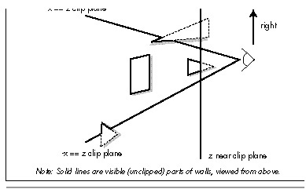
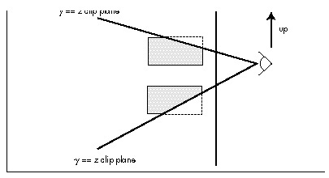

  ------------------------ --------------------------------- --------------------
  [Previous](62-02.html)   [Table of Contents](index.html)   [Next](62-04.html)
  ------------------------ --------------------------------- --------------------

#### The Rendering Pipeline {#Heading4}

Conceptually rendering from a BSP tree really is that simple, but the
implementation is a bit more complicated. The full rendering pipeline,
as coordinated by **UpdateWorld()**, is this:

-   Update the current location.
-   Transform all wall endpoints into viewspace (the world as seen from
    the current location with the current viewing angle).
-   Clip all walls to the view pyramid.
-   Project wall vertices to screen coordinates.
-   Walk the walls back to front, and for each wall that lies at least
    partially in the view pyramid, perform backface culling (skip walls
    facing away from the viewer), and draw the wall if it's not culled.

Next, we'll look at each part of the pipeline more closely. The pipeline
is too complex for me to be able to discuss each part in complete
detail. Some sources for further reading are *Computer Graphics*, by
Foley and van Dam (ISBN 0-201-12110-7), and the *DDJ Essential Books on
Graphics Programming* CD.

### Moving the Viewer {#Heading5}

The sample BSP program performs first-person rendering; that is, it
renders the world as seen from your eyes as you move about. The rate of
movement is controlled by key-handling code that's not shown in Listing
62.1; however, the variables set by the key-handling code are used in
**UpdateViewPos()** to bring the current location up to date.

Note that the view position can change not only in x and z (movement
around the but only viewing horizontally. Although the BSP tree is only
2-D, it is quite possible to support looking up and down to at least
some extent, particularly if the world dataset is restricted so that,
for example, there are never two rooms stacked on top of each other, or
any tilted walls. For simplicity's sake, I have chosen not to implement
this in Listing 62.1, but you may find it educational to add it to the
program yourself.

### Transformation into Viewspace {#Heading6}

The viewing angle (which controls direction of movement as well as view
direction) can sweep through the full 360 degrees around the viewpoint,
so long as it remains horizontal. The viewing angle is controlled by the
key handler, and is used to define a unit vector stored in
**currentorientation** that explicitly defines the view direction (the z
axis of viewspace), and implicitly defines the x axis of viewspace,
because that axis is at right angles to the z axis, where x increases to
the right of the viewer.

As I discussed in the previous chapter, rotation to a new coordinate
system can be performed by using the dot product to project points onto
the axes of the new coordinate system, and that's what
**TransformVertices()** does, after first translating (moving) the
coordinate system to have its origin at the viewpoint. (It's necessary
to perform the translation first so that the viewing rotation is around
the viewpoint.) Note that this operation can equivalently be viewed as a
matrix math operation, and that this is in fact the more common way to
handle transformations.

At the same time, the points are scaled in x according to
**PROJECTION\_RATIO** to provide the desired field of view. Larger scale
values result in narrower fields of view.

When this is done the walls are in viewspace, ready to be clipped.

### Clipping {#Heading7}

In viewspace, the walls may be anywhere relative to the viewpoint: in
front, behind, off to the side. We only want to draw those parts of
walls that properly belong on the screen; that is, those parts that lie
in the view pyramid (view frustum), as shown in Figure 62.2. Unclipped
walls—walls that lie entirely in the frustum—should be drawn in their
entirety, fully clipped walls should not be drawn, and partially clipped
walls must be trimmed before being drawn.

In Listing 62.1, **ClipWalls()** does this in three steps for each wall
in turn. First, the z coordinates of the two ends of the wall are
calculated. (Remember, walls are vertical and their ends go straight up
and down, so the top and bottom of each end have the same x and z
coordinates.) If both ends are on the near side of the front clip plane,
then the polygon is fully clipped, and we're done with it. If both ends
are on the far side, then the polygon isn't z-clipped, and we leave it
unchanged. If the polygon straddles the near clip plane, then the wall
is trimmed to stop at the near clip plane by adjusting the t value of
the nearest endpoint appropriately; this calculation is a simple matter
of scaling by z, because the near clip plane is at a constant z
distance. (The use of t values for parametric lines was discussed in
Chapter 60.) The process is further simplified because the walls can be
treated as lines viewed from above, so we can perform 2-D clipping in z;
this would not be the case if walls sloped or had sloping edges.

After clipping in z, we clip by viewspace x coordinate, to ensure that
we draw only wall portions that lie between the left and right edges of
the screen. Like z-clipping, x-clipping can be done as a 2-D clip,
because the walls and the left and right sides of the frustum are all
vertical. We compare both the start and endpoint of each wall to the
left and right sides of the frustum, and reject, accept, or clip each
wall's t values accordingly. The test for x clipping is very simple,
because the edges of the frustum are defined as the planes where x==z
and -x==z.

\
 **Figure 62.2**  *Clipping to the view pyramid.*

The final clip stage is clipping by y coordinate, and this is the most
complicated, because vertical walls can be clipped at an angle in y, as
shown in Figure 62.3, so true 3-D clipping of all four wall vertices is
involved. We handle this in **ClipWalls()** by detecting trivial
rejection in y, using y==z and ==z as the y boundaries of the frustum.
However, we leave partial clipping to be handled as a 2-D clipping
problem; we are able to do this only because our earlier z-clip to the
near clip plane guarantees that no remaining polygon point can have
z\<=0, ensuring that when we project we'll always pass valid,
y-clippable screenspace vertices to the polygon filler.

### Projection to Screenspace {#Heading8}

At this point, we have viewspace vertices for each wall that's at least
partially visible. All we have to do is project these vertices according
to z distance—that is, perform perspective projection—and scale the
results to the width of the screen, then we'll be ready to draw.
Although this step is logically separate from clipping, it is performed
as the last step for visible walls in **ClipWalls()**.

\
 **Figure 62.3**  *Why y clipping is more complex than x or z clipping.*

  ------------------------ --------------------------------- --------------------
  [Previous](62-02.html)   [Table of Contents](index.html)   [Next](62-04.html)
  ------------------------ --------------------------------- --------------------

* * * * *

Graphics Programming Black Book © 2001 Michael Abrash
