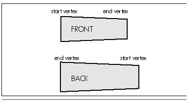

### Walking the Tree, Backface Culling and Drawing {#Heading9}

Now that we have all the walls clipped to the frustum, with vertices
projected into screen coordinates, all we have to do is draw them back
to front; that's the job of **DrawWallsBackToFront()**. Basically, this
routine walks the BSP tree, descending recursively from each node to
draw the farther children of each node first, then the wall at the node,
then the nearer children. In the interests of efficiency, this
particular implementation performs a data-recursive walk of the tree,
rather than the more familiar code recursion. Interestingly, the
performance speedup from data recursion turned out to be more modest
than I had expected, based on past experience; see Chapter 59 for
further details.

As it comes to each wall, **DrawWallsBackToFront()** first descends to
draw the farther subtree. Next, if the wall is both visible and pointing
toward the viewer, it is drawn as a solid polygon. The polygon filler
(not shown in Listing 62.1) is a modification of the polygon filler I
presented in Chapters 38 and 39.

It's worth noting how backface culling and front/back wall orientation
testing are performed. (Note that walls are always one-sided, visible
only from the front.) I discussed backface culling in general in the
previous chapter, and mentioned two possible approaches: generating a
screenspace normal (perpendicular vector) to the polygon and seeing
which way that points, or taking the world or screenspace dot product
between the vector from the viewpoint to any polygon point and the
polygon's normal and checking the sign. Listing 62.1 does both, but
because our BSP tree is 2-D and the viewer is always upright, we can
save some work.

Consider this: Walls are stored so that the left end, as viewed from the
front side of the wall, is the start vertex, and the right end is the
end vertex. There are only two possible ways that a wall can be
positioned in screenspace, then: viewed from the front, in which case
the start vertex is to the left of the end vertex, or viewed from the
back, in which case the start vertex is to the right of the end vertex,
as shown in Figure 62.4. So we can tell which side of a wall we're
seeing, and thus backface cull, simply by comparing the screenspace x
coordinates of the start and end vertices, a simple 2-D version of
checking the direction of the screenspace normal.

The wall orinetation test used for walking the BSP tree, performed in
**WallFacingViewer()** takes the other approach, and checks the
viewspace sign of the dot product of the wall's normal with a vector
from the viewpoint to the wall. Again, this code takes advantage of the
2-D nature of the tree to generate the wall normal by swapping x and z
and altering signs. We can't use the quicker screenspace x test here
that we used for backface culling, because not all walls can be
projected into screenspace; for example, trying to project a wall at
z==0 would result in division by zero.

All the visible, front-facing walls are drawn into a buffer by
**DrawWallsBackToFront()**, then **UpdateWorld()** calls Win32 to copy
the new frame to the screen. The frame of animation is complete.

\
 **Figure 62.4**  *Fast backspace culling test in screenspace.*

#### Notes on the BSP Renderer {#Heading10}

Listing 62.1 is far from complete or optimal. There is no such thing as
a tiny BSP rendering demo, because 3D rendering, even when based on a
2-D BSP tree, requires a substantial amount of code and complexity.
Listing 62.1 is reasonably close to a minimum rendering engine, and is
specifically intended to illuminate basic BSP principles, given the
space limitations of one chapter in a book that's already larger than it
should be. Think of Listing 62.1 as a learning tool and a starting
point.

The most obvious lack in Listing 62.1 is that there is no support for
floors and ceilings; the walls float in space, unsupported. Is it
necessary to go to 3-D BSP trees to get a normal-looking world?

No. Although 3-D BSP trees offer many advantages in that they allow
arbitrary datasets with viewing in any arbitrary direction and, in
truth, aren't much more complicated than 2-D BSP trees for back-to-front
drawing, they do tend to be larger and more difficult to debug, and they
aren't necessary for floors and ceilings. One way to get floors and
ceilings out of a 2-D BSP tree is to change the nature of the BSP tree
so that polygons are no longer stored in the splitting nodes. Instead,
each leaf of the tree—that is, each subspace carved out by the
tree—would store the polygons for the walls, floors, and ceilings that
lie on the boundaries of that space and face into that space. The
subspace would be convex, because all BSP subspaces are automatically
convex, so the polygons in that subspace can be drawn in any order.
Thus, the subspaces in the BSP tree would each be drawn in turn as
convex sets, back to front, just as Listing 62.1 draws polygons back to
front.

This sort of BSP tree, organized around volumes rather than polygons,
has some additional interesting advantages in simulating physics,
detecting collisions, doing line-of-sight determination, and performing
volume-based operations such as dynamic illumination and event
triggering. However, that discussion will have to wait until another
day.
