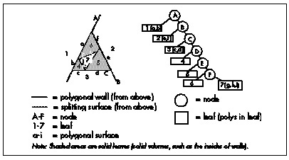
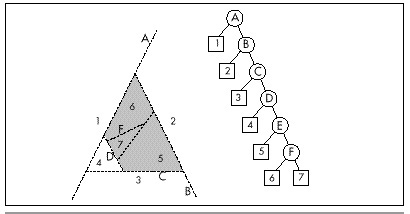

### The Structure of Quake Levels {#Heading4}

Before diving into VSD, let me note that each Quake level is stored as a
single huge 3-D BSP tree. This BSP tree, like any BSP, subdivides space,
in this case along the planes of the polygons. However, unlike the BSP
tree I presented in Chapter 62, Quake's BSP tree does not store polygons
in the tree nodes, as part of the splitting planes, but rather in the
empty (non-solid) leaves, as shown in overhead view in Figure 64.1.

Correct drawing order can be obtained by drawing the leaves in
front-to-back or back-to-front BSP order, again as discussed in Chapter
62. Also, because BSP leaves are always convex and the polygons are on
the boundaries of the BSP leaves, facing inward, the polygons in a given
leaf can never obscure one another and can be drawn in any order. (This
is a general property of convex polyhedra.)

### Culling and Visible Surface Determination {#Heading5}

The process of VSD would ideally work as follows: First, you would cull
all polygons that are completely outside the view frustum (view
pyramid), and would clip away the irrelevant portions of any polygons
that are partially outside. Then, you would draw only those pixels of
each polygon that are actually visible from the current viewpoint, as
shown in overhead view in Figure 64.2, wasting no time overdrawing
pixels multiple times; note how little of the polygon sets in Figure
64.2 actually need to be drawn. Finally, in a perfect world, the tests
to figure out what parts of which polygons are visible would be free,
and the processing time would be the same for all possible viewpoints,
giving the game a smooth visual flow.

\
 **Figure 64.1**  *Quake's polygons are stored as empty leaves.*

\
 **Figure 64.2**  *Pixels visible from the current viewpoint.*

As it happens, it is easy to determine which polygons are outside the
frustum or partially clipped, and it's quite possible to figure out
precisely which pixels need to be drawn. Alas, the world is far from
perfect, and those tests are far from free, so the real trick is how to
accelerate or skip various tests and still produce the desired result.

As I discussed at length in Chapter 62, given a BSP, it's easy and
inexpensive to walk the world in front-to-back or back-to-front order.
The simplest VSD solution, which I in fact demonstrated earlier, is to
simply walk the tree back-to-front, clip each polygon to the frustum,
and draw it if it's facing forward and not entirely clipped (the
painter's algorithm). Is that an adequate solution?

For relatively simple worlds, it is perfectly acceptable. It doesn't
scale very well, though. One problem is that as you add more polygons in
the world, more transformations and tests have to be performed to cull
polygons that aren't visible; at some point, that will bog considerably
performance down.

#### Nodes Inside and Outside the View Frustum {#Heading6}

Happily, there's a good workaround for this particular problem. As
discussed earlier, each leaf of a BSP tree represents a convex subspace,
with the nodes that bound the leaf delimiting the space. Perhaps less
obvious is that each node in a BSP tree also describes a subspace—the
subspace composed of all the node's children, as shown in Figure 64.3.
Another way of thinking of this is that each node splits the subspace
into two pieces created by the nodes above it in the tree, and the
node's children then further carve that subspace into all the leaves
that descend from the node.

\
 **Figure 64.3**  *The substance described by node E.*

Since a node's subspace is bounded and convex, it is possible to test
whether it is entirely outside the frustum. If it is, *all* of the
node's children are certain to be fully clipped and can be rejected
without any additional processing. Since most of the world is typically
outside the frustum, many of the polygons in the world can be culled
almost for free, in huge, node-subspace chunks. It's relatively
expensive to perform a perfect test for subspace clipping, so instead
bounding spheres or boxes are often maintained for each node,
specifically for culling tests.

So culling to the frustum isn't a problem, and the BSP can be used to
draw back-to- front. What, then, *is* the problem?

### Overdraw {#Heading7}

The problem John Carmack, the driving technical force behind DOOM and
Quake, faced when he designed Quake was that in a complex world, many
scenes have an awful lot of polygons in the frustum. Most of those
polygons are partially or entirely obscured by other polygons, but the
painter's algorithm described earlier requires that every pixel of every
polygon in the frustum be drawn, often only to be overdrawn. In a
10,000-polygon Quake level, it would be easy to get a worst-case
overdraw level of 10 times or more; that is, in some frames each pixel
could be drawn 10 times or more, on average. No rasterizer is fast
enough to compensate for an order of such magnitude and more work than
is actually necessary to show a scene; worse still, the painter's
algorithm will cause a vast difference between best-case and worst-case
performance, so the frame rate can vary wildly as the viewer moves
around.

So the problem John faced was how to keep overdraw down to a manageable
level, preferably drawing each pixel exactly once, but certainly no more
than two or three times in the worst case. As with frustum culling, it
would be ideal if he could eliminate all invisible polygons in the
frustum with virtually no work. It would also be a plus if he could
manage to draw only the visible parts of partially-visible polygons, but
that was a balancing act in that it had to be a lower-cost operation
than the overdraw that would otherwise result.

When I arrived at id at the beginning of March 1995, John already had an
engine prototyped and a plan in mind, and I assumed that our work was a
simple matter of finishing and optimizing that engine. If I had been
aware of id's history, however, I would have known better. John had done
not only DOOM, but also the engines for Wolfenstein 3-D and several
earlier games, and had actually done several different versions of each
engine in the course of development (once doing four engines in four
weeks), for a total of perhaps 20 distinct engines over a four-year
period. John's tireless pursuit of new and better designs for Quake's
engine, from every angle he could think of, would end only when we
shipped the product.

By three months after I arrived, only one element of the original VSD
design was anywhere in sight, and John had taken the dictum of "try new
things" farther than I'd ever seen it taken.
