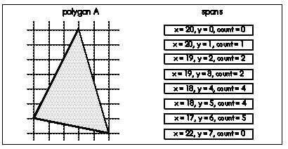
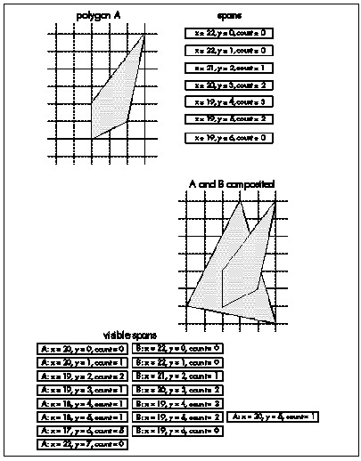

As you may recall from Chapter 64, we're concerned with both raw
performance and level performance. That is, we want the drawing code to
run as fast as possible, but we also want the difference in drawing
speed between the average scene and the slowest-drawing scene to be as
small as possible.

  ------------------- ------------------------------------------------------------------------------------------------------------------------------------------------------------------------------------------------------------------------------------------------------------------------------------------------------------------------------------------------------------
     *It does little good to average 30 frames per second if 10 percent of the scenes draw at 5 fps, because the jerkiness in those scenes will be extremely obvious by comparison with the average scene, and highly objectionable. It would be better to average 15 fps 100 percent of the time, even though the average drawing speed is only half as much.*
  ------------------- ------------------------------------------------------------------------------------------------------------------------------------------------------------------------------------------------------------------------------------------------------------------------------------------------------------------------------------------------------------

The precalculated PVS was an important step toward both faster and more
level performance, because it eliminated the need to identify visible
polygons, a relatively slow step that tended to be at its worst in the
most complex scenes. Nonetheless, in some spots in real game levels the
precalculated PVS contains five times more polygons than are actually
visible; together with the back-to-front HSR approach, this created hot
spots in which the frame rate bogged down visibly as hundreds of
polygons are drawn back-to- front, most of those immediately getting
overdrawn by nearer polygons. Raw performance in general was also
reduced by the typical 50% overdraw resulting from drawing everything in
the PVS. So, although drawing the PVS back-to-front as the final HSR
stage worked and was an improvement over previous designs, it was not
ideal. Surely, John thought, there's a better way to leverage the PVS
than back-to-front drawing.

And indeed there is.

### Sorted Spans {#Heading7}

The ideal final HSR stage for Quake would reject all the polygons in the
PVS that are actually invisible, and draw only the visible pixels of the
remaining polygons, with no overdraw, that is, with every pixel drawn
exactly once, all at no performance cost, of course. One way to do that
(although certainly not at zero cost) would be to draw the polygons from
front-to-back, maintaining a region describing the currently occluded
portions of the screen and clipping each polygon to that region before
drawing it. That sounds promising, but it is in fact nothing more or
less than the beam tree approach I described in Chapter 64, an approach
that we found to have considerable overhead and serious leveling
problems.

We can do much better if we move the final HSR stage from the polygon
level to the span level and use a sorted-spans approach. In essence,
this approach consists of turning each polygon into a set of spans, as
shown in Figure 66.1, and then sorting and clipping the spans against
each other until only the visible portions of visible spans are left to
be drawn, as shown in Figure 66.2. This may sound a lot like z-buffering
(which is simply too slow for use in drawing the world, although it's
fine for smaller moving objects, as described earlier), but there are
crucial differences.

\
 **Figure 66.1**  *Span generation.*

By contrast with z-buffering, only visible portions of visible spans are
scanned out pixel by pixel (although all polygon edges must still be
rasterized). Better yet, the sorting that z-buffering does at each pixel
becomes a per-span operation with sorted spans, and because of the
coherence implicit in a span list, each edge is sorted only against some
of the spans on the same line and is clipped only to the few spans that
it overlaps horizontally. Although complex scenes still take longer to
process than simple scenes, the worst case isn't as bad as with the beam
tree or back-to-front approaches, because there's no overdraw or
scanning of hidden pixels, because complexity is limited to pixel
resolution and because span coherence tends to limit the worst-case
sorting in any one area of the screen. As a bonus, the output of sorted
spans is in precisely the form that a low-level rasterizer needs, a set
of span descriptors, each consisting of a start coordinate and a length.

In short, the sorted spans approach meets our original criteria pretty
well; although it isn't zero-cost, it's not horribly expensive, it
completely eliminates both overdraw and pixel scanning of obscured
portions of polygons and it tends to level worst-case performance. We
wouldn't want to rely on sorted spans alone as our hidden-surface
mechanism, but the precalculated PVS reduces the number of polygons to a
level that sorted spans can handle quite nicely.

So we've found the approach we need; now it's just a matter of writing
some code and we're on our way, right? Well, yes and no. Conceptually,
the sorted-spans approach is simple, but it's surprisingly difficult to
implement, with a couple of major design choices to be made, a subtle
mathematical element, and some tricky gotchas that I'll have to defer
until Chapter 67. Let's look at the design choices first.

### Edges versus Spans {#Heading8}

The first design choice is whether to sort spans or edges (both of which
fall into the general category of "sorted spans"). Although the results
are the same both ways, a list of spans to be drawn, with no overdraw,
the implementations and performance implications are quite different,
because the sorting and clipping are performed using very different data
structures.

With span-sorting, spans are stored in x-sorted, linked list buckets,
typically with one bucket per scan line. Each polygon in turn is
rasterized into spans, as shown in Figure 66.1, and each span is sorted
and clipped into the bucket for the scan line the span is on, as shown
in Figure 66.2, so that at any time each bucket contains the nearest
spans encountered thus far, always with no overlap. This approach
involves generating all spans for each polygon in turn, with each span
immediately being sorted, clipped, and added to the appropriate bucket.

\
 **Figure 66.2**  *Two sets of spans sorted and clipped against one
another.*

With edge-sorting, edges are stored in x-sorted, linked list buckets
according to their start scan line. Each polygon in turn is decomposed
into edges, cumulatively building a list of all the edges in the scene.
Once all edges for all polygons in the view frustum have been added to
the edge list, the whole list is scanned out in a single top-to-bottom,
left-to-right pass. An active edge list (AEL) is maintained. With each
step to a new scan line, edges that end on that scan line are removed
from the AEL, active edges are stepped to their new x coordinates, edges
starting on the new scan line are added to the AEL, and the edges are
sorted by current x coordinate.
