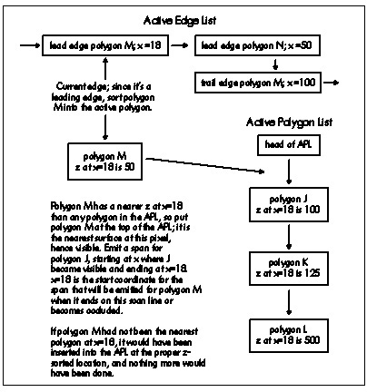
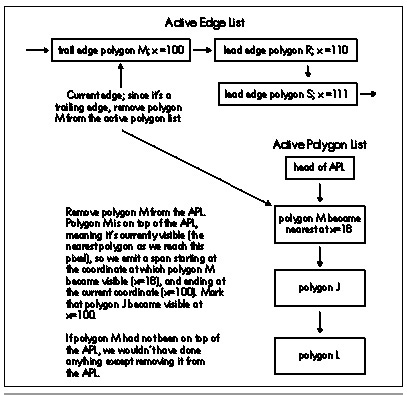

For each scan line, a z-sorted active polygon list (APL) is maintained.
The x-sorted AEL is stepped through in order. As each new edge is
encountered (that is, as each polygon starts or ends as we move left to
right), the associated polygon is activated and sorted into the APL, as
shown in Figure 66.3, or deactivated and removed from the APL, as shown
in Figure 66.4, for a leading or trailing edge, respectively. If the
nearest polygon has changed (that is, if the new polygon is nearest, or
if the nearest polygon just ended), a span is emitted for the polygon
that just stopped being the nearest, starting at the point where the
polygon first because nearest and ending at the x coordinate of the
current edge, and the current x coordinate is recorded in the polygon
that is now the nearest. This saved coordinate later serves as the start
of the span emitted when the new nearest polygon ceases to be in front.

Don't worry if you didn't follow all of that; the above is just a quick
overview of edge-sorting to help make the rest of this chapter a little
clearer. My thorough discussion of the topic will be in Chapter 67.

The spans that are generated with edge-sorting are exactly the same
spans that ultimately emerge from span-sorting; the difference lies in
the intermediate data structures that are used to sort the spans in the
scene. With edge-sorting, the spans are kept implicit in the edges until
the final set of visible spans is generated, so the sorting, clipping,
and span emission is done as each edge adds or removes a polygon, based
on the span state implied by the edge and the set of active polygons.
With span-sorting, spans are immediately made explicit when each polygon
is rasterized, and those intermediate spans are then sorted and clipped
against other the spans on the scan line to generate the final spans, so
the states of the spans are explicit at all times, and all work is done
directly with spans.

Both span-sorting and edge-sorting work well, and both have been
employed successfully in commercial projects. We've chosen to use
edge-sorting in Quake partly because it seems inherently more efficient,
with excellent horizontal coherence that makes for minimal time spent
sorting, in contrast with the potentially costly sorting into linked
lists that span-sorting can involve. A more important reason, though, is
that with edge-sorting we're able to share edges between adjacent
polygons, and that cuts the work involved in sorting, clipping, and
rasterizing edges nearly in half, while also shrinking the world
database quite a bit due to the sharing.

\
 **Figure 66.3**  *Activating a polygon when a leading edge is
encountered in the AEL.*

One final advantage of edge-sorting is that it makes no distinction
between convex and concave polygons. That's not an important
consideration for most graphics engines, but in Quake, edge clipping,
transformation, projection, and sorting have become a major bottleneck,
so we're doing everything we can to get the polygon and edge counts
down, and concave polygons help a lot in that regard. While it's
possible to handle concave polygons with span-sorting, that can involve
significant performance penalties.

\
 **Figure 66.4**  *Deactivating a polygon when a trailing edge is
encountered in the AEL.*

Nonetheless, there's no cut-and-dried answer as to which approach is
better. In the end, span-sorting and edge-sorting amount to the same
functionality, and the choice between them is a matter of whatever you
feel most comfortable with. In Chapter 67, I'll go into considerable
detail about edge-sorting, complete with a full implementation. I'm
going the spend the rest of this chapter laying the foundation for
Chapter 67 by discussing sorting keys and 1/z calculation. In the
process, I'm going to have to make a few forward references to aspects
of edge-sorting that I haven't yet covered in detail; my apologies, but
it's unavoidable, and all should become clear by the end of Chapter 67.

### Edge-Sorting Keys {#Heading9}

Now that we know we're going to sort edges, using them to emit spans for
the polygons nearest the viewer, the question becomes: How can we tell
which polygons are nearest? Ideally, we'd just store a sorting key in
each polygon, and whenever a new edge came along, we'd compare its
surface's key to the keys of other currently active polygons, and could
easily tell which polygon was nearest.

That sounds too good to be true, but it is possible. If, for example,
your world database is stored as a BSP tree, with all polygons clipped
into the BSP leaves, then BSP walk order is a valid drawing order. So,
for example, if you walk the BSP back-to-front, assigning each polygon
an incrementally higher key as you reach it, polygons with higher keys
are guaranteed to be in front of polygons with lower keys. This is the
approach Quake used for a while, although a different approach is now
being used, for reasons I'll explain shortly.

If you don't happen to have a BSP or similar data structure handy, or if
you have lots of moving polygons (BSPs don't handle moving polygons very
efficiently), another way to accomplish your objectives would be to sort
all the polygons against one another before drawing the scene, assigning
appropriate keys based on their spatial relationships in viewspace.
Unfortunately, this is generally an extremely slow task, because every
polygon must be compared to every other polygon. There are techniques to
improve the performance of polygon sorts, but I don't know of anyone
who's doing general polygon sorts of complex scenes in realtime on a PC.

An alternative is to sort by z distance from the viewer in screenspace,
an approach that dovetails nicely with the excellent spatial coherence
of edge-sorting. As each new edge is encountered on a scan line, the
corresponding polygon's z distance can be calculated and compared to the
other polygons' distances, and the polygon can be sorted into the APL
accordingly.

Getting z distances can be tricky, however. Remember that we need to be
able to calculate z at any arbitrary point on a polygon, because an edge
may occur and cause its polygon to be sorted into the APL at any point
on the screen. We could calculate z directly from the screen x and y
coordinates and the polygon's plane equation, but unfortunately this
can't be done very quickly, because the z for a plane doesn't vary
linearly in screenspace; however, 1/z *does* vary linearly, so we'll use
that instead. (See Chris Hecker's 1995 series of columns on texture
mapping in *Game Developer* magazine for a discussion of screenspace
linearity and gradients for 1/z.) Another advantage of using 1/z is that
its resolution increases with decreasing distance, meaning that by using
1/z, we'll have better depth resolution for nearby features, where it
matters most.
