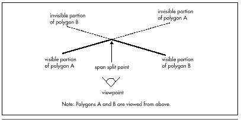
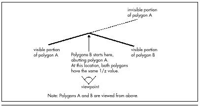

  ------------------------ --------------------------------- --------------------
  [Previous](67-01.html)   [Table of Contents](index.html)   [Next](67-03.html)
  ------------------------ --------------------------------- --------------------

And then yet another crop of sorting errors popped up.

We could have fixed those errors too; we'll take a quick look at how to
deal with such cases shortly. However, like the sixth rocket stage, the
fixes would have made Quake *slower* than it had been with BSP sorting.
So we gave up and went back to BSP order, and now the code is simpler
and sorting works reliably. It's too bad our experiment didn't work out,
but it wasn't wasted time because in trying what we did we learned quite
a bit. In particular, we learned that the information provided by a
simple, reliable world ordering mechanism, such as a BSP tree, can do
more good than is immediately apparent, in terms of both performance and
solid code.

Nonetheless, sorting on 1/z can be a valuable tool, used in the right
context; drawing a Quake world just doesn't happen to be such a case. In
fact, sorting on 1/z is how we're now handling the sorting of multiple
BSP models that lie within the same world leaf in Quake. In this case,
we don't have the option of using BSP order (because we're drawing
multiple independent trees), so we've set restrictions on the BSP models
to avoid running into the types of 1/z sorting errors we encountered
drawing the Quake world. Next, we'll look at another application in
which sorting on 1/z is quite useful, one where objects move freely
through space. As is so often the case in 3-D, there is no one "right"
technique, but rather a great many different techniques, each one handy
in the right situations. Often, a combination of techniques is
beneficial; for example, the combination in Quake of BSP sorting for the
world and 1/z sorting for BSP models in the same world leaf.

For the remainder of this chapter, I'm going to look at the three main
types of 1/z span sorting, then discuss a sample 3-D app built around
1/z span sorting.

### Types of 1/z Span Sorting {#Heading4}

As a quick refresher: With 1/z span sorting, all the polygons in a scene
are treated as sets of screenspace pixel spans, and 1/z (where z is
distance from the viewpoint in viewspace, as measured along the
viewplane normal) is used to sort the spans so that the nearest span
overlapping each pixel is drawn. As I discussed in Chapter 66, in the
sample program we're actually going to do all our sorting with polygon
edges, which represent spans in an implicit form.

There are three types of 1/z span sorting, each requiring a different
implementation. In order of increasing speed and decreasing complexity,
they are: intersecting, abutting, and independent. (These are names of
my own devising; I haven't come across any standard nomenclature in the
literature.)

#### Intersecting Span Sorting {#Heading5}

Intersecting span sorting occurs when polygons can interpenetrate. Thus,
two spans may cross such that part of each span is visible, in which
case the spans have to be split and drawn appropriately, as shown in
Figure 67.1.

\
 **Figure 67.1**  *Intersecting span sorting.*

Intersecting is the slowest and most complicated type of span sorting,
because it is necessary to compare 1/z values at two points in order to
detect interpenetration, and additional work must be done to split the
spans as necessary. Thus, although intersecting span sorting certainly
works, it's not the first choice for performance.

#### Abutting Span Sorting {#Heading6}

Abutting span sorting occurs when polygons that are not part of a
continuous surface can butt up against one another, but don't
interpenetrate, as shown in Figure 67.2. This is the sorting used in
Quake, where objects like doors often abut walls and floors, and turns
out to be more complicated than you might think. The problem is that
when an abutting polygon starts on a given scan line, as with polygon B
in Figure 67.2, it starts at exactly the same 1/z value as the polygon
it abuts, in this case, polygon A, so additional sorting is needed when
these ties happen. Of course, the two-point sorting used for
intersecting polygons would work, but we'd like to find something
faster.

As it turns out, the additional sorting for abutting polygons is
actually quite simple; whichever polygon has a greater 1/z gradient with
respect to screen x (that is, whichever polygon is heading fastest
toward the viewer along the scan line) is the front one. The hard part
is identifying *when* ties—that is, abutting polygons—occur; due to
floating-point imprecision, as well as fixed-point edge-stepping
imprecision that can move an edge slightly on the screen, calculations
of 1/z from the combination of screen coordinates and 1/z gradients (as
discussed last time) can be slightly off, so most tie cases will show up
as near matches, not exact matches. This imprecision makes it necessary
to perform two comparisons, one with an adjust-up by a small epsilon and
one with an adjust-down, creating a range in which near-matches are
considered matches. Fine-tuning this epsilon to catch all ties, without
falsely reporting close-but-not-abutting edges as ties, proved to be
troublesome in Quake, and the epsilon calculations and extra comparisons
slowed things down.

\
 **Figure 67.2**  *Abutting span sorting.*

I do think that abutting 1/z span sorting could have been made reliable
enough for production use in Quake, were it not that we share edges
between adjacent polygons in Quake, so that the world is a large polygon
mesh. When a polygon ends and is followed by an adjacent polygon that
shares the edge that just ended, we simply assume that the adjacent
polygon sorts relative to other active polygons in the same place as the
one that ended (because the mesh is continuous and there's no
interpenetration), rather than doing a 1/z sort from scratch. This
speeds things up by saving a lot of sorting, but it means that if there
is a sorting error, a whole string of adjacent polygons can be sorted
incorrectly, pulled in by the one missorted polygon. Missorting is a
very real hazard when a polygon is very nearly perpendicular to the
screen, so that the 1/z calculations push the limits of numeric
precision, especially in single-precision floating point.

Many caching schemes are possible with abutting span sorting, because
any given pair of polygons, being noninterpenetrating, will sort in the
same order throughout a scene. However, in Quake at least, the benefits
of caching sort results were outweighed by the additional overhead of
maintaining the caching information, and every caching variant we tried
actually slowed Quake down.

  ------------------------ --------------------------------- --------------------
  [Previous](67-01.html)   [Table of Contents](index.html)   [Next](67-03.html)
  ------------------------ --------------------------------- --------------------

* * * * *

Graphics Programming Black Book © 2001 Michael Abrash
